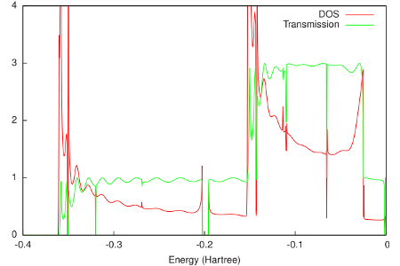

.. _example green_Al:

Example: DOS and transmission: Aluminium
========================================= 

:download:`Download green_Al.run <../../../examples/adf/green_Al/green_Al.run>` 

As an example of a non-self-consistent Green's function calculation, we will look at the density of states (DOS) and transmission of an infinite 1D chain of Aluminum atoms. 

The final resulting DOS and transmission are shown in the following figure: 

As would be expected for a 1D system, the DOS shows Van Hove singularities at the band edges. Apart from oscillations due to the finite size of the system in ADF, the transmission only reaches integer values. Between approximately -0.35 and -0.15 Hartree, only the sigma channel contributes to the transmission. Above -0.15 Hartree also the two pi channels start to contribute. 

.. literalinclude :: ../../../examples/adf/green_Al/green_Al.run 
   :language: bash 
