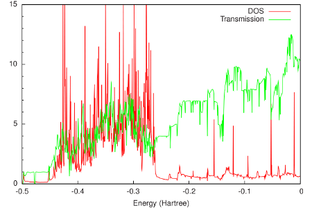

.. _example green_Au: 

Example: Gold electrodes
========================

:download:`Download green_Au.run <../../../examples/adf/green_Al/green_Au.run>`

In this example of *green*, the self-energies are calculated of gold electrodes, the material most often used in molecular electronics. In  :ref:`the example for the Benzenedithiol junction<example green_BDT>` these self-energies will be used to calculate the DOS and transmission of a benzenedithiol junction. The geometry of the electrodes is shown in Fig. 1. 

Figure 1: Geometry of the gold contact used in the calculation of the self-energy. The lead consists of two surface layers, left (red) and right (blue), and a bulk layer (green). Each principal layer in turn consists of three atomic layers. This should be sufficient to ensure that the Hamiltonian of the central (green) layer is a bulk Hamiltonian. 

The final results are shown in the following figure: 

From this figure it can be seen that around the Fermi energy (-0.2 Hartree), both the DOS and the transmission of gold are relatively constant. This feature makes gold an attractive material for electrodes, since one can expect that the transmission of a molecular junction will be dominated by the molecular properties. 

.. literalinclude :: ../../../examples/adf/green_Al/green_Au.run
   :language: bash
