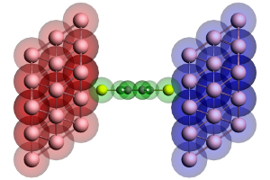
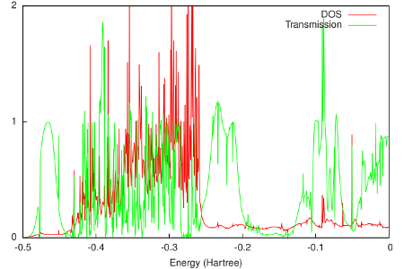

.. _example green_BDT: 

Example: Benzenedithiol junction
================================

:download:`Download green_BDT.run <../../../examples/adf/green_Al/green_BDT.run>`

In this example of *green*, the DOS and transmission of a benzenedithiol molecule between gold electrodes is calculated. The calculation uses the self-energies obtained in  :ref:`the example for the gold electrodes<example green_Au>`. Note that this is a relatively expensive calculation. 

First a fragment of the isolated molecule is constructed. 
Next the molecule is sandwiched between the electrodes in the configuration of Fig. 2. For this the fragment of the principal layer obtained in  :ref:`the example for the gold electrodes<example green_Au>` is needed. 

Figure 2: Geometry of the extended molecule used in the calculation of a benzenedithiol junction. The molecule is shown in green, while the left and right contact regions are shown in red and blue, respectively. Note that the red region corresponds to the blue surface layer in Figure 1 of :ref:`the example for the gold electrodes<example green_Au>` and vice versa. 

The final results are shown in the following figure: 

The Fermi energy of the electrodes is -0.2 Hartree (see  :ref:`the example for the gold electrodes<example green_Au>`). This is just above the HOMO of the molecular junction. Consistent with literature, the HOMO and lower orbitals are combined into a broad peak just below the Fermi energy, while the LUMO is much sharper and situated about 2 eV above the Fermi energy. 

The current can be calculated by integrating the transmission around the Fermi energy. At low temperatures this means that the differential conductance is equal to the transmission times the quantum of conductance. 

.. literalinclude :: ../../../examples/adf/green_Al/green_BDT.run
   :language: bash
