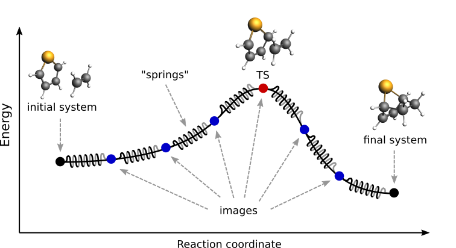

.. index:: NEB
.. index:: Nudged elastic band

.. _NEB:

Nudged Elastic Band (NEB)
*************************

The Nudged Elastic Band (NEB) method [#ref1]_ can be used to find a reaction path and the transition state between a reactant and a product state.

  Pictorial representation of a reaction path computed with NEB

At the beginning of a NEB calculation, the geometry of the initial and final systems are optimized to minimize their energy (unless the :ref:`OptimizeEnds <ams-key-NEB>` option is set to False).

Then, a rough approximation of the reaction path is build: a set of *images* is created by performing a linear interpolation between the **initial** and **final** systems. Optionally, an **intermediate** system can be provided, in which case the interpolation is performed between the initial and intermediate systems, and then between the intermediate and final systems.

Finally, a reaction path is found by performing a simultaneous optimization of all the images. In the NEB method the images are not independent from each other. The force on each image depend on its neighboring images: at each step the forces parallel to the reaction path are eliminated and a so-called spring force is added that tries to keep each image in the middle between its neighbors. This does not let images slide to the initial or final reaction state and ensures that they are evenly distributed along the reaction path.  

During the NEB path optimization, a climbing image algorithm is used to drive the highest-energy image in the path to the transition state (unless the :ref:`Climbing <ams-key-NEB>` option is set to False).

Be aware that NEB is a computationally expensive method, typically involving hundreds if not thousands of energy and gradients evaluations.

.. seealso::

  * :ref:`examples NEB`
  * `GUI Nudged Elastic Band tutorial <../../Tutorials/StructureAndReactivity/NEB.html>`__

.. _NEB_input:

Input
=====

A NEB calculation in AMS is triggered by setting the ``Task`` to ``NEB``: 

::

    Task NEB

The NEB method requires two or three input systems. The first, unnamed system is used as the **initial system** and the system called ``final`` is used as a **final system**. These two systems are mandatory. This is an example of system-definitions for a HCN isomerization reaction:

.. code-block:: none

  Task NEB

  # This is the initial system:
  System
     Atoms
        C   0.0000   0.0000   0.0000
        N   1.1800   0.0000   0.0000
        H   2.1960   0.0000   0.0000
     End
  End

  # This is the final system (note the header 'final' in the next line):
  System final
     Atoms
        C   0.0000   0.0000   0.0000
        N   1.1630   0.0000   0.0000
        H  -1.0780   0.0000   0.0000
     End
  End

Optionally, a third system, called ``intermediate``, can be used to provide a better approximation for the transition state. The intermediate system will be placed in the middle of the chain. When providing three input systems it may be a good idea to optimize the ends in advance and set :ref:`OptimizeEnds <ams-key-NEB>` to False to prevent creating an unbalanced reaction path.

Note that not only the atomic coordinates, but also the lattice parameters and the charge (if non-zero) must be set for all input systems.

.. important::

  The order in which atoms are specified in the ``System%Atoms`` blocks **must be the same for the initial and final systems** (if you provide an intermediate system, you must use a consistent atom-ordering for that too). The order of the atoms must be consistent because the images-interpolation algorithm maps the n-th atom of the initial system to the n-th atom of the final system.

All NEB-specific options are specified in the NEB input block:

.. scmautodoc:: ams NEB
   :onlysummary:

All keys of the NEB block have reasonable defaults or are optional. Thus, in principle, the NEB block can be omitted altogether. These are the main options:

.. scmautodoc:: ams NEB Images Iterations Spring Skewness Climbing ClimbingThreshold InterpolateInternal InterpolateShortest OptimizeEnds Restart ReOptimizeEnds
   :nosummary:
   :noref:
   :skipblockdescription:

The following keys are related to solid-state NEB (SS-NEB):

.. scmautodoc:: ams NEB OptimizeLattice Jacobian MapAtomsToCell
   :nosummary:
   :noref:
   :skipblockdescription:

At each iteration, the images may be computed in parallel. The parallel execution is normally configured completely automatically, but users can override the automatic parallelization using the keys in the ``Parallel`` block.

.. scmautodoc:: ams NEB Parallel
   :nosummary:
   :noref:
   :skipblockdescription:

The following keys modify other aspects of the NEB and should, in principle, be left to their defaults:

.. scmautodoc:: ams NEB DoubleNudge OldTangent
   :nosummary:
   :noref:
   :skipblockdescription:

Frozen atom constraints
=======================

It is possible to perform NEB with part of the system frozen, using any of the following keys of the Constraints block or a combination thereof:

.. scmautodoc:: ams Constraints Atom AtomList FixedRegion
   :nosummary:
   :noref:
   :skipblockdescription:

Note: the frozen atom constraints will be enforced both during the geometry optimizations of the initial and final systems and during the NEB optimization.

Optimizations and convergence criteria
======================================

The NEB path is optimized using a limited-memory BFGS (l-BFGS) method where the system being optimized is a union of all NEB images with their respective molecular and spring forces. 

The NEB convergence thresholds are defined in the :ref:`GeometryOptimization%Convergence block <GO_convergence>`. NEB is considered converged when the following criteria are satisfied: 

- the change in the highest image energy must be less than [GeometryOptimization%Convergence%Energy]
- the max atomic force component for the highest image must be less than [GeometryOptimization%Convergence%Gradients]
- the max atomic force component for all other images must be less than ten times the [GeometryOptimization%Convergence%Gradients] value. 

If the optimization of the initial NEB end point fails to converge, you can try using the :ref:`FIRE optimization method <GeometryOptimizationMethods>`.

Output
======

Results are printed to the text output and stored in the binary result file 'ams.rkf'. In the 'ams.rkf' file, NEB calculation results are stored in the History section just like in a normal geometry optimization. The NEB section of the RKF file contains additional, NEB-specific, information. 

The NEB reaction path can be visualized using the **AMSmovie GUI module**.

Troubleshooting
===============

* In case the geometry optimization of the initial and final systems fails: try using the :ref:`FIRE optimization method <GeometryOptimizationMethods>`
* In case the optimization of the NEB path does not converge:

  * make sure that the order in which the atoms are defined is consistent between the initial and final systems (see the *important* note in the :ref:`NEB input section <NEB_input>`)
  * try increasing the number of :ref:`NEB images <ams-key-NEB>`
  * try tweaking the :ref:`TrustRadius <L-BFGS>` or :ref:`TrialStep <L-BFGS>` options (see :ref:`L-BFGS`) 
  * try specifying an **intermediate** system

.. only:: html

  .. rubric:: References

.. [#ref1] \G. Henkelman, B.P. Uberuaga and H. Jonsson, *A climbing image nudged elastic band method for finding saddle points and minimum energy paths*, `Journal of Chemical Physics 113, 9901 (2000) <https://doi.org/10.1063/1.1329672>`__ 
