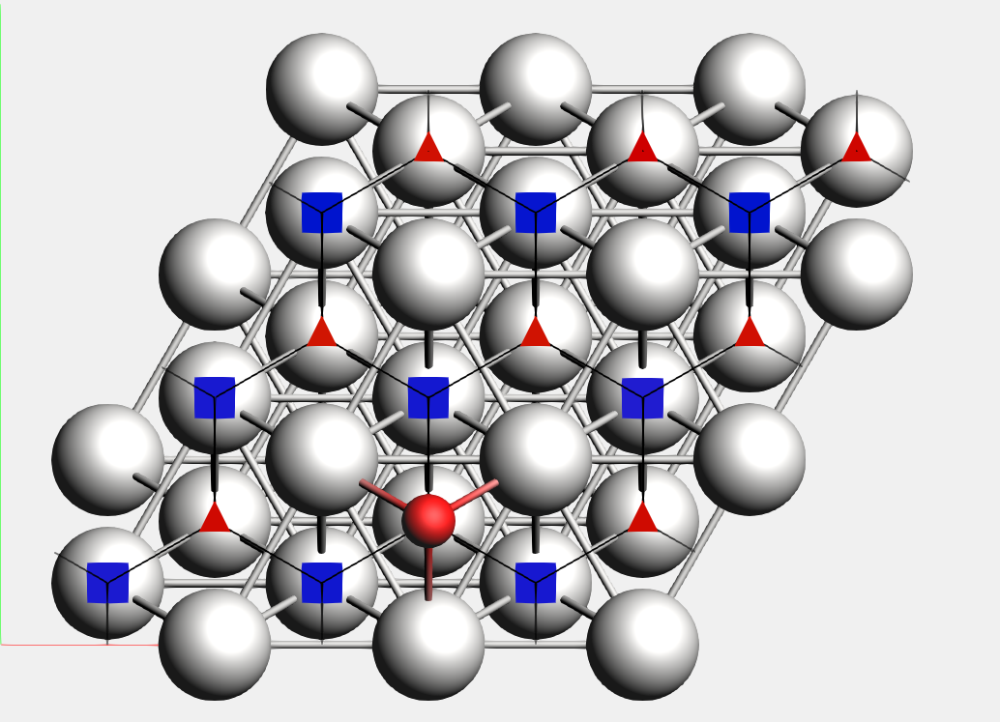

.. _EON:
.. index:: Automated PES exploration
.. index:: EON

Automated PES Exploration
*************************

In chemistry and materials science, two types of Potential Energy Surface (PES) critical points are of particular interest: local minima and (first-order) saddle points.

The ``PESExploration`` task consists of a set of algorithms (which we will refer to as *jobs*) that will automatically explore the PES of a given system, looking for local minima and saddle points.

The available PES exploration jobs are:

:ref:`Process Search <ProcessSearch>`
    A composite method for finding escape mechanisms from a state. This will find both local minima and saddle points.

:ref:`Basin Hopping <BasinHopping>`
    A Monte Carlo method for finding local minima.

:ref:`Saddle Search <SaddleSearch>`
    A single-ended method for finding nearby saddle points.

:ref:`Landscape Refinement<LandscapeRefinement>`
    Given a pre-calculated Energy Landscape, re-optimize local minima and saddle points using a different computational engine/settings.

:ref:`Binding Sites<BindingSites>`
    Given a pre-calculated Energy Landscape, compute the binding sites.

The AMS driver links to the client program of the `EON software package <http://theory.cm.utexas.edu/eon/index.html>`_ [#EON_paper]_ and uses its implementation of the dimer method.
EON is developed by the University of Texas at Austin and the University of Iceland.
See also the :ref:`required_citations` section.

.. seealso::

   * PES Exploration GUI tutorials:

     * |hydrohalogenation_tutorial|
     * |cluster_growth_tutorial|
     * |water_dissociation_tutorial|

   * Examples:

     * :ref:`example BasinHopping_Ar13`
     * :ref:`example ProcessSearch_alanine`
     * :ref:`example BindingSites_O+Pt111`

Overview
--------

While many details of a PES exploration calculation depend on the specific :ref:`job <main_PES_Exp_input>` selected, some aspects are common to all PES explorations jobs. Here we give a brief overview of a typical PES exploration, using a Process Search job as example.

A PES exploration calculation generally consists of multiple *expeditions*, each with several *explorers*.

*Explorers* are given an initial structure, and their goal is to find a nearby critical point (a local minimum, a saddle point or both).
The explorer moves around the PES by modifying the atomic positions of the system and by using the specified :ref:`Engine <engines>` to compute energy and gradients.

An *expedition* is a collection of *explorers* all starting from the same point on the PES.

Before setting off for the first expedition, the input structure is optimized and added to the *Energy Landscape*, which is the database of all interesting points found during the exploration (see the section :ref:`EnergyLandscape` for more details).

Starting from this initial structure, a number of PES explorers (3 in the diagram below) will set off in random directions exploring the potential energy surface and looking for nearby critical points.

.. image:: ../images/PESExplorationCartoon1.png
   :width: 85 %
   :align: center

Explorers have "stop conditions" (e.g. a maximum number of steps or a maximum energy above the starting point) so in general not all explorers will successfully find a critical point. In this case, only one of the explorers found relevant critical points: a saddle point and a local minimum. These newly found critical points are added to the Energy Landscape.

After the first expedition is over, the program will start with the second expedition. The starting point for the next expedition will be a randomly chosen local minimum from the list of minima present in the Energy Landscape (the possible starting points for an exploration are called *seed states*. See also the :ref:`DynamicSeedStates <main_PES_Exp_input>` option).

In this example, the starting point of the second expedition is the new local minimum found during the first expedition. A new set of explorers will set off in random directions from this point.

In the diagram above, one of the explorer found a saddle point that was already found in a previous exploration. This structure will not be added to Energy Landscape since it was already *seen* before (see the :ref:`PESExpStructureComparison` section for more details). The newly found critical points are added to the Energy Landscape.

Usually, many expeditions and/or many explorers are needed to map the PES, but you should keep in mind that the computation time of the calculation will roughly be proportional to the product ``NumExpeditions x NumExplorers``.

By having many explorers you will have a higher chance of comprehensively mapping the PES near the starting point of each expedition. By having many expeditions, you will have a higher chance of traveling further away from the initial structure.

It should be emphasized that the PES exploration task is stochastic in nature, as it uses random numbers to perform initial-displacements. This means that if you run the same calculation twice you might find different critical points.

.. It can be useful to run many exploration

.. _main_PES_Exp_input:

Job selection and main options
------------------------------

To use one of the PES Exploration procedures you should set the :ref:`Task <ams-key-Task>` to ``PESExploration`` and specify one of the jobs in the ``PESExploration%Job`` key::

   Task PESExploration

   PESExploration
      Job [ProcessSearch | BasinHopping | SaddleSearch | LandscapeRefinement | BindingSites]
   End

The input options for the various jobs are described in the corresponding sections: :ref:`Process Search <ProcessSearch>`,
:ref:`Basin Hopping <BasinHopping>`, :ref:`Saddle Search <SaddleSearch>`, :ref:`Landscape Refinement<LandscapeRefinement>`, :ref:`Binding Sites <BindingSites>`.

It is then important pick an appropriate number of expeditions and explorers. Having many expeditions and explorers will result in a more comprehensive PES exploration, but since the computation time will roughly be proportional to the product ``NumExpeditions x NumExplorers`` you'll need to find an appropriate balance.

.. scmautodoc:: ams PESExploration NumExpeditions NumExplorers DynamicSeedStates

The following miscellaneous input option generally apply to most PES exploration calculations:

.. scmautodoc:: ams PESExploration WriteHistory Temperature FiniteDifference
   :noref:

.. _EnergyLandscape:

Results: the "Energy Landscape"
-------------------------------

The results of a PES Exploration are the structures and energies of the critical points found.
There are multiple ways for you to inspect the results:

* The energy landscape can be visualized using the ``AMSMovie`` GUI module (In AMSMovie: ``File → Open`` and select the ``ams.rkf`` file of your calculation). See the GUI tutorials (e.g. |hydrohalogenation_tutorial|) for more details.
* The results are printed to the text output under the header ``Final Energy Landscape``, see :ref:`below <EnergyLandscapeOnTextOutput>`.
* The results are stored on the ``ams.rkf`` binary results file in the section ``EnergyLandscape``
* In `PLAMS <../../plams/index.html>`__, you can use the `get_energy_landscape <../../plams/interfaces/ams.html#scm.plams.interfaces.adfsuite.ams.AMSResults.get_energy_landscape>`__ method of the  ``AMSResults`` object to conveniently extract the results.

.. _EnergyLandscapeOnTextOutput:

Results on the text output
^^^^^^^^^^^^^^^^^^^^^^^^^^

These are printed at the end of the text output under the header ``Final Energy Landscape``. Here is an output example for a ProcessSearch job for the simple HCN molecule (computed with the DFTB engine):

.. code-block:: none

  ----------------------
  Final Energy Landscape
  ----------------------

        Id        Energy(a.u.)         RE(eV)   RE(kcal/mol)    Counts    Crit. point
     --------------------------------------------------------------------------------
         1           -5.782789        0.00000         0.0000         4            Min
         2           -5.748792        0.92510        21.3334         4            Min
         3           -5.689025        2.55143        58.8375         4             TS  1 <--> 2

  Number of configurations                             3
  Number of local minima                               2
  Number of transition states                          1
  Energy range (a.u.)                           0.093763
  Energy range (eV)                              2.55143
  Energy range (kcal/mol)                        58.8375

  Configurations
  --------------
  3
  Id 1 Energy(hartree)     -5.78278852 isTS=False
  H       -5.05604362312999       1.04394551246415       0.36836337958238
  C       -4.06812264817497       0.95005534859126      -0.01533183100739
  N       -3.00601476684712       0.84907755770632      -0.42810754191928
  3
  Id 2 Energy(hartree)     -5.74879169 isTS=False
  H       -4.01886309319822       1.09046314142766       1.01610923624838
  C       -4.06910389782095       0.79751242545583      -1.12016730790896
  N       -4.04221404713293       0.95510285187825       0.02898207831626
  3
  Id 3 Energy(hartree)     -5.68902502 isTS=True
  H       -4.51488871821561       1.04261603660424       0.52096081259126
  C       -4.32990923520194       0.88203060069718      -0.58636688911847
  N       -3.28538308473452       0.91843178146029      -0.00966991681712

From this you can see that 3 critical points were found: 2 minima (``Id 1`` and ``Id 2``) and 1 transition state (``Id 3``) connecting the first two states (indicated by ``1 <--> 2``).

Under ``Counts`` you can see how many times each state was encountered during the exploration (often the same state is found multiple times) See the :ref:`PESExpStructureComparison` section for more details on how states are compared.

``RE`` is the "relative energy" with respect to the lowest-energy state found.

Under the header ``Configurations`` you will find the XYZ geometries (in Angstrom) corresponding to the various critical points.

.. _LoadEnergyLandscape:

Continue a PES exploration from a previous calculation
------------------------------------------------------

You can load an Energy Landscape obtained from PES exploration calculation and use it as starting point for a new PES exploration. In this way you can extend your Energy Landscape, and potentially use different PES exploration algorithms.

To load a previously computed energy landscape, use the ``PESExploration%LoadEnergyLandscape%Path`` option (note: you should still provide an input system in the :ref:`System <SystemDefinition>` block even if you are loading a previous Energy Landscape. The input system will be optimized and added to the energy landscape as a minimum).

It is often convenient to load only some of the states from a previous calculation; this can be done via the ``Remove`` or ``KeepOnly`` input options. Specify the seed states with the ``SeedStates`` option.

These are all the input options related to the loading an Energy Landscape:

.. scmautodoc:: ams PESExploration LoadEnergyLandscape
   :noref:
   :skipblockdescription:

.. _PESExpTroubleshooting:

Troubleshooting
---------------

The PES exploration in AMS is quite sensitive to noise on the potential energy surface.
A too noisy PES may result in bad convergence of the individual explorers, or states being rejected because their :ref:`PES point character <PESPointCharacterization>` is not the expected one.

In case of problems we therefore advise to set engine options that result in a smoother PES.
Often this can be accomplished by setting the ``NumericalQuality`` keyword in the engine input.

Especially the `ReaxFF <../../ReaxFF/ReaxFFEngine.html>`__ engine has a rather noisy PES by default, which may cause problems in a PES exploration job.
Please refer to the ReaxFF manual for advice on how to smoothen the ReaxFF potential energy surface:

* `ReaxFF manual: Smoothened potential energy surface <../../ReaxFF/ReaxFFEngine.html#smoothened-potential-energy-surface>`__
* `ReaxFF manual: Geometry optimization issues <../../ReaxFF/Troubleshooting.html#troubleshooting-geoopt>`__

.. _PESExpStructureComparison:

Structure comparison
--------------------

During a PES exploration some critical points will most likely be encountered more than once.

Whenever a critical point is found, the program will ask itself: is this a new structure, or have I already encountered this before?
If the structure was not seen before (i.e. it's a novel configuration), it will be added to the list of structures found during the exploration.
If the structure was already found before, the program will simply increase a counter keeping track of how many times a specific structure was found during the PES exploration.

When deciding if two structures are the same or not, the program will compare both the geometry and the energy of the two configurations. Several parameters and thresholds can be tweaked in the ``PESExploration%StructureComparison`` block to tell AMS under which conditions two systems should be considered equal.

.. scmautodoc:: ams PESExploration StructureComparison
  :noref:
  :skipblockdescription:

.. _ProcessSearch:
.. index:: Process Search

Process Search job
------------------

Overview
^^^^^^^^

Process Search is a composite method for finding escape mechanisms from a state. Each PES explorer will perform the following steps:

* Starting from a minimum, a :ref:`SaddleSearch <SaddleSearch>` calculation is performed to find a nearby saddle point
* If a saddle point is found, two images are placed on either side of the saddle along the min mode.
* The two images are then minimized; one of the images is expected to fall back into the original minimum, while the other image is expected to end up in the product state on the other side of the saddle. If this is case, the product, TS and reactant states are added to the energy landscape.

The Process Search procedure will therefore not only find minima and saddle points, but it will also keep track of which minima each saddle point is connecting.

.. seealso::

  * GUI tutorials |hydrohalogenation_tutorial| and |water_dissociation_tutorial|.

Input options
^^^^^^^^^^^^^

To perform a Process Search calculation you should specify::

   Task PESExploration

   PESExploration
      Job ProcessSearch

      ProcessSearch
         # Options for the Process Search procedure. See description below.
      End

      SaddleSearch
         # Options for the Saddle Search part of the Process Search procedure.
      End
   End

The options for the saddle search part of a Process Search job are described in the  :ref:`SaddleSearch <SaddleSearch>` section.

Options specific to the Process Search procedure can be specified in the ``PESExploration%ProcessSearch`` block:

.. scmautodoc:: ams PESExploration ProcessSearch
   :noref:
   :skipblockdescription:

.. _SaddleSearch:
.. index:: Saddle Search

Saddle Search job
-----------------

Overview
^^^^^^^^

Saddle Search is a single-ended method for finding nearby saddle points.

In a Saddle Search calculation, each PES explorer starts by performing a random displacement from the initial geometry (or seed state). Then, starting from this point, the explorer searches for a nearby saddle point using a minimum-mode following method (the available min-mode following methods are dimer [#dimer_henkelman]_ [#dimer_heyden]_ [#dimer_kastner]_ and Lanczos [#lanczos]_).

If you already know which atoms are likely to be involved in the reactions, you can use the ``DisplaceAtomsInRegion`` option to nudge the Saddle Search procedure towards the right part of the PES (:ref:`regions <Regions>` can be specified in the :ref:`system input block <SystemDefinition>`, or via the "Model → Regions" panel in AMSinput).

Input options
^^^^^^^^^^^^^

To perform a Saddle Search calculation you should specify::

   Task PESExploration

   PESExploration
      Job SaddleSearch

      SaddleSearch
         # Options for the Saddle Search procedure. See description below.
      End
   End

Options for the Saddle Search procedure can be specified in the ``PESExploration%SaddleSearch`` block.

Note: these options also affect the Saddle Search part of :ref:`Process Search Jobs <ProcessSearch>`.

.. scmautodoc:: ams PESExploration SaddleSearch
   :noref:
   :skipblockdescription:

.. index:: Basin Hopping
.. _BasinHopping:

Basin Hopping job
-----------------

Overview
^^^^^^^^

Basin hopping [#basin_hopping]_ is an iterative Monte Carlo method for PES exploration and global minimization.

An "iteration" in basin hopping consists of the following steps:

1. The atomic coordinates of the system are randomly perturbed (the details of this random perturbation can be configured via the keywords ``Displacement``, ``DisplacementDistribution``, ``SingleAtomDisplace``, ``SwapProbability``. See :ref:`below <basin_hopping_input>` for more details).
2. A local optimization of the randomly perturbed structure is performed (see also the :ref:`EONOptimizer` section)
3. The new optimized structure is accepted or rejected based of its energy (if the energy of the newly optimized structure lower than the lowest energy so far, the new structure is readily accepted. Otherwise it is accepted with probability :math:`e^{(-\Delta E / kT)}` where :math:`\Delta E` is the difference between the energy at the previous iteration and the current energy, :math:`T` is temperature specified in the ``PESExploration%Temperature`` keyword, see :ref:`main_PES_Exp_input`).

By iteratively performing these steps, the basin hopping procedure explores the highly-dimensional configuration space of the system, looking for the global minimum and finding local minima along the way. The number of iteration can be specified via the ``Steps`` keywords (see :ref:`below <basin_hopping_input>` for more details).

For a more comprehensive PES exploration, AMS can perform several expeditions (potentially with several explorers for each expedition) in a single calculation. See the ``NumExpeditions`` and ``NumExplorers`` keywords in the :ref:`main_PES_Exp_input` section for more details.

.. seealso::

  * :ref:`example BasinHopping_Ar13`
  * GUI tutorials |cluster_growth_tutorial| and |water_dissociation_tutorial|.

Input options
^^^^^^^^^^^^^

To perform a Basin Hopping calculation you should specify::

   Task PESExploration

   PESExploration
      Job BasinHopping

      Temperature float

      BasinHopping
         # Options for the Basin Hopping procedure. See description below.
      End
   End

The ``PESExploration%Temperature`` keyword is described in the :ref:`main_PES_Exp_input` section.

.. _basin_hopping_input:

The following input keywords are specific to Basin Hopping procedure:

.. scmautodoc:: ams PESExploration BasinHopping
   :noref:
   :skipblockdescription:

.. index:: Landscape Refinement
.. _LandscapeRefinement:

Landscape Refinement
--------------------

The ``LandscapeRefinement`` Job can be used to re-optimize the critical points (local minima and saddle points) found in a previous PES exploration calculation using a different engine or different engine settings.

Since PES exploration calculations can be computationally demanding, a possible strategy is to first perform a PES exploration using either a fast engine or computationally cheap settings for the engine of choice, and then to *refine* the energy landscape obtained using a more accurate (and computationally more expensive) method.

.. seealso::

   Check the `tutorial <../../Tutorials/StructureAndReactivity/PESExpHydrohalogenation.html#refining-an-energy-landscape-at-a-higher-level-of-theory>`__ on automated reaction pathway discovery for hydrohalogenation. There the landscape refinement is used to go from the DFTB level of theory to DFT.

The ``LandscapeRefinement`` job needs a previously computed Energy Landscape. See the section :ref:`LoadEnergyLandscape` for more details.

To perform a Landscape Refinement calculation you should specify::

   Task LandscapeRefinement

   PESExploration
      Job LandscapeRefinement

      LoadEnergyLandscape
        Path path/to/previous/calculation/ams.results
      End
   End

.. warning::

  If you perform a LandscapeRefinement of an Energy Landscapes obtained with :ref:`ProcessSearch <ProcessSearch>` job, the connections between TS and minima are **NOT** recomputed.

  Lets say, for example, that after a ProcessSearch calculation using DFTB we found a TS connecting minima with ``Id`` ``3`` and ``4``. After a LandscapeRefinement using a different engine (for example ADF) it is no longer assured that the refined TS will still connect the same two minima.

  When you visualize a refined energy landscape using AMSmovie, be aware that some of the connections might be incorrect.

.. index:: EON Optimizer
.. _EONOptimizer:

Optimizer
---------

Geometry optimizations are performed for most PES Explorations job types. In the ``PESExploration%Optimizer`` block you may configure some of the parameters for these geometry optimizations:

.. scmautodoc:: ams PESExploration Optimizer
   :noref:
   :skipblockdescription:

.. index:: Binding Sites Detection
.. _BindingSites:

Binding Sites
-------------

Binding sites can be determined from an Energy Landscape.

When computing binding sites you will first need to define a **reference region**, which typically will be a surface or a cluster (:ref:`regions <Regions>` can be specified in the :ref:`system input block <SystemDefinition>`, or via the "Model → Regions" panel in AMSinput). AMS will then go though all the local minima of Energy Landscape and mark as 'binding sites' the positions where an atom of an adsorbed molecule is neighboring atoms in the reference region.

For instance, in :ref:`example BindingSites_O+Pt111`, the platinum surface is the reference region, while the oxygen atom is the adsorbate. In the picture below, you can see the oxygen binding sites on the platinum 111 surface (the two different types of binding sites are marked by a blue square and a red triangle respectively).

Lines connecting the the binding sites will be drawn if 1) there is a transition state connecting two local minima associated to these binding-sites (notice that may there are multiple local minima associated with the same binding site), and 2) there is at least an atom (from the adsorbate region) that changes its position from the first binding site to the second one mediated by the same transition state described above. In this process, AMS will align as much as possible all local minima and transition states to the input’s file structure but ignoring the atoms in the region adsorbate trying to establish a common reference frame (see also the ``StatesAlignment`` input block below).

.. seealso::

  * :ref:`example BindingSites_O+Pt111`
  * |cluster_growth_tutorial|

Input options
^^^^^^^^^^^^^

There are two distinct ways of triggering the computation of binding sites. You can either:

compute the binding sites at the end of a :ref:`Process Search <ProcessSearch>`, :ref:`Basin Hopping <BasinHopping>` or :ref:`Landscape Refinement<LandscapeRefinement>` calculation by setting the ``PESEXploration%BindingSites%Calculate`` option to ``yes``::

    PESEXploration
      Job [ProcessSearch | BasinHopping | LandscapeRefinement]

      BindingSites
        Calculate Yes
      End

      StatesAlignment
        ReferenceRegion reference_region_name
      End
    End

**or**

compute the binding sites by setting the ``PESExploration%Job`` to ``BindingSites`` and load a previously computed Energy Landscape (see :ref:`example BindingSites_O+Pt111`)::

    PESEXploration
      Job BindingSites

      LoadEnergyLandscape
        Path path/to/previous/calculation/ams.results
      End

      StatesAlignment
        ReferenceRegion reference_region_name
      End
    End

The following input options are related to the calculation of binding sites:

.. scmautodoc:: ams PESExploration BindingSites
   :noref:
   :skipblockdescription:

The following input options are related to the definition of the reference region and alignment thereof:

.. scmautodoc:: ams PESExploration StatesAlignment
   :noref:
   :skipblockdescription:

References
----------

.. [#EON_paper] Samuel T Chill, Matthew Welborn, Rye Terrell, Liang Zhang, Jean-Claude Berthet, Andreas Pedersen, Hannes Jónsson and Graeme Henkelman *EON: software for long time simulations of atomic scale systems*, `Modelling Simul. Mater. Sci. Eng. 22 055002 (2014) <https://doi.org/10.1088/0965-0393/22/5/055002>`__

.. [#basin_hopping] David J. Wales and Jonathan P. K. Doye *Global Optimization by Basin-Hopping and the Lowest Energy Structures of Lennard-Jones Clusters Containing up to 110 Atoms*, `J. Phys. Chem. A 1997, 101, 28, 5111–5116 <https://doi.org/10.1021/jp970984n>`__

.. [#dimer_henkelman] G.\  Henkelman and H. Jónsson, *A dimer method for finding saddle points on high dimensional potential surfaces using only first derivatives*, `J. Chem. Phys. 111, 7010-7022 (1999) <http://dx.doi.org/10.1063/1.480097>`__

.. [#dimer_heyden] A.\  Heyden, A.T. Bell, and F.J. Keil *Efficient methods for finding transition states in chemical reactions: Comparison of improved dimer method and partitioned rational function optimization method*, `J. Chem. Phys. 123, 224101 (2005) <http://dx.doi.org/10.1063/1.2104507>`__

.. [#dimer_kastner] J.\  Kästner and P. Sherwood *Superlinearly converging dimer method for transition state search*, `J. Chem. Phys. 128, 014106 (2008) <http://dx.doi.org/10.1063/1.2815812>`__

.. [#lanczos] R.\  Malek and N. Mousseau, *Dynamics of Lennard-Jones clusters: A characterization of the activation-relaxation technique*, `Phys. Rev. E 62, 7723 (2000) <http://dx.doi.org/10.1103/PhysRevE.62.7723>`__

.. |hydrohalogenation_tutorial| replace:: `Automated reaction pathway discovery for hydrohalogenation <../../Tutorials/StructureAndReactivity/PESExpHydrohalogenation.html>`__

.. |cluster_growth_tutorial| replace:: `Cluster Growth: Cobalt Clusters <../../Tutorials/StructureAndReactivity/PESExpClusterGrowthCo8.html>`__

.. |water_dissociation_tutorial| replace:: `Water dissociation on an oxide surface <../../Tutorials/StructureAndReactivity/PESExpWaterDissociationOnZnO.html>`__
