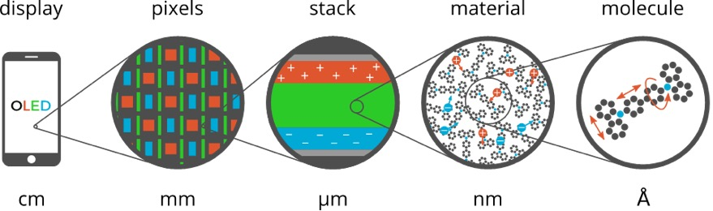

.. _OLEDWorkflows:

OLED workflows
**************

Starting with the 2022 release of the Amsterdam Modeling Suite we include a set of *workflow scripts* for multiscale OLED modeling.
These workflows are developed and validated in close `collaboration <https://www.scm.com/news/multiscale-oled-modeling-collaboration-with-simbeyond/>`__ with `Simbeyond <https://simbeyond.com>`__ to bridge the gap between ab-initio atomistic modeling of OLED molecules with AMS, and device level kinetic Monte Carlo simulations using Simbeyond's `Bumblebee code <https://simbeyond.com/bumblebee>`__.
Together with Simbeyond, we attempt to provide a fully integrated multiscale simulation platform for the digital screening and prediction of successful OLED materials and devices.

The Amsterdam Modeling Suite implements the atomistic simulation part of this multiscale toolchain in the form of two workflow scripts:

.. raw:: html

   

      
   

* :ref:`Deposition <OLEDDeposition>`
   The first step simulates the growth of a thin film in a :ref:`molecular dynamics <MolecularDynamics>` and :ref:`force-bias Monte Carlo <fbMC>` calculation mimicking physical vapor deposition.

* :ref:`Properties <OLEDProperties>`
   In the second step the morphology resulting from the deposition is used to obtain the distributions (and possibly spatial correlations) of molecular properties such as ionization potential, electron affinity and exciton energies at the DFT level.
   Each molecule's environment is taken into account in a polarizable QM/MM scheme using the `DRF model <../../ADF/Input/DIM-QM.html#DRF>`__.

The output of the :ref:`Properties <OLEDProperties>` workflow is an :ref:`HDF5 file <OLEDPropertiesOutput>` containing a summary of the results for a material.
This file can be opened in `AMSview <../../GUI/AMSview.html>`__ for a visualization of the results, but also directly imported into Simbeyond's `Bumblebee code <https://simbeyond.com/bumblebee>`__ to use it in simulations at the device level.

This manual page describes the technical details and options of the OLED workflow scripts.
For a more hands-on introduction, you may want to start with the GUI tutorial, that will guide you through the entire workflow using the hole transport material alpha-NPD as an example

.. seealso::

  `Tutorial on multiscale modeling of OLED devices <../../Tutorials/OpticalPropertiesElectronicExcitations/OLEDMaterials.html>`__

.. note::

   The OLED workflow scripts use `ADF <../../ADF/index.html>`__, `DFTB <../../DFTB/index.html>`__, and the `ForceField <../../ForceField/index.html>`__ engine. You will therefore need a license for these components in order to use the workflows.

.. _OLEDDeposition:

Deposition
----------

The deposition workflow implements a series of mixed :ref:`molecular dynamics <MolecularDynamics>` and :ref:`force-bias Monte Carlo <fbMC>` calculations to simulate the growth of a thin film with physical vapor deposition.

.. _OLEDDepositionCycles:

.. raw:: html

   

      <video width="100%" muted controls src="https://nextcloud.scm.com/index.php/s/EfqQRLE5ZgxfDty/download"></video>
      
Deposition of <a class="reference external" href="https://pubchem.ncbi.nlm.nih.gov/compound/1_3-Bis_N-carbazolyl_benzene">mCP</a>

   

Basically the :ref:`molecule gun<MDAddMolecules>` in the is used to shoot molecules at the substrate. Upon reaching the surface, the :ref:`force-bias Monte Carlo <fbMC>` method is used to accelerate the search for favorable adsorption sites. This process is repeated until a thin film of a user defined thickness has grown on the substrate.

To make this process computationally more efficient, the deposition happens in so called "cycles". At the end of each deposition cycle, the bulk material at the bottom of the growing film is "trimmed off" and stored. Only the two top layers (each about 10 Å thick) are transfered to the next deposition cycle, where the lower of the two layers is frozen. This ensures that the trimmed off parts of the system fit perfectly together when the system is reassembled in the end of the simulation. By depositing in cycles we avoid simulating a lot of bulk material and are able to make the total computational cost linear in the thickness of the deposited film.

At the end of the simulation the layer deposited by the individual cycles are stacked and a short :ref:`molecular dynamics <MolecularDynamics>` calculation on the entire film is used to anneal it from the deposition temperature down to 300K at ambient pressure.

An entire deposition with 6 dosition cycles (and the final equilibration to room temperature) is shown in the video on the right.

Basic input
^^^^^^^^^^^

The minimal input to the deposition workflow just specifies what to deposit:

.. code-block:: bash

   #!/bin/sh

   DEPOSITION_JOBNAME=myDeposition $AMSBIN/oled-deposition << EOF

   Molecule
      SystemName myMol
   End

   System myMol
      ...
   End

   EOF

The ``Molecule`` block is only really used when depositing mixed molecule materials, e.g. host-guest systems. This will be explained in a :ref:`separate section <OLEDMixtureDeposition>` below. For a single molecule deposition there should just be one ``Molecule`` block that references the only ``System`` block by name via the ``SystemName`` keyword, as shown in the example above.

The ``System`` block used by the OLED deposition script closely follows the ``System`` block in the input for the AMS driver, but supports only a subset of the keywords:

.. scmautodoc:: ams System Atoms GeometryFile BondOrders
   :noref:
   :nosummary:

Just like in the AMS driver, as an alternative to the ``System`` block, you an also use the ``LoadSystem`` block to :ref:`load a system <LoadSystem>` directly from a ``.rkf`` file of a previous calculation.

.. _OLEDSystemBlock:

The deposition workflow uses the `ForceField <../../ForceField/index.html>`__ engine for the :ref:`molecular dynamics <MolecularDynamics>` simulation of the physical vapor deposition.
In order to also support the deposition of metal containing compounds, we use the UFF force field with the `UFF4MOF-II <https://doi.org/10.1021/acs.jctc.6b00664>`__ parametrization for the deposition.
As with any calculation with the `ForceField <../../ForceField/index.html>`__ engine you may manually provide (UFF4MOF-II) atom-types, atomic charges and bond orders in the input file::

   System
     Atoms
        C  [...]  ForceField.Type=C_R  ForceField.Charge=-0.1186
        N  [...]  ForceField.Type=N_R  ForceField.Charge=-0.2563
        H  [...]  ForceField.Type=H_   ForceField.Charge=+0.1021
        [...]
     End
     BondOrders
        1 2 1.0
        1 5 1.5
        1 6 1.5
        [...]
     End
   End

Whatever is not specified in the input will automatically be determined: the input system is optimized with ADF using the S12g exchange-correlation functional with a TZP basis set.
At the optimized geometry, the `Charge Model 5 <../../ADF/Input/Results_Output.html#charge-model-5>`__ is used to calculate the atomic charges, while the rounded `Nalewajski-Mrozek bond orders <../../ADF/Input/Results_Output.html#bond-order-analysis>`__ determine the topology.
See the `ADF manual <../../ADF/Input/Advanced_analysis.html#advanced-charge-density-and-bond-order-analysis>`__ for details on the calculation of charges and bond orders.
Finally, using the topology determined by the calculated bond orders, the `automatic UFF atom-typing <../../ForceField/Atom_typing_behaviour.html#uff>`__ that is built into the `ForceField <../../ForceField/index.html>`__ engine is used to determine the atom-types.

If you want to make sure the correct atom-types and bonds are used in your calculation, we recommend building the system in AMSinput, where you can visually check the bond orders and atom-types to make sure they are correct.
The result can then be exported into a file as a ``System`` block via **File → Export coordinates → .in**.
For the atomic charges we recommend relying on the automatic calculation with ADF. (Just make sure the ``ForceField.Charge`` suffixes are not included in the atom block. Their absence will trigger the automatic charge calculation with ADF.)

By default a box of 60 x 60 x 120 Å is deposited. The first two dimensions give the surface area of the deposited layer, while the third dimension is the thickness of the layer.
The size of the deposited box can be changed using the ``Size`` keyword in the ``Box`` block::

   Box
      Size 60 60 120
   End

.. scmautodoc:: oled-deposition Box Size
   :nosummary:

With sizes typical for molecules used in OLED devices, the default box size results in a deposition of ~500 molecules.
Note that the computational time of a deposition scales linearly with the thickness of the layer, but quadratically with the surface area.
This is because a larger area requires both the deposition of more molecules to fill the box, but also makes each MD step more expensive as more molecules have to be simulated at the same time.
When increasing the thickness of the layer, molecules at the bottom are first frozen, and later removed from the simulation altogether, giving an overall linear scaling.

The temperature at which the deposition is performed can be configured in the ``Deposition`` section.

.. scmautodoc:: oled-deposition Deposition Temperature

Finally, there are a couple more technical options in the ``Deposition`` section, that we suggest to leave at their default values.

.. scmautodoc:: oled-deposition Deposition Frequency TimeStep ConstrainHXBonds NumMolecules
   :noref:

.. _OLEDDepositionOutput:

Output
^^^^^^

Running the ``oled-deposition`` workflow script creates a single directory in which you can find all results of a deposition.
By default this directory is named ``deposition.workdir``, but in order to avoid name clashes, that location can be changed with the ``DEPOSITION_WORKDIR`` environment variable, similar to ``AMS_JOBNAME`` for the AMS driver. The example below will collect all results in the directory ``myMol.workdir``:

.. code-block:: bash

   #!/bin/sh

   DEPOSITION_WORKDIR=myMol $AMSBIN/oled-deposition << EOF
   ...
   EOF

Let us go through all files and folders in the working directory in the order in which they are created.

Firstly, the working directory contains a ``logfile``.
The contents of the logfile are identical to what you see on standard output when running the ``oled-deposition`` workflow.

The deposition workflow starts with a couple of calculations on single molecules in vacuum. Each of them runs in a separate folder, in which you can find the usual :ref:`AMS output files <AMS_output>` (such as ``ams.rkf``)::

   dft_opt/
   ff_opt/
   equilibrate_ff_input_molecule/

The ``dft_opt`` directory contains the results of the initial geometry optimization with ADF, which is used to determine the atomic charges and bond orders if these were not specified in the input. The ``ff_opt`` directory contains the results of a subsequent geometry optimization using the `ForceField <../../ForceField/index.html>`__ engine with the UFF4MOF-II forcefield. In this step the atom-types are determined if they were not specified in the input already. Finally in the ``equilibrate_ff_input_molecule`` directory a short MD simulation at the deposition temperature is performed to equilibrate the molecule to the desired temperature. We suggest visualizing the trajectory of this equilibration in AMSmovie to make sure the molecule does not undergo unexpected conformational changes that could be caused by wrong atom-types or bonds. If the molecule behaves strangely (or falls apart) at this point, one may need to go back and :ref:`assign atom-types and bonds manually <OLEDSystemBlock>` in the input.

When :ref:`depositing mixtures <OLEDMixtureDeposition>` you will see multiple instances of the three directories above: one for each
deposited species.

Once all the preparatory work is done, the actual :ref:`deposition cycles <OLEDDepositionCycles>` each write a folder and (upon completion of the cycle) two files::

   depo_cycle_1/
   depo_box.1.in
   depo_box.1.xyz

You can follow the progress of your deposition by opening the ``ams.rkf`` in the last ``depo_cycle_*/`` directory.
The ``depo_box.*.in`` and ``depo_box.*.xyz`` files contain the entire morphology deposited so far: by visualizing them in order you can watch your material grow!

.. important::

   The files with the ``.in`` extension contain the System geometry in form of a :ref:`System block <SystemDefinition>`. This format contains bond orders, force field atom-types as well as atomic charges. It can be opened in AMSinput and PLAMS and should be the preferred format when working with the OLED workflow scripts in AMS. The ``.xyz`` file is in :ref:`extended XYZ format <ExtendedXYZ>` does *not* contain that extra information. Always use a ``.in`` file when transferring a system from one script to the next, e.g. when going from the OLED deposition to the OLED :ref:`properties workflow <OLEDProperties>`.

Once all molecules have been deposited the entire box is annealed from the deposition temperature down to room temperature. This creates one directory and (upon completion) a ``.in`` and ``.xyz`` file containing the annealed morphologies::

   equilibrate_box/
   equil_box.in
   equil_box.xyz

The last step is to take the room temperature morphology and perform a geometry optimization on it.
This essentially removes all thermal vibrations and results in a geometry that is relaxed at the force field level.
As you might expect, the last step also produces a folder and (upon completion) a ``.in`` and ``.xyz`` file::

   optimize_box/
   opt_box.in
   opt_box.xyz

It is up to the user to decide whether to continue to the OLED :ref:`properties workflow <OLEDProperties>` with the morphology from ``equil_box.in`` (equilibrated to 300K) or ``opt_box.in`` file (fully relaxed). (We recommend using the fully relaxed morphology though.)

.. _OLEDMixtureDeposition:

Deposition of host-guest materials
^^^^^^^^^^^^^^^^^^^^^^^^^^^^^^^^^^

A deposition of host-guest materials can easily be done by specifying multiple ``Molecule`` and ``System`` blocks in the input. The following runscript generates a 95% to 5% mixture (by number of molecules) of two compounds:

.. code-block:: bash

   #!/bin/sh

   DEPOSITION_JOBNAME=host_guest $AMSBIN/oled-deposition << EOF

   Molecule
      SystemName myHost
      PartialPressure 0.95
   End
   Molecule
      SystemName myGuest
      PartialPressure 0.05
   End

   System myHost
      ...
   End
   System myGuest
      ...
   End

   EOF

The partial pressures are unitless and only the relative ratios between the different molecules matter.

.. scmautodoc:: oled-deposition Molecule

You can have an arbitrary number of ``Molecule`` blocks in your input to deposit multi-component mixtures. Obviously, the box your are depositing must be large enough that it still contains at least a few molecules of the rarest component.

Note that multiple ``Molecule`` and ``System`` blocks can also be used to deposit different conformers of the same compound. While conformational changes can in principle happen over the course of the MD simulation, it may be a good idea to deposit a mixture of conformers directly if their geometries are very different.

Deposition of interfaces
^^^^^^^^^^^^^^^^^^^^^^^^

By default the deposition will use a single graphene layer as a substrate.
The graphene layer is removed after the first :ref:`deposition cycle <OLEDDepositionCycles>` and will not be included in the output morphologies, i.e. the ``.in`` files in the :ref:`working directory <OLEDDepositionOutput>`.
Note that the graphene layer is **not** present in the annealing of the entire morphology from deposition temperature to 300K, which is performed at the end of the workflow.
The result of this is that both the bottom and top of the deposited thin-film by default represents an interface between the material and a vacuum.

Instead of depositing on a clean graphene sheet, the deposition workflow also supports custom substrates.
This is intended to be used for depositing a thin film of one material on top of another material and allows users to study the interface between the two.
A custom substrate is set up using the ``Substrate`` and ``SubstrateSystem`` keys in the ``Box`` block.

.. scmautodoc:: oled-deposition Box Substrate SubstrateSystem
   :noref:

Here the value of the ``SubstrateSystem`` refers to a named ``System`` block in the input, representing the geometry of the substrate. The following example shows how to deposit a molecule B on top of a substrate of molecule A:

.. code-block:: bash

   #!/bin/sh

   DEPOSITION_JOBNAME=molB_on_molA $AMSBIN/oled-deposition << EOF

   Molecule
      SystemName molB
   End
   System molB
      ...
   End

   Box
      Size 0 0 240
      Substrate Custom
      SubstrateSystem molA_substrate
   End

   System molA_substrate
      Atoms
         ...
      End
      BondOrders
         ...
      End
      Lattice
         ...
      End
   End

   EOF

The contents of the block ``System molA_substrate`` should be obtained by first running a deposition of molecule A: just use the ``System`` block found in e.g. the ``equil_box.in`` file of that deposition as the custom substrate for the next job.
(Note that no attempt will be made to automatically determine atomic charges, bond orders, or force-field atom types for the molecules in the substrate.
Taking the ``System`` block from the results of an earlier deposition is the easiest way ensure you are using exactly the same bonds, atom types and charges for the substrate molecules in the new calculation.)

Note that the ``Box%Size`` in the x- and y-direction is ignored when using a custom substrate: the size of the custom substrate is used instead. The thickness of the layer can be set manually when using a custom substrate, but it needs to accommodate both the already existing substrate as well as the newly grown film on top. Assume that the thickness of the substrate film is 120 Å in the example above. By setting the the z-value of the ``Box%Size`` to 240 Å, we will have space to accomodate the substrate and then grow another layer of 120 Å thickness on top of it. Note that while the default graphene layer is *removed* from the morphology, a custom substrate will be *included* in the morphology.

.. _OLEDDepositionRestart:

Restarting a deposition
^^^^^^^^^^^^^^^^^^^^^^^

The OLED workflow scripts are based on the `PLAMS <../../plams/index.html>`__ scripting framework.
As such it can rely on the `PLAMS rerun prevention <../../plams/components/jobmanager.html#rerun-prevention>`__ to implement restarting of interrupted depositions.

The easiest way to restart a deposition is to include the ``--restart`` (or short: ``-r``) command line flag:

.. code-block:: bash

   #!/bin/sh

   DEPOSITION_JOBNAME=myDeposition $AMSBIN/oled-deposition --restart << EOF
   ...
   EOF

This first (interrupted) run will have created the ``myDeposition.workdir`` directory. Running the above script again will move that directory to ``myDeposition.workdir.res`` and reuse all successful jobs from the first run. (People already familiar with PLAMS will recognize that this works just like the ``-r`` flag on the `PLAMS launch script <../../plams/started.html#restarting-failed-script>`__.) Note that this does not restart the previous deposition precisely at the point where it was interrupted. Instead it restarts from the beginning of the last :ref:`deposition cycle <OLEDDepositionCycles>`.

When running a deposition workflow on a batch system such as SLURM, you may want to consider always including the ``--restart`` flag in your runscript. It is not a problem if there are no previous results to restart from, but in case your job gets interrupted and automatically rescheduled, the ``--restart`` flag will make sure that it continues (approximately) where it stopped.

There is also the ``RestartWorkdir`` keyword in the input file::

   #!/bin/sh

   DEPOSITION_JOBNAME=newDepo $AMSBIN/oled-deposition << EOF

   RestartWorkdir oldDepo.workdir

   ...

   EOF

.. scmautodoc:: oled-deposition RestartWorkdir
   :nosummary:

While this can be used to accomplish the same thing the ``--restart`` flag would do, its best use is to specify a ``RestartWorkdir`` of a previous deposition of the same molecules. This can save you the initial step of doing the DFT calcultions in order to determine the atomic charges and bonds. A perfect use it when you have already :ref:`deposited a mixture<OLEDMixtureDeposition>`, and later decide to change the ratio between the compounds: by specifying the working directory of the first deposition the initial DFT calculations can be skipped entirely.

.. _OLEDProperties:

Properties
----------

The properties workflow is used to obtain distributions (and possibly spatial correlations) of molecular properties such as ionization potential, electron affinity and exciton energies from the morphology.
To accomplish this, it will perform DFT calculations on all individual molecules from the morphology, taking their environment into account in QM/MM calculation.

**The exact workflow (with all default settings) is as follows:**

1. For each molecule in the box, do a quick DFT calculation with `LDA <../../ADF/Input/Density_Functional.html#lda>`__ and a `DZP basis <../../ADF/Input/Basis_sets_and_atomic_fragments.html>`__ and use the `MDC-D charge model <../../ADF/Input/Results_Output.html#multipole-derived-charges>`__ to determine atomic charges. These charges will be used for the electrostatic part of the embedding potential in the next step.

.. raw:: html

   

      <video width="100%" muted loop controls src="https://nextcloud.scm.com/index.php/s/SzxtRSGqmfmzBMz/download"></video> 
      
<a class="reference external" href="https://pubchem.ncbi.nlm.nih.gov/compound/1_3-Bis_N-carbazolyl_benzene">mCP</a> in 15 Å environment

   

2. For each molecule in the box:

   * Determine which other molecules to consider as the environment. By default all molecules within 15 Å (atom-atom distance) are considered.
   * Individually, for neutral molecule, cation, and anion:
      * Optimize geometry of central QM molecule in frozen MM environment using `GFN1-xTB <../../DFTB/DFTB_Model_Hamiltonian.html#extended-tight-binding-xtb>`__ and UFF4MOF-II with `electrostatic embedding <../../Hybrid/EngineOptions.html#qm-mm>`__ in the `Hybrid engine <../../Hybrid/index.html>`__.
      * Do a DFT single point on the optimized geometry using `PBE <../../ADF/Input/Density_Functional.html#gga>`__ and an all-electron `TZ2P basis <../../ADF/Input/Basis_sets_and_atomic_fragments.html>`__. The environment is taked into account using a polarizable `DRF embedding <../../ADF/Input/DIM-QM.html>`__. (For the neutral systems `exciton energies <../../ADF/Input/Excitation_energies.html>`__ and transition dipole moments are also computed with `TD-DFT <../../ADF/Input/Time-dependent_DFT.html>`__.)
   * Calculate the (approximately) adiabatic ionization potential and electron affinity from the differences in total energy with respect to the neutral system.

3. For all pairs of neighboring molecules (within 4 Å atom-atom distance of each other) calculate the electron and hole `charge transfer integrals with GFN1-xTB <../../DFTB/Charge_transfer_integrals.html#transferintegrals>`__.

What is described above is the workflow with all default settings.
Various aspects of this (such as the ranges) can be tweaked from the input, see the :ref:`Settings section <OLEDPropertiesInput>` below.

Basic input
^^^^^^^^^^^

The simplest possible input for the ``oled-properties`` workflow script is just a single ``System`` block.

.. code-block:: bash

   #!/bin/sh

   $AMSBIN/oled-properties << EOF

   System
      Atoms
         ...
      End
      Lattice
         ...
      End
     [BondOrders
         ...
      End]
   End

   EOF

Obviously, the ``Atoms`` and ``Lattice`` blocks are required, while the ``BondOrders`` block is optional.
If the bond orders are present, they will be used to determine which parts of the system are connected, which ultimately determines which sets of atoms are considered distinct molecules.
If the ``BondOrders`` block is not present, the bonds will be guessed.
Since we only care about which atoms are bonded at all, and not on details such as the bond order, this should work quite reliably.

Nevertheless, if the morphology was obtained with the AMS :ref:`deposition workflow <OLEDDeposition>`, we can use the fact that it writes out the morphology as a ``.in`` file containing exactly the ``System`` block we need.
Basically, we use the ``System`` block from e.g. the ``opt_box.in`` output file of the deposition as the input for the properties script.

.. code-block:: bash

   #!/bin/sh

   $AMSBIN/oled-deposition << EOF
      ... see oled-deposition manual page ...
   EOF

   $AMSBIN/oled-properties < deposition.workdir/opt_box.in

This has the advantage that the bonds are guaranteed to be transferred without change between the two workflows.

.. _OLEDPropertiesOutput:

Output
^^^^^^

Working directory
~~~~~~~~~~~~~~~~~

Running the ``oled-properties`` workflow script creates a single directory in which you can find all results of the calculation.
By default this directory is named ``properties.workdir``, but in order to avoid name clashes, that location can be changed with the ``PROPERTIES_WORKDIR`` environment variable, similar to ``AMS_JOBNAME`` for the AMS driver. The example below will collect all results in the directory ``myMaterial.workdir``:

.. code-block:: bash

   #!/bin/sh

   PROPERTIES_WORKDIR=myMaterial $AMSBIN/oled-properties << EOF
   ...
   EOF

This will create the ``myMaterial.workdir`` directory with roughly the following internal structure::

   myMaterial.workdir/
   ├── logfile
   ├── atomic_charges
   │   ├── 0/
   │   │   ├── adf.rkf
   │   │   ├── ams.log
   │   │   └── ...
   │   ├── 1/
   │   │   ├── adf.rkf
   │   │   ├── ams.log
   │   │   └── ...
   │   └── .../
   └── properties/
       ├── relax_0/
       │   ├── ams.rkf
       │   ├── ams.log
       │   └── ...
       ├── 0/
       │   ├── adf.rkf
       │   ├── ams.log
       │   └── ...
       ├── relax_0_-1/
       │   ├── ams.rkf
       │   ├── ams.log
       │   └── ...
       ├── 0_-1/
       │   ├── adf.rkf
       │   ├── ams.log
       │   └── ...
       ├── relax_0_1/
       │   ├── ams.rkf
       │   └── ...
       ├── 0_1/
       │   ├── adf.rkf
       │   ├── ams.log
       │   └── ...
       ├── .../
       └── summary.hdf5

The ``atomic_charges`` directory contains the results from the intial pass over all molecules, in which the atomic charges are determined with a quick DFT calculations.
These charges are later be used for the electrostatic part of the embedding.
The directory will be missing if you did not use ``DFT`` as the setting for the ``Embedding%Charges`` keyword.

The ``properties`` directory contains the results from the second pass over all molecules.
The first number in the name of the subdirectories is again the ID of the molecule (starting from zero).
This is followed by the total charge for the calculations on the ions.
The QM/MM geometry optimizations used to obtain approximate equilibrium structures follow the same naming scheme, with the added ``relax_`` prefix.
If you choose not to relax (ion) geometries by setting the ``Relax`` keyword to ``None`` (or ``Neutral``), the ``relax_*`` folders (or at least some of them) may be missing.

.. _OLEDPropertiesHDF5:

Data on the HDF5 file
~~~~~~~~~~~~~~~~~~~~~

I addition to the full output of all individual calculations, you will also get a small `HDF5 file <https://en.wikipedia.org/wiki/Hierarchical_Data_Format>`__ called ``summary.hdf5`` containing a summary of the results of your calculations.
These are generally just the results that are usually interesting for the design of OLED materials, such as site energies, exciton energies, (transition) dipole moments, etc.
This file can be imported into Simbeyond's `Bumblebee code <https://simbeyond.com/bumblebee>`__ to use your calculated material in a device level kinetic Monte Carlo simulation.
The following groups and datasets can be found on the HDF5 file.
Note that all arrays on the HDF5 file are indexes starting from zero.

The ``species`` group contains information about the different molecular species making up the morphology.
There are two arrays in the ``species`` group whose size is equal to the number of different species (``numSpecies``):

``species.name``
   An array of human readable names identifying the molecular species making up the morphology. Currently this is just the molecular formula in `Hill notation <https://en.wikipedia.org/wiki/Chemical_formula#Hill_system>`__.

``species.smiles``
   An array of `SMILES <https://en.wikipedia.org/wiki/Simplified_molecular-input_line-entry_system>`__ strings for the different molecular species. May contain a dummy value in case the determination of the SMILES string from the 3D structure fails for a species.

The ``molecules`` group contains the complete geometrical description of the morphology.
It contains a number of arrays, (almost) all of which have the total number of molecules (``numMolecules``) as their size:

``molecules.species``
   An array of integers containing the species a molecule in for of an index into the arrays in the ``species`` group.

``molecules.lattice``
  (3 x 3) array containing the lattice vectors in Ångstrom.

``molecules.position``
  (``numMolecules`` x 3) array containing the center of mass positions of all molecules in Ångstrom. Note that all center of mass poisitions are within the parallelepiped spanned by the lattice vectors, i.e. all fractional coordinates are in the [0,1] range.

``molecules.atoms``
   This is an ``numMolecules`` sized 1D array, where each element itself is an array of ``string,float,float,float`` tuples representing ``symbol,x,y,z``. The x, y and z coordinates are given in Ångstrom.

``molecules.bonds``
   This is an ``numMolecules`` sized 1D array, where each element itself is an array of ``int,int,float`` tuples representing ``atom1,atom2,bondOrder``. Here ``atom1`` and ``atom2`` are indices into the corresponding element of the ``molecules.atoms`` array. The ``bondOrder`` is a floating point number, where the value of ``1.5`` is used to represent an aromatic bond.

The site energies are contained in the ``energies`` group on the HDF5 file:

``energies.IP``
   A ``numMolecules`` sized array containing the first ionization potential for each molecule in eV.

``energies.EA``
   A ``numMolecules`` sized array containing the first electron affinity for each molecule in eV.

``energies.HOMO``
   A ``numMolecules`` sized array containing the Kohn-Sham orbital energy of the highest occupied orbital in eV. If requested via the ``NumAdditionalEnergies`` keyword in the :ref:`input <OLEDPropertiesInput>` of the properties workflow, more arrays of this type (``HOMO-1``, ``HOMO-2``, ...) may exist and contain the orbital energies of lower lying occupied orbitals.

``energies.LUMO``
   A ``numMolecules`` sized array containing the Kohn-Sham orbital energy of the lowest unoccupied orbital in eV. If requested via the ``NumAdditionalEnergies`` keyword in the :ref:`input <OLEDPropertiesInput>` of the properties workflow, more arrays of this type (``LUMO+1``, ``LUMO+2``, ...) may exist and contain the orbital energies of higher lying virtual orbitals.

Similarly the exciton energies (in eV) can be found in the ``exciton_energies`` group. If the calculation of exciton energies was disabled by setting ``NumExcitations`` to ``0`` in the :ref:`input <OLEDPropertiesInput>`, this information is not present.

``exciton_energies.S1``
   Energies of the first excited singlet state (S1) with respect to the ground state. Higher singlet excitation energies may be found in more arrays of this type (``S2``, ``S3``, ...) if their calculation was requested by setting ``NumExcitations`` to a value larger ``1``.

``exciton_energies.T1``
   Energies of the first excited triplet state (T1) with respect to the ground state. Higher triplet excitation energies may be found in more arrays of this type (``T2``, ``T3``, ...) if their calculation was requested by setting ``NumExcitations`` to a value larger ``1``.

Static dipole moments and transition dipole moments (in Debye) can be found in their respective groups:

``static_multipole_moments.dipole_moment``
  (``numMolecules`` x 3) array containing the dipole moment vectors for each molecule.

``transition_dipole_moments.S1_S0``
  (``numMolecules`` x 3) array containing the transition dipole moment vectors for the S0 → S1 transition for each molecule. Transition dipole moments for higher singlet excitations may be found in more arrays of this type (``S2_S0``, ``S3_S0``, ...) if their calculation was requested by setting ``NumExcitations`` to a value larger ``1``.

If the calculation of transfer integrals is requested with the ``TransferIntegrals%Type`` key in the :ref:`input <OLEDPropertiesInput>`, the ``pairs`` and ``transfer_integrals`` groups will also be available on the HDF5 file, containing the following datasets:

``pairs.indices``
   A (``numPairs`` x 2) array of integers containing the molecule indices for all pairs of molecules that were considered close enough to trigger the calculation of transfer integrals between them.

``transfer_integrals.electron``
   A ``numPairs`` sized array containing the transfer integral (in eV) for electrons between each pair.

``transfer_integrals.hole``
   A ``numPairs`` sized array containing the transfer integral (in eV) for holes between each pair.

Accessing the HDF5 file
~~~~~~~~~~~~~~~~~~~~~~~

The easiest way to view the data from the HDF5 file is to open it in the GUI using the `AMSview <../../GUI/AMSview.html>`__ module.
There you can easily plot histograms of all the calculated properties, but also visualize the spacial distribution of the properties.

For more custom built analysis, the HDF5 file can easily be opened from Python using the `h5py <https://www.h5py.org/>`__ library, which is included in the `AMS Python Stack <../../Scripting/Python_Stack/Python_Stack.html>`__.
The following code snippet shows how to calculate the mean and standard deviation of the ionization potential:

.. code:: python

   import h5py

   with h5py.File("summary.hdf5", "r") as f:
      IPs = f['energies']['IP'].value
      print("IP = ", IPs.mean(), "±" , IPs.std())

The above snippet is only suitable for calculations of pure compounds, as we are calculating the mean and standard deviation over *all* molecules, not taking their species into account.
For :ref:`mixtures <OLEDMixtureDeposition>` calculating these properties *per species* would be much more useful.
This can easily be accomplished by using an appropriate mask on the ``IPs`` array for the calculation of mean and standard deviation:

.. code:: python

   import h5py
   import numpy as np

   with h5py.File("summary.hdf5", "r") as f:
      IPs        = f['energies']['IP'].value
      speciesIDs = f['molecules']['species'].value

      for specID, specName in enumerate(f['species']['name']):
            mask = (speciesIDs==specID) & (~np.isnan(IPs))
            print(specName)
            print("IP = ", IPs[mask].mean(), "±" , IPs[mask].std())

Note how we also use the mask to exclude all ``NaN`` elements in the array from the calculation of the mean and standard deviation.
Occasional ``NaN`` values in the arrays on the HDF5 file indicate that a property could not be calculated for a molecule because the job for it crashed or failed in some other way.
This is not a problem as long as it happens only rarely, but the ``NaN`` values need to be excluded from the analysis.

Parallelization
^^^^^^^^^^^^^^^

As you can imagine, the properties workflow is computationally quite expensive. After all, we are doing hundreds of (TD-)DFT calculations on relatively large molecules.
Luckily all the calculations on the different molecules are independent from each other, and can therefore run in parallel.
The workflow scripts supports different methods of parallelization through the ``JobRunner`` keyword.

.. scmautodoc:: oled-properties JobRunner
   :nosummary:

Local job execution
~~~~~~~~~~~~~~~~~~~

The simplest option (``local``) is to run the job on the machine that also executes the workflow script itself.
This is a good option if you have access to a powerful machine with many CPU cores, on which you can run jobs directly (i.e. not through a batch system).
By default 4 cores will be used for the execution of each job, and enough jobs will be run in parallel to saturate the entire machine::

   JobRunner local:*,4

See above for a detailed description of the ``local`` option.

Job submission to a batch system
~~~~~~~~~~~~~~~~~~~~~~~~~~~~~~~~

If you have access to a cluster through a batch system, it is also an option to run the workflow scripts and the actual jobs on different machines.
The workflow script then **submits** the individual jobs to the batch system and waits for them to finish.
(Under the hood, this is based on the `PLAMS GridRunner <../../plams/components/runners.html#remote-job-runner>`__.)
The workflow script itself can then either run under a `terminal multiplexer <https://en.wikipedia.org/wiki/Terminal_multiplexer>`__ (e.g. `GNU screen <https://en.wikipedia.org/wiki/GNU_Screen>`__) on the login node of the cluster, or be submitted as a simple 1 core job to the batch system.
Note that it is *essential* that the workflow script keeps running until all jobs have finished, as the summary of the results into the :ref:`HDF5 file <OLEDPropertiesHDF5>` only happens when all jobs have finished.
You will have to specify used batch systems, as well as the command used for the job submission with the ``JobRunner`` keyword.
This gives you a lot of flexibility and allows to efficiently use the computational resources at hand.
The following example will submit 4 core, single node jobs to either the ``mars``, ``jupiter`` or ``saturn`` queue of a cluster, requesting 2 gigabytes of memory per used CPU core, with a maximum wall-time of 4 hours per job::

   JobRunner slurm:sbatch -p mars,jupiter,saturn -N 1 -n 4 --mem-per-cpu=2G --time=04:00:00

The downside of this approach is that **each** job for an individual molecule might be waiting in the batch system's queue before starting.

Note that it is currently not possible to submit the workflow script and molecule jobs together as a single, large job to a batch system. In other words it is *not* possible to request a large allocation from the batch system once, and then run the workflow script and all jobs within that allocation. (Support for this needs to be added to the `PLAMS library <../../plams/index.html>`__, which will happen in the future.)

.. _OLEDPropertiesInput:

Additional settings
^^^^^^^^^^^^^^^^^^^

The OLED properties workflow script has a few options that determine what properties will be calculated and/or written to the :ref:`HDF5 file <OLEDPropertiesHDF5>` file::

   NumAdditionalEnergies integer
   NumExcitations integer
   TransferIntegrals
      Cutoff float
      Metric [CoM | Atoms | Atoms_noH]
      Type [None | DFTB]
   End

.. scmautodoc:: oled-properties NumAdditionalEnergies
   :nosummary:
.. scmautodoc:: oled-properties NumExcitations
   :nosummary:
.. scmautodoc:: oled-properties TransferIntegrals
   :nosummary:

There are also a few options to tweak some aspects of the workflow.
We have not properly tested their effect on the results.
When changing these options, verify your results against calculations using all default settings.

::

   Embedding
      Charges [DFTB | DFT]
      Cutoff float
      Metric [CoM | Atoms | Atoms_noH]
      Type [None | DRF]
   End
   Relax [None | Neutral | All]
   OccupationSmearing [None | Ions | All]

.. scmautodoc:: oled-properties Embedding
   :nosummary:
.. scmautodoc:: oled-properties Relax
   :nosummary:
.. scmautodoc:: oled-properties OccupationSmearing
   :nosummary:

The ``oled-properties`` workflow supports both the ``-r/--restart`` command line flag and the ``RestartWorkdir`` keyword. They work exactly the same way as for the ``oled-deposition`` workflow, see :ref:`above <OLEDDepositionRestart>`.

.. scmautodoc:: oled-properties RestartWorkdir
   :nosummary:
