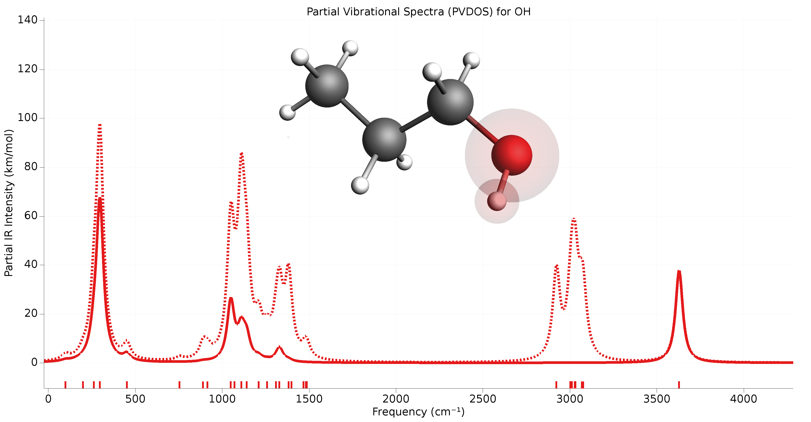

.. _PESVibrations:
.. index:: Vibrational spectroscopy

Vibrational Spectroscopy
########################

General
=======

The starting point is the Hessian of the system, being the second derivative of the energy with respect to the atomic coordinates.

The eigenvalues of the Hessian are the frequencies and the eigen vectors are the normal modes.

As the calculation of the full Hessian is very expensive there are several ways to avoid it, so that you only get a part of the full spectrum, or only modes for a region of the system, see :ref:`IR frequencies and normal modes <IRFrequencies>` section.

A full, partial, or approximate Hessian in itself can be useful for a (Hessian-based) geometry optimization or a transition state search.

Vibrational spectra are obtained by differentiating a property along the normal modes at a (local) minimum of the PES. So for spectra you need to optimize the geometry first, otherwise you get negative frequencies.

The Normal modes and or vibrational spectra can be requested via the ``Properties`` block

.. scmautodoc:: ams Properties NormalModes Raman VROA VCD Phonons
   :noref:
   :onlysummary:

When requesting the normal modes, the IR intensities are calculated, as they are very cheap.

.. seealso::

  `Tutorials on Vibrational Spectroscopy <../Tutorials/VibrationalSpectroscopy/index.html>`__

Where are the results?
----------------------

Because the results of a vibrational spectroscopy calculation
are tied to a particular point on the
potential energy surface, they are found on the :ref:`engine output
files<engine_output_files>`. Note also that the properties are not always
calculated in every PES point that the AMS driver visits during a calculation.
By default they are only calculated in *special* PES points, where the
definition of special depends on the :ref:`task<Tasks>` AMS is performing: For
a :ref:`geometry optimization<GeometryOptimization>` properties would for
example only be calculated at the final, converged geometry. This behavior can
often be modified by keywords special to the particular running task.

.. _IRFrequencies:

.. index:: IR frequencies
.. index:: Normal modes

IR frequencies and normal modes
===============================

.. _AMSFullVibrationalAnalysis:

All vibrational Modes
---------------------

The calculation of the normal modes of vibration can be requested with:

.. scmautodoc:: ams Properties NormalModes
   :noref:
   :skipblockdescription:
   :onlysummary:

Typically used icw with :ref:`Task SinglePoint <SinglePoint>`, :ref:`Task GeometryOptimization <GeometryOptimization>`,
or :ref:`Task TransitionStateSearch<TransitionStateSearch>`.
In case of geometry optimization or transition state search the
normal modes will only be calculated at the final, converged geometry.

.. scmautodoc:: ams Properties NormalModes
   :skipblockdescription:
   :noref:
   :nosummary:

The molecular normal modes are normally calculated within the harmonic oscillation model.
If the molecule is in its equilibrium conformation, it sits in the lowest point
(at least locally) on the PES. The cross-section of the PES profile close to
this point can then be assumed to be approximately parabolic, such that the
second derivative of the energy w.r.t a nuclear coordinate can be interpreted
as a force constant for the harmonic oscillation of an atom along this
coordinate. Since molecular vibrations in polyatomics involve the simultaneous
displacement of multiple atoms, this harmonic oscillator model can be
generalized to multiple nuclear coordinates. The normal modes and their
frequencies then become eigenvectors and eigenvalues of a force constant
matrix, the Hessian:

.. math:: H_{ij} = \frac{\partial^2E}{\partial{}R_i\partial{}R_j}

The (non-mass-weighted) Hessian is saved in the engine result file as variable
``AMSResults%Hessian``. It is not printed to the text output. The column/row
indices are ordered as: x-component of atom 1, y-component of atom 1,
z-component of atom 1, x-component of atom 2, etc.

Most :ref:`engines<Engines>` cannot calculate the Hessian analytically. The
Hessian is then constructed column-wise through numerical differentiation of
the energy gradients w.r.t. each nuclear coordinate. AMS will set up 2
single-point calculations (1 for the positive displacement, 1 for the negative
displacement), and the requested engine will return the energy gradients at
these displacements. These gradients are calculated analytically for most
engines.

.. note::

   Numerical calculation of the full Hessian requires 6N single points calculation,
   which can take a considerable amount of time for large systems.
   A mode selective method can be a fast alternative,
   see :ref:`mode scanning<ModeScanning>`, :ref:`mode refinement<ModeRefinement>`,
   and :ref:`mode tracking<ModeTracking>`.

When requesting the normal modes calculation, integrated IR intensities are
simultaneously calculated during the finite differentiation steps when
constructing the Hessian (as long as dipole moments are supported by the
engine). These IR intensities are calculated from the numerical dipole
gradients:

.. math:: I_{IR} = \frac{N\pi}{3c^2}\sum_\alpha\Big(\sum_j\frac{\partial{}\mu_\alpha}{\partial{}R_j^m}Q_{j}^m\Big)^2

Where :math:`\alpha` denotes the x-,y- and z-components of the dipole moment
:math:`\mu`, and :math:`Q^m` is the mass-weighted vibrational normal mode.

The resulting IR spectrum can be visualized by opening the engine result file with AMSspectra.
The normal modes of vibration and the IR intensities are saved to the
:ref:`engine result file<engine_output_files>` in the ``Vibrations`` section.

.. note::

   The calculation of the normal modes of vibration needs to be done the
   system's equilibrium geometry. So one should either run the normal modes
   calculation using an already optimized geometry, or combine both steps into
   one job by using the :ref:`geometry optimization task<GeometryOptimization>`
   together with the ``Properties%NormalModes`` keyword.

Symmetry labels of the normal modes may be calculated if AMS uses symmetry in the calculation (key ``UseSymmetry``).
If symmetry is used, the normal modes are projected against symmetric displacements for each irrep. If that is not successful the symmetry label is 'MIX'.
Symmetry is only recognized if the geometry is (almost) perfectly symmetric and has a specific orientation in space. 
You can use the ``Symmetrize`` key in the :ref:`System block <ams-key-System>` to symmetrize and reorient the molecule. 
If the AMSinput GUI module is used, one can click the Symmetrize button (the star) and the GUI will try to symmetrize and reorient the molecule.

.. index:: ScanFreq
.. index:: Imaginary modes

Rescanning Imaginary modes
^^^^^^^^^^^^^^^^^^^^^^^^^^

.. _AutomaticModeScanning:

The ``ReScanModes`` keyword can be used to calculate more accurately frequencies of specific modes
after a normal modes calculation. It is identical to the ``ScanFreq`` option
that was available for older versions of ADF and BAND. 
Primarily used to identify spurious imaginary modes, and is on by default for this purpose.
See also the :ref:`Mode Scanning<ModeScanning>` task, which is an extension of this method, but which is not on by default.

.. scmautodoc:: ams NormalModes ReScanModes ReScanFreqRange
   :skipblockdescription:

.. index:: Symmetric displacements

Symmetric Displacements
-----------------------

.. index:: Raman-active vibrations

::

  NormalModes
     Displacements Symmetric
  End

Specify ``Displacements Symmetric`` to calculate the energy Hessian using finite differences in symmetry-adapted displacements, and the corresponding normal modes. 

.. scmautodoc:: ams NormalModes SymmetricDisplacements
   :noref:
   :skipblockdescription:
   :onlysummary:

If ``Type InfraRed`` or ``Type Raman`` is specified then only irreps that result in non-zero intensities for the corresponding spectroscopy will be included in the calculation. 
Using this feature may save a lot of time for large symmetric molecules by skipping calculation of normal modes that would not contribute to the spectrum anyway. 
If ``Type InfraRedAndRaman`` is specified then vibrations that have a non-zero IR or Raman intensity will be calculated. 
If ``Type All`` is specified then all vibrations will be calculated. For multi-dimensional irreps (such as E and T) only the first component will be computed. 
For any component beyond the first, the frequencies and intensities will be copied from the first one.

.. scmautodoc:: ams NormalModes SymmetricDisplacements
   :noref:
   :skipblockdescription:
   :nosummary:

.. warning::

   Specifying ``Type Raman`` alone does not trigger calculation of the Raman intensities. In order to calculate the Raman spectrum one should also specify ``Raman True``.

.. note::

   ``Displacements Symmetric`` will also produce a *3N*-by-*3N* Hessian matrix but if the Type key's argument is not ``All`` then this matrix will likely have many zero eigenvalues. 

.. _MBH: 
.. index:: Block normal modes 
.. index:: Mobile block Hessian 
.. index:: MBH 

Mobile Block Hessian (MBH)
--------------------------

::

  NormalModes
     Displacements Block
  End

Specify ``Displacements Block`` for the Block Normal Modes option (also known as **Mobile Block Hessian**, or **MBH** [#ref1]_ [#ref2]_).
MBH is useful when calculating vibrational frequencies of a small part of a very large system (molecule or cluster).  Calculation of the full spectrum of such a system may be inefficient and is unnecessary if one is interested in one particular part. Besides, it may be difficult to extract normal modes related to the interesting sub-system out of the whole spectrum. Using Block Normal Modes it is possible to treat parts of the system as rigid blocks. Each block will usually have only six frequencies related to its rigid motions compared to 3*N for when each atom of the block is treated separately.

MBH is suitable to calculate frequencies in partially optimized structures. Assume a geometry optimization is performed with the Block key in the Constraints input block [see constrained geometry optimizations]. During the geometry optimization, the shape of the block is not changed. The internal geometry of the block is kept fixed, but the block as a whole can still translate or rotate. 

At the end of such a partial geometry optimization, the position and orientation of the block is optimized, thus the total force on the block is zero. However, there might be still some residual forces within a block, since those degrees of freedom were not optimized. A traditional frequency calculation performed on this partially optimized structure might result in non-physical imaginary frequencies without a clear interpretation. Therefore one should use an adapted formulation of normal mode analysis: the Mobile Block Hessian method. MBH does not consider the internal degrees of freedom of the block (on which residual forces) apply, but instead uses the position/orientation of the block as coordinates. In the resulting normal mode eigenvectors, all atoms within the same block move collectively. 

Of course, MBH can also be applied on a fully optimized structure. 

**Accuracy**

.. scmautodoc:: ams NormalModes BlockDisplacements
   :noref:
   :skipblockdescription:

The second derivatives of the energy with respect to Cartesian displacements of the free atoms and those with respect to block motions (3 translation plus 3 rotations) are calculated by numerical differentiation of the gradient. The accuracy of the second derivatives is determined by the accuracy of the gradient evaluation and the step size in the numerical differentiation. The ``RadialDisplacement`` and ``AngularDisplacement`` parameters can be specified to set the step size for Cartesian displacements (translations) and block rotations respectively. The step size for angles is automatically scaled with the block size. 

.. note::

   Blocks should consist of at least 3 atoms (i.e. block of 1 or 2 atoms are not supported). 

.. [#ref1] A.\  Ghysels, D. Van Neck, V. Van Speybroeck, T. Verstraelen and M. Waroquier, *Vibrational Modes in partially optimized molecular systems*, `Journal of Chemical Physics 126, 224102 (2007) <https://doi.org/10.1063/1.2737444>`__ 

.. [#ref2] A.\  Ghysels, D. Van Neck and M. Waroquier, *Cartesian formulation of the Mobile Block Hessian Approach to vibrational analysis in partially optimized systems*, `Journal of Chemical Physics 127, 164108 (2007) <https://doi.org/10.1063/1.2789429>`__ 

.. index:: Mode scanning
.. _ModeScanning:

Mode Scanning
-------------

Mode Scanning can be used to obtain more accurate approximations for
properties obtained by numerical differentiation along the vibrational normal modes (frequencies, intensities, Raman, etc.), without changing the modes themselves. Mode Scanning is an extension of the frequency scanning options (``ScanFreq``) that were part of ADF and BAND in
earlier versions of the Amsterdam Modeling Suite. These latter options are still available as the ``ReScanModes`` keyword in the ``NormalModes`` block, if these are requested during a calculation.

* Primarily used to identify spurious imaginary modes.
* Improve numerical accuracy of normal mode properties.
* Rescanning modes using a different level of theory.

Theory
^^^^^^

Vibrational normal modes are usually obtained as eigenvectors of the Hessian
matrix. A common problem with this scheme however, is that due to numerical
errors in constructing this Hessian, low-frequency vibrations may be reported
to have imaginary frequencies instead. The Mode Scanning task allows for
re-calculation of the frequency of these modes. The Mode Scanning task does
not change the normal modes itself, only its properties. This Mode Scanning task allows you to confirm
whether reported imaginary frequencies are attributed to transition states or
whether they are simply due to numerical errors.

Given a user-supplied mode :math:`Q`, the frequency is calculated from the
force constant:

.. math:: k = \frac{\partial^2E}{\partial{}^2Q}

.. math:: \nu = \frac{1}{2\pi c}\sqrt{\frac{k}{\mu_r}}

This is again done by numerical differentiation of the energy gradients,
requiring AMS to set up 2 single point calculations per selected normal mode.
Integrated IR intensities are also calculated simultaneously (if dipole moments
are supported by the :ref:`engine<Engines>`):

.. math:: I_{IR} = \frac{N\pi}{3c^2}\sum_\alpha\Big(\frac{\partial{}\mu_\alpha}{\partial{}Q^m}\Big)^2

Where the derivative is with respect to the mass-weighted normal mode.

It is also possible to use this method to selectively re-calculate the normal
mode properties for different engine settings. This has two distinct uses:

* If the modes were originally generated using a finite difference method, a
  different stepsize can be used. For strong vibrations (high frequencies),
  large stepsizes may cause inaccuracies due to increasing anharmonic
  contributions. For weak vibrations (low frequencies) on the other hand,
  stepsizes can often be too small. The displacements associated with these
  vibrations are small, which can give incorrect sampling of the PES profile.
  This should be compensated for by choosing a larger stepsize. The stepsize
  can be set using the ``Displacement`` key.
* Users can also recalculate modes using higher levels of theory. Modes
  generated from a full frequency analysis using e.g. DFTB can be recalculated
  using e.g. LDA DFT to obtain more realistic integrated IR intensities. The
  method used for the single point calculations can be set in the :ref:`Engine
  block <engines>`.

Input
^^^^^

A numerical frequency calculation is performed by requesting the
``VibrationalAnalysis`` task with ``Type ModeScanning``::

   Task VibrationalAnalysis
   VibrationalAnalysis
      Type ModeScanning
      Displacement 0.001
      NormalModes
        ModeFile adf.rkf
        # select all modes with imaginary frequencies
        ModeSelect
           ImFreq true
        End
      End
   End

The Mode Scanning tasks uses only the ``NormalModes`` block for its input handling. Here, ``ModeFile`` specifies the AMS output file containing the normal modes for which you want to calculate the frequencies. The ``ModeSelect`` block is used to specify which of the modes in this file should be recalculated, since we are often only interested in a select few of them. A more detailed overview of this block is given in the section `Selecting Modes` on the :ref:`main page<ModeSelect>`. Finally, ``Displacement`` can be used to specify the stepsize (in Bohr) for the finite differences. The stepsize is provided for displacements along the Cartesian normal modes.

The Mode Scanning module is the main driving force for the :ref:`Mode Tracking
<ModeTracking>` and :ref:`Vibrational Mode Refinement <ModeRefinement>` tasks,
which provide more advanced options for refining not only the properties of the
modes, but also the modes themselves. Consult the relevant pages for more
information. Alternatively, a simplified version of Mode Scanning is available
which follows the old implementation in ADF and BAND (as the ``ScanFreq`` option).
This version can be enabled when doing a full frequency analysis by enabling the
``Properties%NormalModes`` keyword. See the 
:ref:`Full Analysis<AMSFullVibrationalAnalysis>` page for further details.

.. index:: Mode refinement
.. _ModeRefinement:

Mode Refinement
---------------

With this option you can improve the normal modes, by importing previously calculated modes and then applying a more accurate engine, or more accurate settings, typically for only part of the spectrum.
The vibrational Mode Refinement method not only refines frequencies from a previous calculation, but also
tries to correct the vibrational modes themselves.

* Refinement of spectral regions requires a sufficient number of
  modes in the basis to be accurate.
* 1-step refinement. No iterative improvement possible. (Unless followed by a
  separate Mode Tracking calculation.)
* Quality of the results depends on accuracy of the selected guess modes.

If we start from e.g. a
semi-empirical method such as in MOPAC, we can get approximations for the
vibrational modes. Mode Refinement then re-calculates part of the Hessian for a
subset of these modes using a more accurate method such as GGA DFT, and updates
the normal modes themselves to fit this more accurate method.  It is intended to
circumvent the expensive calculation of the Hessian if you are only interested
in a (small) part of the full spectrum. This is based on the method in reference
[#ref00]_.

Because the Mode Refinement method uses linear combinations of the guess modes,
its accuracy depends on the set of modes that is supplied.

* If we want to e.g. obtain a mode which includes a C=O stretch, then the
  initial set must contain a mode which has this C=O stretch, otherwise this
  cannot be included in the refined modes.
* If we are refining a region containing many similar modes, e.g. vibrations of
  aromatic ring backbones, and we only use part of this spectral region for the
  initial set, the set of refined modes will "drift" towards the centre of the
  spectral region as a results of mode-mixing. This is again an artefact of
  missing character in the modes.
* This mode-mixing may result in reduced accuracy for some of the modes, as
  this procedure minimizes the total error for all of the modes. Instead of
  having a couple of modes with large errors, mode-mixing tends to spread out
  the error across multiple normal modes. Adding 1 "bad" mode to the basis can
  then negatively affect your results.
* The advantage of Mode Refinement over Mode Tracking is the ability to refine entire spectral
  regions at once. If we have a good basis, Mode Refinement can be less
  computationally expensive than Mode Tracking. If you want to refine larger
  sections of the spectrum, Mode Refinement is therefore recommended. If you
  only want to calculate a select few modes, use Mode Tracking to avoid basis
  dependence and to assure accuracy of the obtained modes.
* For characteristic peaks, Mode Tracking shows very good convergence, and will
  thus be cheaper to use than Mode Refinement. For (semi-)degenerate modes
  however, Mode Refinement works better due to the poor tracking performance
  for these modes.

.. seealso::

   The `GUI tutorial <../Tutorials/VibrationalSpectroscopy/ModeRefinement.html>`__ on Mode Refinement.

Theory
^^^^^^

We are going to start from a set of normal modes :math:`b`, obtained from e.g.
a semi-empirical or force-field method. First, this task runs the
:ref:`numerical frequency<ModeScanning>` calculation for all selected normal
modes, but this time using an ab initio method such as DFT. During the finite
difference steps, we also calculate the projection of the Hessian onto the
normal modes:

.. math::

   \sigma_i = H^m \cdot b_i^m = \frac{\partial{}^{2}E}{\partial{}R_i^{m}\partial{}b^m}

This term is calculated through finite differences on the analytical gradients
of the electronic energy along the mass-weighted normal modes :math:`b^m`. The
index :math:`i` denotes the :math:`3N` nuclear coordinates. These projections
are then used to construct a Rayleigh matrix:

.. math::

   \tilde{H}^m = {B^m}^T \cdot H^m \cdot B^m = {B^m}^T \cdot \Sigma

Here, :math:`B^m` and :math:`\Sigma` are matrices containing the :math:`b^m`
and :math:`\sigma` vectors. The eigenvectors of :math:`\tilde{H}^m` give us the
coefficient series for linear combinations of the normal modes :math:`b^m` such
that we obtain a new set of modes :math:`q`:

.. math::

   q^m = \sum_k c_k \cdot b_k^m

These modes :math:`q` are the closest approximation to the DFT-modes that we
could obtain from a linear combination of the approximate modes :math:`b`. In
other words: the approximate modes :math:`b` are used as a basis for finding
the modes from a more sophisticated theory.

Input
^^^^^

This method inherently features a trade-off:

* The computational benefit comes from only performing the finite difference
  calculations for the selected modes. By only selecting a small set of modes
  that we are interested in, we minimize computational expense.
* The more modes we select, the larger the basis for constructing the refined
  modes. Running for a larger number of modes yields better results. (In the
  extreme case, running for all 3N modes equates to constructing the full
  Hessian.)

In practice, Mode Refinement requires you to select a reasonable
portion of the spectrum to get accurate results. Specifically, you should
select all modes in a region of the spectrum which look similar. Ring
structures for instance often feature broad frequency regions with many ring
distortions. Even if you are only interested in a couple of these, you should
still select all modes in this region, to assure sufficient basis size.
Vibrational modes involving ring substituents can however be omitted, which is
where we save computation time.

If you are interested only in IR-active vibrations, you could further minimize
the basis by only selecting the approximate modes which are IR-active (since
adding the non-active modes to the linear expansion does not affect the
IR-intensity of the refined modes). Do note that if the semi-empirical method
used for calculating the approximate modes yields poor approximations for the
dipole gradients, it may be safer to include also modes with very low IR
intensity. This is because their low IR-activity may have only been due to the
low accuracy of the approximate method.

.. seealso::

   A `tutorial <../Tutorials/VibrationalSpectroscopy/ModeRefinement.html>`__ showing this basis
   representability.

A Mode Refinement calculation is set up by requesting the ``VibrationalAnalysis``
task with the Type ``ModeRefinement``::

   Task VibrationalAnalysis
   VibrationalAnalysis
      Type ModeRefinement
      Displacement 0.001
      NormalModes
        ModeFile adf.rkf
        ModeSelect
           ...
        End
        ScanModes true
      End
   End

The details of the calculation are specified in the ``NormalModes`` block.
Here, ``ModeFile`` specifies the AMS output file containing the normal modes
for which you want to calculate the frequencies. The ``ModeSelect`` block is
used to specify which of the modes in this file will be selected for
refinement. A more detailed overview of this block is given in the section
`Selecting modes` on the :ref:`main page<ModeSelect>`. Finally,
``Displacement`` can be used to specify the stepsize (in Bohr) for the finite
differences. The stepsize is provided for displacements along the Cartesian
normal modes.

The ``ScanModes`` key in the ``NormalModes`` block can be used to
automatically run a :ref:`numerical frequencies<ModeScanning>` calculation on
the new modes :math:`q`. Mode Refinement uses a linear combination of modes and
properties, all obtained through finite differences. These results may still
contain some minor errors due to the accumulation of numerical errors from the
linear expansion, or stepsize issues in the numerical frequency calculations.
While commonly not necessary, it is possible to run an additional numerical
refinement calculation on the new modes to minimize these errors.  Only in
exceptional cases will these errors be significant. Running this additional
refinement step is therefore only necessary if you need complete certainty that
the results are accurate.

.. index:: Mode tracking
.. _ModeTracking:

Mode Tracking
-------------

The Mode Tracking task is an interface for mode- and intensity-tracking
methods, adapted from the MoViPac suite [#ref01]_-
[#ref02]_. These methods can be used to obtain select normal
modes, without having to calculate the entire vibrational spectrum. It does
this through an iterative procedure.

* Calculations are conducted for each mode separately. Converges fastest for
  characteristic (non-highly degenerate) modes.
* Iterative approximation to the true modes. Guaranteed to give the correct
  normal modes if the procedure converges.
* Will not necessarily reproduce the entire spectrum as multiple guess modes
  can converge to the same normal mode.

Mode Tracking uses information about the known parts of the
Hessian to expand its basis iteratively:

* Missing C-O stretch character can thus be recovered in this procedure, and
  there is no basis dependency.
* For large regions with similar modes however, it is possible that multiple
  guess modes converge to the same normal mode. Running mode tracking for all
  modes in this region might not reproduce all unique normal modes.
* The advantage of Mode Refinement over Mode Tracking is the ability to refine entire spectral
  regions at once. If we have a good basis, Mode Refinement can be less
  computationally expensive than Mode Tracking. If you want to refine larger
  sections of the spectrum, Mode Refinement is therefore recommended. If you
  only want to calculate a select few modes, use Mode Tracking to avoid basis
  dependence and to assure accuracy of the obtained modes.
* For characteristic peaks, Mode Tracking shows very good convergence, and will
  thus be cheaper to use than Mode Refinement. For (semi-)degenerate modes
  however, Mode Refinement works better due to the poor tracking performance
  for these modes.

Mode Tracking starts with a :ref:`numerical frequency<ModeScanning>`
calculation, which refines the initial guess :math:`b^m` for the selected mode.
The error of this mode with respect to the true Hessian eigenvector is
calculated. This error is used in a (Jacobi-)Davidson algorithm to generate an
additional mode. In subsequent iterations, we use these modes as approximations
to the true normal modes. In this way, the error of the mode is minimized
iteratively, yielding a closer approximation to true normal modes. This is how
Mode Tracking differs from the Mode Refinement methods, in that it guarantees
that the obtained modes are correct (assuming the procedure has converged).

.. seealso::

   The `GUI tutorial <../Tutorials/VibrationalSpectroscopy/ModeTracking.html>`__ on Mode Tracking.

Theory
^^^^^^

During the numerical frequency calculation, we obtain also the projection of
the Hessian onto this mode:

.. math::

   \sigma_i = H^m \cdot b_i^m = \frac{\partial{}^{2}E}{\partial{}R_i^{m}\partial{}b^m}

This term is calculated through finite differences on the analytical gradients
of the electronic energy along the mass-weighted normal modes :math:`q^m`. The
index :math:`i` denotes the :math:`3N` nuclear coordinates. From this
projection a Rayleigh matrix is generated:

.. math::

   \tilde{H}^m = {B^m}^T \cdot \Sigma

Here, :math:`B^m` and :math:`\Sigma` are matrices containing the :math:`b^m`
and :math:`\sigma` vectors for all foregoing iterations. During each iteration
:math:`k`, if we have not converged, we generate an updated guess vector
:math:`b_k^m`, and so the number of vectors in the matrices above is equal to
the number of iterations :math:`k`. The eigenvectors of :math:`\tilde{H}^m`
give us the coefficient series for linear combinations of the guess modes
:math:`b^m` such that we obtain approximations for the true normal modes:

.. math::

   Q^m = \sum_k c_k \cdot b_k^m

Each iteration, we expand the vector basis :math:`B^m`, which allows this
series expansion to come closer to the true normal modes each time. We can also
calculate the error of this mode with respect to how close it is to being an
eigenvalue of the real Hessian:

.. math::

   r = \sum_k c_k \cdot \Big[\sigma_k - \lambda \cdot b_k\Big]

Here, :math:`\lambda` is the corresponding eigenvalue of :math:`\tilde{H}^m`.
:math:`r` is the residual vector, giving the error for each vector element. It
should be zero if the mode is an exact eigenvector of the true Hessian.

Since :math:`\tilde{H}^m` may give multiple eigenvectors, several approximate
modes will be generated during those iterations. Out of these, 1 mode is
identified as the mode of interest according to the specified :ref:`tracking
method<TrackingMethod>`. If the residual of this mode has been minimized
sufficiently, the procedure has converged. If not, we generate a new guess
vector :math:`b_k^m`. There are 2 algorithms for generating this new guess, set
by ``UpdateMethod`` in the ``ModeTracking`` block:

Davidson method
~~~~~~~~~~~~~~~

The Davidson method uses a pre-conditioner :math:`D` to generate a new guess
mode from the residual vector of the mode selected by the tracking method:

.. math::

   b_k^m = D^{-1} \cdot r

This preconditioner is constructed from an approximation of the Hessian:

.. math::

   D = H_A - \lambda \cdot I

The Davidson method works reasonably well, but can have trouble converging if
the approximate modes or the Hessian are too accurate. This results as the new
vectors that are generated do not necessarily extend the span of the basis.
[#ref03]_

vdVorst-Sleijpen-Jacobi-Davidson
~~~~~~~~~~~~~~~~~~~~~~~~~~~~~~~~

This variant of the Jacobi-Davidson scheme from Sleijpen & vdVorst
[#ref03]_ automatically makes the new guess vector orthogonal
to the normal mode selected by the tracking method:

.. math::

   b_k^m = \Big(\frac{Q^{m}D^{-1}r}{Q^{m}D^{-1}Q^m}\Big)D^{-1}Q^m - D^{-1}r

The new vector is therefore guaranteed to extend the span of the basis as much
as possible, and thus also eliminates the aforementioned issue with the
Davidson method. In general, it is therefore recommended to use this
Jacobi-Davidson method since it is found to converge faster, and be more
reliable, as a result of yielding better guess modes.

Input
^^^^^

::

   Task VibrationalAnalysis
   VibrationalAnalysis
      Type ModeTracking
      ...
      ModeTracking
         HessianGuess [Unit | File | UFF | Inline]
         HessianInline # Non-standard block. See details.
            ...
         End
         HessianPath string
         UpdateMethod [JD | D | I]
         MaxIterations integer
         ...
         GramSchmidt [True | False]
         GramSchmidtIterations integer
         GramSchmidtTolerance float
      End
   End

There are 4 methods to obtain the approximate Hessian :math:`H_A`, used by both
update methods. They are set by ``HessianGuess``:

``HessianGuess [Unit | File | UFF | Inline]``
  ``UFF``
    is the default, which generates the approximate Hessian using UFF.
    While this Hessian may not yield the correct modes by itself, it produces
    good results as a preconditioner since it correctly represents the molecular
    structure.

  ``File``
    will read the Hessian from an AMS output file, which can be
    specified in ``HessianPath``. Using a Hessian from a more advanced method
    will generally yield better results for the Jacobi-Davidson method. The
    Davidson method will however experience difficulties with convergence as the
    Hessian becomes too accurate. [#ref03]_

  ``Inline``
    will read a Hessian specified in the input file, in the ``HessianInline`` block.
    This allows you to use Hessians generated in external programs::

       Task VibrationalAnalysis
       VibrationalAnalysis
          Type ModeTracking
          ModeTracking
            HessianGuess Inline
            # Approximate Hessian for H2O: 3 x nAtoms = 9 so 9x9 Hessian
            HessianInline
                0.62088786   0.00000000   0.00000000  -0.31044393   0.00000000  -0.21902068  -0.31044393   0.00000000   0.21902068
                0.00000000   0.00000000   0.00000000   0.00000000   0.00000000   0.00000000   0.00000000   0.00000000   0.00000000
                0.00000000   0.00000000   0.32143213  -0.15284008   0.00000000  -0.16071607   0.15284008   0.00000000  -0.16071607
               -0.31044393   0.00000000  -0.15284008   0.33598889   0.00000000   0.18593038  -0.02554496   0.00000000  -0.03309030
                0.00000000   0.00000000   0.00000000   0.00000000   0.00000000   0.00000000   0.00000000   0.00000000   0.00000000
               -0.21902068   0.00000000  -0.16071607   0.18593038   0.00000000   0.15761846   0.03309030   0.00000000   0.00309761
               -0.31044393   0.00000000   0.15284008  -0.02554496   0.00000000   0.03309030   0.33598889   0.00000000  -0.18593038
                0.00000000   0.00000000   0.00000000   0.00000000   0.00000000   0.00000000   0.00000000   0.00000000   0.00000000
                0.21902068   0.00000000  -0.16071607  -0.03309030   0.00000000   0.00309761  -0.18593038   0.00000000   0.15761846
            End
          End
       End

  ``Unit``
    uses the unit matrix. This is evidently not a good approximation for
    the Hessian, and is not intended to be used for proper Mode Tracking runs.
    However: using a poor approximation for the Hessian can result in basis
    vectors being generated that we would not obtain otherwise. Running Mode
    Tracking with this option can allow you to "probe" the vector space to obtain
    guesses for normal modes, which can be used as starting points for proper
    Mode Tracking calculations. It is however generally recommended to instead do
    e.g. a DFTB or UFF run if your goal is to obtain guess modes.

``UpdateMethod [JD | D | I]``
  ``JD``
    vdVorst-Sleijpen variant of Jacobi-Davidson (Mode tracking default).

  ``D``
    Davidson

  ``I``
    No preconditioner (VST default). This is not recommended for typical mode tracking applications,
    but is useful for a variation of mode tracking, :ref:`Vibronic-Structure Tracking<VibronicStructureTracking>`.

In later iterations, the basis :math:`B^m` will become larger. In order to
improve the guess modes even further, an iterative Gram-Schmidt procedure is
used to orthogonalize the new guess mode to the existing basis. An iterative
procedure is necessary to account for numerical noise.

``GramSchmidt [True | False]``
  Expert key. Sets whether to perform this Gram-Schmidt orthogonalization
  step. It is ``True`` by default.

``GramSchmidtTolerance float``
  Expert key. Sets the absolute tolerance for orthogonality of the
  basis. It is evaluated with respect to the norm of the overlap vector between
  the new guess mode and the basis of the previous iteration :math:`||{b_k^m}^T B^m||`.

``GramSchmidtIterations``
  Expert key. Sets the maximum number of allowed iterations during the Gram-Schmidt procedure.

The default settings for the Gram-Schmidt procedure should work for almost all systems.

``MaxIterations integer``
  Finally, the Mode Tracking input block contains the ``MaxIterations`` key. 
  It sets the maximum allowed number of iterations that the Mode
  Tracking calculation may go through. If this number is reached, the
  calculation will stop even if convergence was not achieved. If no value is
  supplied, a default of :math:`3N/2` will be used. This is approximately the
  maximum number of iterations where the procedure remains computationally
  competitive with the construction of the full Hessian.

Additional input parameters
~~~~~~~~~~~~~~~~~~~~~~~~~~~

::

   Task VibrationalAnalysis
   VibrationalAnalysis
      Type ModeTracking
      Displacement float
      ...
      NormalModes
         ScanModes [True | False]
         ...
      End
   End

``Displacement float``
  is the displacement stepsize (in Bohr) that is used for
  calculating frequencies, IR intensities and the Hessian projections through
  finite differences. The stepsize is provided for displacements along the
  Cartesian normal modes.

``ScanModes [True | False]``
  key (False by default) in the ``NormalModes`` vibrational analysis sub-block
  can be used to automatically run a :ref:`numerical frequencies<ModeScanning>` 
  calculation on the new modes :math:`Q` after the Mode Tracking calculation 
  has finished. Ritz vectors are obtained here as linear combinations of the 
  guess modes, which in turn follow from finite difference calculations. This 
  makes it possible for numerical errors to accumulate in the normal modes. 
  Only in exceptional cases will these errors be significant, and running this 
  additional refinement step is therefore only necessary if you need complete 
  certainty that the results are accurate.

.. _TrackingMethod:

Input: Tracking methods
^^^^^^^^^^^^^^^^^^^^^^^

The ``TrackingMethod`` parameter allows you to select what property of the
normal modes you want to track. At the end of each iteration, we obtain a set
of approximate normal modes. The tracking method identifies which of these
modes fits best for some criterion, and either returns this mode as the
calculation result, or, if convergence was not achieved, uses it to generating
a new basis mode for the next iteration. In general these methods are
distinguished in 3 categories:

::

   Task VibrationalAnalysis
   VibrationalAnalysis
      Type ModeTracking
      ModeTracking
         TrackingMethod [OverlapInitial, DifferenceInitial, FreqInitial, IRInitial,
                         OverlapPrevious, DifferencePrevious, FreqPrevious, IRPrevious,
                         HighestFreq, HighestIR, LowestFreq, LowestResidual]
         ...
      End
   End

Mode Tracking
~~~~~~~~~~~~~

The original tracking methods focus on obtaining as accurate as possible a
normal mode for the system. This class of tracking methods focuses either on
accuracy of the mode, or obtaining modes with particular vibrational character:

``TrackingMethod [OverlapInitial, DifferenceInitial, FreqInitial, OverlapPrevious, DifferencePrevious, FreqPrevious, HighestFreq, LowestFreq, LowestResidual]``
  ``OverlapInitial``
    is the default tracking method. Here, we choose the mode
    which resembles most closely the guess mode that was initially supplied
    :math:`b_1^m`. This is done by choosing the mode which has the greatest
    overlap with the initial guess vector. This method allows us to direct the
    optimization towards modes that e.g. involve particular atoms or include
    particular bending/stretching vibrations.

  ``OverlapPrevious``
    instead chooses the mode which resembles closest the
    approximate mode of the previous iteration :math:`Q_k^m`. This procedure
    allows a bit more flexibility in the optimization. Since we essentially
    "forget" about earlier iterations, this procedure allows the optimization to
    correct errors in the initial guess. (It is possible for instance that the
    initial guess included 2 different bond stretches which do not mutually occur
    in the true modes. This method will then converge quicker to a mode involving
    only 1 of these stretches, whereas ``OverlapInitial`` will take a much larger
    number of iterations to achieve this, if it does so at all.) Do note that
    this means that the final mode that you obtain does not necessarily represent
    the mode you initially supplied.

  ``DifferenceInitial``
    works the same as ``OverlapInitial``, except that it
    chooses the mode which has the smallest norm for the difference vector
    between the initial mode and the approximate normal modes of this iteration.
    The use of the difference vector prioritizes deviations in the dominant parts
    of the vibrational character. E.g. if a mode consists primarily of a CO
    stretch, plus some minor vibrations in a carbon backbone, it may be desired
    to prioritize getting the correct force constant for the dominant CO stretch.
    This is achieved using these difference vector methods. In general, overlap
    methods still work well in these situations, and the use of difference
    methods should only be necessary in extreme cases.

  ``DifferencePrevious``
    is also the same as ``DifferenceInitial`` except for
    the use of the difference vector norm as the selection criterion.

  ``FreqInitial``
    chooses the mode with the frequency closest to that of the
    initial guess. This allows us to direct the tracking towards modes in a
    particular frequency region of the spectrum. Note that convergence for these
    frequency-based methods is slightly slower since the character of the mode
    itself is not included in the selection criteria, allowing for larger
    differences in the modes between iterations.

  ``FreqPrevious``
    is similar to ``FreqInitial`` except that we choose the mode
    with the frequency closest to that of the previous iteration. This allows the
    optimization more freedom to move away from the frequency region of the
    initial guess, and thus allows to correct somewhat for poor initial guesses.

  ``HighestFreq``
    chooses the mode with the highest frequency. This method can
    be used if it is desired to track particular characteristic high-frequency
    vibrations.

  ``LowestResidual``
    chooses the mode which has the smallest norm for the
    residual vector (see the 'Convergence' section below.) This method only
    focuses on obtain the most accurate mode, regardless of vibrational
    character or where it lies in the spectrum. This method should generally only
    be used as a pre-conditioner if you have very little information on what the
    normal modes should look like. (Since it is basically a non-directed
    optimization.) This method will then try and find the normal mode closest to
    your guess. The approximate normal mode obtained this way will most likely
    not have converged yet, but should give you an indication of what the normal
    modes may look like. You can use these modes to refine your initial guess,
    and then do a new Mode Tracking run using any of the other tracking
    parameters to obtain the desired mode. Although this strategy is possible, it
    is generally recommended to use an approximate method to get an initial guess
    for the normal modes instead (as shown in the :ref:`examples<Examples>`).

.. index:: Mode intensity tracking

Intensity Tracking
~~~~~~~~~~~~~~~~~~

This class of methods focuses on tracking modes based on their intensity in
e.g. the infrared spectrum, rather than focusing on getting a mode with a
particular type of vibration.

``TrackingMethod [IRInitial, IRPrevious, HighestIR]``
  ``IRInitial``
  chooses the mode with the IR intensity closest to that of the
  initial guess. This constrains the optimization to modes which are IR active,
  a property that may be lost when using mode tracking update methods.

  ``IRPrevious``
  similarly chooses the mode with the IR intensity closest to
  that of the previous iteration. This allows the method some more flexibility
  in varying the intensity of the vibration, and thus works better if the
  initial guess is not that good.

  ``HighestIR``
  chooses the mode with the highest IR intensity. This option can
  be used to find the modes associated with sharp peaks in the IR spectrum.

With Intensity Tracking, we essentially add an additional requirement to the
modes: they must have a particular IR intensity. This constrained search has
different convergence characteristics than conventional mode tracking, which
you should take into account when setting up the mode tracking calculations.

* The majority of modes will have near-zero IR intensity. If we use a near-zero
  IR intensity mode as our initial guess, and request ``IRIntitial`` or
  ``IRPrevious``, then we could be tracking any of one of these. Conversely,
  convergence behavior will be poor since the generated basis modes are
  essentially random. If you are trying to obtain a high IR-intensity mode, use
  an IR-susceptible mode.

.. note::

  In our conventional work-flow, we recommend starting mode tracking or
  refinement calculations from a set of approximate normal modes obtained from
  a semi-empirical or force-field method. Note however, that these method often
  do not produce accurate IR intensities. When selecting the initial guess
  mode, do **not** use the ``IRRange`` or related options in the ``ModeSelect``
  block. This will cause you to miss vibrations which were incorrectly labeled
  with low IR intensity, or vice versa. Instead, rely on chemical intuition to
  identify the modes which contain commonly IR active vibrational components
  (such as C-O or N-H stretches). You can use AMSspectra in the GUI to
  visualize the vibrational modes, to help you in this process.

* To allow the intensity tracking procedure to converge faster, it is
  recommended to use the ``IRPrevious`` tag instead of the ``IRInitial`` tag.
  As discussed earlier, the former allows more flexibility in the optimization
  procedure, which counters the rigidity imposed by the intensity constraint.
  Intensity tracking methods often need this additional flexibility in
  generating guess modes to converge to the desired modes.

* **Poor Initial Guesses:** During each iteration, we still use the mode
  tracking methods to generate new basis modes. These basis modes try to expand
  the span of the basis with respect to the vibrational character of the modes.
  Note that this expansion does not guarantee that we will expand the basis
  specifically in the sub-span of IR-susceptible vibrations. If the initial
  guess for intensity tracking is correct, we already start our search in the
  sub-span vicinity of the normal modes. Basis expansion is then more efficient
  and there is a high chance that new guess modes sample the IR characteristic
  vibrations. For intensity tracking it is therefore discouraged to use poor
  initial guess modes.

* ``HighestIR`` is considered a "pure" intensity tracking method, in that it is
  used specifically to target characteristics of the IR spectrum irrespective
  of the underlying vibrational character. Consequently, the normal mode
  character can vary a lot between iterations. In order to assure that the
  procedure converges to the desired modes, it is recommended to use
  sufficiently strict tolerances (see the `Convergence` section). If the
  tolerances are too lax, the program may consider the modes to be "good
  enough" based on residual minimization, even though there may be another mode
  with a higher IR intensity. For this reason it is generally recommended to
  use ``ToleranceForNorm`` values 1 order of magnitude lower than the default,
  or around ``0.00005``.

Input: Selecting modes
^^^^^^^^^^^^^^^^^^^^^^

It is possible to track multiple modes in a single Mode Tracking calculation.
The Mode Tracking task will then run the Mode Tracking algorithm for each mode
in order.

The initial guess for the mode which will be tracked can be supplied in several
ways. This is governed by ``ModeInputFormat``:

::

   Task VibrationalAnalysis
   VibrationalAnalysis
      Type ModeTracking
      NormalModes
         ModeInputFormat [File | Inline | Hessian]
         ModeFile string
         ModeInline # Non-standard block. See details.
            ...
         End
         ModeSelect
            ...
         End
         MassWeighInlineMode [True | False]
     End
   End

``ModeInputFormat [File | Inline | Hessian]``
  ``Inline``
    will make the module read the mode from the input file. If this
    option is selected, you can supply the mode in the ``ModeInline`` block. It is
    possible to supply multiple modes by adding additional ``ModeInline`` blocks.
    The modes are given with one line for the x,y,z-displacement per atom, and in
    the same order, as the ``Atoms`` block in ``System``::

     ModeTracking
        TrackedMode Inline
        ModeInline
            0.00000000   0.00000000   -0.03815965
           -0.18888544   0.00000000    0.30281066
            0.18888544   0.00000000    0.30281066
        End
        ModeInline
            0.00000000   0.00000000   -0.02243153
            0.32132452   0.00000000    0.17800237
           -0.32132452   0.00000000    0.17800237
        End
        ...
     End

  ``File``
    will make the module read modes from an AMS or engine output file,
    specified by ``ModePath``. Modes generated using DFTB can be read from the
    ``dftb.rkf`` file and optimised using Mode Tracking for example. When this
    option is selected, all the vibrational modes present in the file are read
    first. The ``ModeSelect`` block then specifies for which of these modes you
    want to perform the Mode Tracking calculation.

  ``Hessian``
    will generate modes as the eigenvectors of the approximate Hessian
    selected for the preconditioner in ``HessianGuess``. This also allows modes to
    be generated for Hessians obtained from external programs.  ``ModeSelect``
    specifies which of the generated vibrational modes are selected for Mode
    Tracking.

* Settings for the ``ModeSelect`` block are discussed on the :ref:`main page<ModeSelect>`.

``MassWeighInlineMode [True | False]``
  decides whether the initial guess modes need to be
  mass-weighted (default True). As discussed above, Mode Tracking uses mass-weighted normal
  modes. In most cases, the normal modes are given in regular Cartesian
  coordinates however. By setting ``MassWeighInlineMode true``, these Cartesian
  modes are converted into mass-weighted modes by the program. If you supply a
  mass-weighted mode through the ``ModeInline`` block however, you do not need
  the program to do the mass-weighing, and you should set ``MassWeighInlineMode
  false``.

Input: Convergence
^^^^^^^^^^^^^^^^^^

::

   Task VibrationalAnalysis
   VibrationalAnalysis
      Type ModeTracking
      ModeTracking
         ToleranceForNorm float
         ToleranceForResidual float
         ToleranceForBasis float
      End
   End

In order to guide the Mode Tracking procedure, several convergence criteria
are used:

``ToleranceForNorm float``
  is the absolute tolerance for convergence of the norm of
  the residual vector. The residual vector is a vector containing the error for
  each element of the normal mode, and we use the norm as a measure for the
  total error. If the total error is smaller than this threshold, we consider
  the mode to be a true normal mode and we stop iterating. Since the value of
  this norm depends on the length of the residual vector hence the number of
  atoms in the system, this tolerance is scaled internally to the number of
  atoms. ``0.0005`` is used as a default value for which most systems will
  converge to reasonably accurate modes in not too many iterations. If you want
  a more accurate approximation, you can decrease this value by e.g. 1 order of
  magnitude. (Consider running using the default settings, and reading the norm
  at convergence from the logfile. The new norm can be chosen to be lower than
  this value to 'force' the method into another iteration.)

``ToleranceForResidual float``
  is the absolute tolerance for the maximum component
  of the residual vector. Particularly in larger systems, where the vibration
  may be dominated by a small number of atoms, the error associated with the
  vibration of the majority of atoms may be small (the scaled residual norm
  will be small). The error for the atoms involved in the vibration may be
  comparatively large then, which is why we also check convergence for the
  maximum component of the error. Note that both the norm and this max. error
  are checked simultaneously. By varying strictness of the criteria for the
  norm and the max. error separately, you can prioritize either the total
  vibration or more localized character.

``ToleranceForBasis float``
  checks that the basis mode generated in the previous
  iteration, through the (Jacobi-)Davidson method, contributes to the
  approximate normal mode. Since the approximate mode is taken as a linear
  combination of the basis modes, its linear expansion coefficient must be
  larger than this tolerance.

The iterative procedure is stopped in one of two cases. Either both the residual
criteria are achieved, in which case the mode is deemed to be converged and
the program exits normally. Alternatively, the basis criterion is met in which
case a warning is broadcast indicating that the desired level of accuracy of the
mode may not have been reachd yet, but the basis has stopped expanding. 
The default values for these parameters should be applicable for most 
cases, but can be adjusted if needed. If stricter criteria are required, it is 
recommended to adjust both ``ToleranceForNorm`` and ``ToleranceForResidual``.

.. only:: html

  .. rubric:: References

.. [#ref00] T.Q. Teodoro, M.A.J.\  Koenis, S.E.\  Galembeck, V.P.\  Nicu, W.J.\  Buma, L. Visscher, *A frequency range selection method for vibrational spectra*, `J. Phys. Chem. Lett., 9 (23), 6878 (2018) <https://doi.org/10.1021/acs.jpclett.8b02963>`__

.. [#ref01] T.\  Weymuth, M.P.\  Haag, K.\  Kiewisch, S.\  Luber, S.\  Schenk, C.R.\  Jacob, C.\  Herrmann, J.\  Neugebauer, M. Reiher, *MoViPac: Vibrational Spectroscopy with a Robust Meta-Program for Massively Parallel Standard Inverse Calculations*, `Journal of Computational Chemistry 33, 2186 (2012) <https://doi.org/10.1002/jcc.23036>`__

.. [#ref02] S.\  Luber, J.\ Neugebauer, M. Reiher, *Intensity tracking for theoretical infrared spectroscopy of large molecules*, `Journal of Chemical Physics 130, 064105 (2009) <https://doi.org/10.1063/1.3069834>`__

.. [#ref03] G.L.G. Sleijpen, H.A. van der Vorst, *A Jacobi-Davidson Iteration Method for Linear Eigenvalue Problems*, `SIAM Journal on Matrix Analysis and Applications 17, 401 (1996) <https://doi.org/10.1137/S0895479894270427>`__

.. _ModeSelect:
.. index:: Mode selecting

Selecting modes
---------------

Mode Scanning, Mode Refinement and Mode Tracking as well as VG-FC Vibronic-Structure,
VG-FC Vibronic-Structure Refinement and VG-FC resonance Raman all require a set of normal
modes to operate on. For Mode Scanning these are the modes that you want to
calculate the properties of, for Mode Refinement these modes form the basis
modes, and for Mode Tracking these are the initial guess modes. For the VG-FC based 
methods these modes are the modes responsible for the vibronic coupling to the
electronic excitation (in VG-FC Vibronic-Structure Refinement they are refined first).

.. note::

    VG-FC Vibronic-Structure Tracking does not require any normal modes and as such does not
    support the ``ModeSelect`` (nor does it support the ``NormalModes`` block for that matter).

These methods provide options to load a large set of modes, after which the
program will filter out the modes of interest. This is done according to the
keys set in the ``ModeSelect`` block.

.. note::

   The ``ModeSelect`` block is part of the ``NormalModes`` block of the Vibrational
   Analysis input. All Vibrational Analysis methods share this block, with the 
   exception of VG-FC Vibronic-Structure Tracking. The methods for obtaining the 
   set of modes that we will filter can differ per method. Particularly Mode Tracking
   features a lot of additional options, and the vibronic variants feature 
   more specialized options.

Below is an overview of all the available options for the ``ModeSelect`` block
as they appear in the basic vibrational analysis tools. The vibronic variants
are discussed in more detail on their respective documentation pages.

The options below are not mutually exclusive.

.. scmautodoc:: ams VibrationalAnalysis%NormalModes%ModeSelect
   :skipblockdescription:

.. _Thermodynamics:
.. index:: Thermodynamics
.. index:: Entropy
.. index:: Internal energy
.. index:: Heat capacity
.. index:: Enthalpy
.. index:: Gibbs free energy
.. index:: Free rotor interpolation corrections

Thermodynamics (ideal gas)
--------------------------

The following thermodynamic properties are calculated by default whenever normal modes are computed: entropy, internal energy, constant volume heat capacity, enthalpy and Gibbs free energy. Translational, rotational and vibrational contributions are calculated for entropy, internal energy and constant volume heat capacity.

The results are written to the output file (section: "Statistical Thermal Analysis") and to the engine binary results file (section: "Thermodynamics").

The thermodynamic properties are computed assuming an ideal gas, and electronic contributions are ignored. The latter is a serious omission if the electronic configuration is (almost) degenerate, but the effect is small whenever the energy difference with the next state is large compared to the vibrational frequencies.
The thermal analysis is based on the temperature dependent partition function. The energy of a (non-linear) molecule is (if the energy is measured from the zero-point energy)

.. math::

   \frac{E}{NkT} = \frac{3}{2} + \frac{3}{2} + \sum_j^{3N-6} \left( \frac{h \nu_j}{2kT} + \frac{h \nu_j}{kT (e^{h \nu_j /(kT)}-1)}    \right) - \frac{D}{kT}

The summation is over all harmonic :math:`\nu_j`, :math:`h` is Planck's constant and :math:`D` is the dissociation energy

.. math::

   D = D_0 + \sum_j \frac{h \nu_j}{2}

Contributions from low (less than 20 1/cm) frequencies to entropy, heat capacity and internal energy are excluded from the total values, but they are listed separately (so the user can add them if they wish).

As an alternative to outright excluding low-frequency contributions, a correction scheme is available that is based on interpolating between harmonic oscillator and free rotor values [#ref_free_rotor_correction1]_ [#ref_free_rotor_correction2]_ (Li/Head-Gordon and Grimme). It can greatly reduce the impact of the inaccuracies of the harmonic oscillator model on thermodynamic properties at these low frequencies. The scheme corrects vibrational contributions to entropies, internal energies and constant volume heat capacities. This correction is applied automatically and its results are printed separately (in the text output, the corrected terms are marked with the symbol ``(c)``). When applied, the correction considers all real frequencies, including those less than 20 1/cm.

The interpolation for a corrected thermodynamic property :math:`f` at pressure :math:`p` and temperature :math:`T` in terms of harmonic oscillator terms :math:`f_{HO}`, free rotor terms :math:`f_{FR}`, and interpolator terms :math:`x` for each harmonic oscillator frequency :math:`\nu_j` is:
 
.. math::

   f \left( p, T \right) = \sum_j x \left( \nu_j \right) \cdot f_{HO} \left( p, T, \nu_j \right) + \left( 1 - x \left( \nu_j \right) \right) \cdot f_{FR} \left( p, T, \nu_j \right)

 
.. math::

   x \left( \nu_j \right) = \frac{1}{1+\left(\frac{\nu_0}{\nu_j}\right)^\alpha}

Where :math:`\alpha` is an arbitrary exponent and :math:`\nu_0` is the harmonic oscillator frequency around which :math:`x` interpolates, with :math:`x=0.5` when :math:`\nu_j=\nu_0` and :math:`x\approx1.0` when :math:`\nu_j\gg\nu_0`. 

While the free rotor terms used for internal energies and heat capacities are the standard ones, the terms used for entropies have to use the rotors' moments of inertia :math:`\mu_{FR}` and symmetry :math:`\sigma`, which formally cannot be calculated from harmonic frequencies alone. The correction scheme instead estimates each moment of inertia as being of a :math:`\sigma=1` free rotor whose first excited state has an energy equal to the given :math:`h\nu_{j}`. After this, each obtained moment of inertia :math:`\mu_{FR}` is modified by an averaging moment of inertia :math:`\mu_{av}` to avoid grossly overestimating entropies at very small frequencies (less than around 1 1/cm):
 

.. math::

 

   \mu = \frac{\mu_{FR}\cdot\mu_{av}}{\mu_{FR}+\mu_{av}}

**Input options**

.. scmautodoc:: ams Thermo Temperatures Pressure LowFrequencyCorrector

.. [#ref_free_rotor_correction1] Yi-Pei Li, Joseph Gomes, Shaama Mallikarjun Sharada, Alexis T. Bell, Martin Head-Gordon, *Improved Force-Field Parameters for QM/MM Simulations of the Energies of Adsorption for Molecules in Zeolites and a Free Rotor Correction to the Rigid Rotor Harmonic Oscillator Model for Adsorption Enthalpies*, `J. Phys. Chem. C 2015, 119, 4, 1840-1850 <https://doi.org/10.1021/jp509921r>`__

.. [#ref_free_rotor_correction2] Stefan Grimme, *Supramolecular Binding Thermodynamics by Dispersion‐Corrected Density Functional Theory*, `Chem. Eur. J., 18: 9955-9964 <https://doi.org/10.1002/chem.201200497>`__

.. _GasPhaseGibbsFree:

Gibbs free energy change for a gas phase reaction
^^^^^^^^^^^^^^^^^^^^^^^^^^^^^^^^^^^^^^^^^^^^^^^^^

Here an example is given how to calculate the free energy change for a reaction. In the AMS output of a normal modes calculation you can find the electronic bonding energy and nuclear kinetic energies, at room temperature. Example part of the AMS output of a nonlinear molecule::

     Zero-point energy (Hartree):     0.0333

     ...
     ...

     Temp                                                        Transl      Rotat     Vibrat     Total
     ----                                                        ------      -----     ------     -----

     298.15   Entropy (cal/mol-K):                              34.441     11.474      0.137     46.052
              Nuclear Internal Energy (kcal/mol):                0.889      0.889     20.941     22.718
              Constant Volume Heat Capacity (cal/mol-K):         2.981      2.981      0.565      6.526

      Summary of energy terms
                                                   hartree              eV         kcal/mol           kJ/mol
                                      --------------------     -----------       ----------      -----------
      Energy from Engine:               -0.743995039793930        -20.2451          -466.86         -1953.36
      Nuclear Internal Energy:           0.036203917534227          0.9852            22.72            95.05
      Internal Energy U:                -0.707791122259703        -19.2599          -444.14         -1858.31
      pV/n = RT:                         0.000944186013486          0.0257             0.59             2.48
      Enthalpy H:                       -0.706846936246217        -19.2343          -443.55         -1855.83
      -T*S:                             -0.021880868282982         -0.5954           -13.73           -57.45
      Gibbs free energy:                -0.728727804529199        -19.8297          -457.28         -1913.27

The Energy from Engine = -466.86 kcal/mol. It depends on the engine how this energy is calculated.
In the ADF and BAND engines the energy is normally calculated with respect to (artificial) spherical averaged neutral atoms.

The Nuclear Internal Energy = zero point energy + 3 kT + small correction term = 22.72 kcal/mol. 
3 kT = 3/2 kT for rotation, and 3/2 kT for translation (i.e. 1/2 kT for each degree of freedom).
The small correction term is a term due to the vibration partition function, depending on the temperature not only the ground state vibrational levels are occupied, see also the previous discussion.

The Internal Energy U = Energy from Engine + Nuclear Internal Energy = -466.86 + 22.72 = -444.14 kcal/mol. 
Gas phase pV/n = RT = 8.314472 * 298.15 / 4184 = 0.59 kcal/mol. The enthalpy H = U + pV = -444.14 + 0.59 = -443.55 kcal/mol.
The Gibbs free energy G = H - TS = -443.55 - 298.15*46.052/1000 = -457.28 kcal/mol.

For a calculation of the free energy change for reaction (:math:`\Delta` G), you will have to do this for the reactant and product molecules, and add and subtract these energies, for each molecule proportional to the number of molecules that take place in the reaction. Application of ADF for obtaining enthalpy, entropy and Gibbs free energy can for instance be obtained in Refs. [#ref9]_ [#ref10]_.

.. [#ref9] M.\  Swart, E. Rösler, and F. M. Bickelhaupt, *Proton affinities of maingroup-element hydrides and noble gases: Trends across the periodic table, structural effects, and DFT validation*, `Journal of Computational Chemistry 27, 1486 (2006) <https://doi.org/10.1002/jcc.20431>`__ 

.. [#ref10] M.\  Swart, and F. M. Bickelhaupt, *Proton Affinities of Anionic Bases: Trends Across the Periodic Table, Structural Effects, and DFT Validation*, `Journal of Chemical Theory and Computation 2, 281 (2006) <https://doi.org/10.1021/ct0502460>`__. 

.. index:: Moments of inertia

Moments of inertia
------------------

In case normal modes are computed in AMS, AMS also reports the moments of inertia of the molecule in units of amu bohr\ :sup:`2`  (amu = atomic mass unit) and its corresponding principal axes.

.. index:: Partial vibrational spectra
.. index:: Partial vibrational density of states
.. index:: PVDOS
.. _PVDOS:

Partial Vibrational Spectra (PVDOS)
-----------------------------------

The Partial Vibrational Spectra (also known as PVDOS) is computed by default whenever normal modes are requested.
The PVDOS :math:`P_{I,n}` for atom :math:`I` and normal mode :math:`n` is defined as:

.. math::

   P_{I,n} = \frac{m_I |\vec{\eta}_{I,n}|^2} {\sum_{J} m_J |\vec{\eta}_{J,n}|^2}

where :math:`m_I` is the nuclear weight of atom :math:`I`, and :math:`\vec{\eta}_{I,n}` is the displacement vector for atom :math:`I` in normal normal mode :math:`n`.

.. tip::

   The Partial Vibrational Spectra (PVDOS) can be visualized using the **AMSspectra** GUI module (**Vibrations → Partial Vibrational Spectra (PVDOS)**). When plotting a partial vibrational spectrum, the IR intensity of normal modes is scaled by the corresponding PVDOS of the selected atoms.

   Example of partial vibrational spectrum (PVDOS). The dotted line is the full IR spectrum of 1-propanol. The solid line is the PVDOS-scaled IR spectrum of the OH group (IR spectrum computed using GFN1-xTB).

The PVDOS matrix is not printed to the text output, but only saved to the engine
binary output (.rkf) in the variable ``Vibrations%PVDOS``.

.. index:: Phonons
.. index:: Lattice vibrations

.. _Phonons:

Phonons
=======

Collective oscillations of atoms around theirs equilibrium positions, giving
rise to lattice vibrations, are called phonons. AMS can calculate phonon
dispersion curves within standard harmonic theory, implemented with a finite
difference method. Within the harmonic approximation we can calculate the
partition function and therefore thermodynamic properties, such as the specific
heat and the free energy.

.. seealso::

  :ref:`example Phonons_Graphene`, :ref:`example Phonons_Isotopes`, :ref:`example Phonons_UserBZPath` and `diamond lattice optimization and phonons tutorial <../Tutorials/StructureAndReactivity/DiamondOptimizationAndPhonons.html>`__

The calculation of phonons is enabled in the ``Properties`` block.

.. scmautodoc:: ams Properties Phonons
   :noref:
   :onlysummary:

.. note::

   Phonon calculations should be performed on optimized geometries, **including the lattice vectors**. This can be done by either using an already optimized system as input, or by combining the phonon calculation with the :ref:`geometry optimization task<GeometryOptimization>` (you should set the ``GeometryOptimization%OptimizeLattice`` input option to ``True``).

The details of the phonon calculations are configured in the
``NumericalPhonons`` block:

.. scmautodoc:: ams NumericalPhonons SuperCell StepSize DoubleSided UseSymmetry Interpolation NDosEnergies AutomaticBZPath BZPath Parallel
   :onlysummary:

.. scmautodoc:: ams NumericalPhonons SuperCell
   :noref:
   :skipblockdescription:
   :nosummary:

The most important setting here is the super cell transformation. In principle
this should be as large as possible, as the phonon bandstructure converges with
the size of the super cell. In practice one may want to start with a 2x2x2 cell
and increase the size of the super cell until the phonon band structure
converges::

   NumericalPhonons
      SuperCell
         2 0 0
         0 2 0
         0 0 2
      End
   End

By default the phonon dispersion curves are computed for the standard path though the Brillouin zone (see `<https://doi.org/10.1016/j.commatsci.2010.05.010>`_). One can request the a different path using the following keywords (for an example of how to specify a user-defined path see :ref:`example Phonons_UserBZPath`):

.. scmautodoc:: ams NumericalPhonons AutomaticBZPath BZPath
   :noref:
   :skipblockdescription:

Other keywords in the ``NumericalPhonons`` block modify the details of the numerical differentiation
procedure and the accuracy of the results:

.. scmautodoc:: ams NumericalPhonons StepSize DoubleSided UseSymmetry Interpolation NDosEnergies
   :noref:
   :skipblockdescription:
   :nosummary:

The numerical phonon calculation supports AMS' :ref:`double parallelization <DriverLevelParallelism>`, which can perform the calculations for the individual displacements in parallel. This is configured automatically, but can be further tweaked using the keys in the ``NumericalPhonons%Parallel`` block:

.. scmautodoc:: ams NumericalPhonons Parallel
   :noref:
   :skipblockdescription:

.. _raman:
.. index:: Raman

(Resonance) Raman
=================

Raman
-----

In this method the Raman scattering spectrum is calculated from the geometrical derivatives of the frequency-dependent polarizability. Engine ADF is required.  
Raman scattering intensities and depolarization ratios for all or a selected number of molecular vibrations at a certain laser frequency can be calculated.
The Raman scattering calculation is very similar to an IR intensity calculation.
In fact, all IR output is automatically generated as well.
At all distorted geometries the dipole polarizability tensor is calculated.
This is time-consuming and is only feasible for small molecules.

.. scmautodoc:: ams Properties Raman
   :noref:
   :skipblockdescription:
   :onlysummary:

.. scmautodoc:: ams Raman IncidentFrequency FreqRange
   :skipblockdescription:
   :onlysummary:

If a ``FreqRange`` is included the Raman intensities are calculated for a range of vibrational frequencies only.
Using this option is a fast alternative for calculating all Raman intensities.

.. scmautodoc:: ams Properties Raman
   :noref:
   :skipblockdescription:
   :nosummary:

.. scmautodoc:: ams Raman IncidentFrequency FreqRange
   :noref:
   :skipblockdescription:
   :nosummary:

.. index:: Resonance Raman

Resonance Raman: excited-state finite lifetime
----------------------------------------------

Resonance Raman spectroscopy uses incident light with a wavelength close to that of an electronic transition.
In this method (Ref. [#ref5]_) the resonance Raman-scattering (RRS) spectra is calculated from the geometrical derivatives of the frequency-dependent polarizability. Engine ADF is required.  
The polarizability derivatives are calculated from resonance polarizabilities by including a finite lifetime (phenomenological parameter) of the electronic excited states. 

.. scmautodoc:: ams Raman
   :noref:
   :skipblockdescription:

It is similar to the simple excited-state gradient approximation method (see next section) if only one electronic excited state is important, however, it is not restricted to only one electronic excited state. In the limit that there is only one possible state in resonance the two methods should give more or less the same results. However, for many states and high-energy states  and to get resonance Raman profiles (i.e., Raman intensities as a function of the energy of the incident light beam) this approach might be more suitable. The resonance Raman profiles in this approach are averaged profiles since vibronic coupling effects are not accounted for.

.. [#ref5] L.\  Jensen, L. Zhao, J. Autschbach and G.C. Schatz, *Theory and method for calculating resonance Raman scattering from resonance polarizability derivatives*, `Journal of Chemical Physics 123, 174110 (2005) <https://doi.org/10.1063/1.2046670>`__ 

.. _IMDHOResonanceRaman:

Resonance Raman: VG-FC
----------------------

According to a the time-dependent picture of resonance-Raman (RR) scattering the relative intensities of RR scattering cross sections are, under certain assumptions, proportional to the square of the excited-state energy gradients projected onto the ground-state normal modes of the molecule (see Ref. [#ref7]_). For an alternative implementation of RR scattering using a finite lifetime of the excited states, and a discussion of some of the differences, see the previous section. Engine ADF or DFTB is required.

The vertical gradient Franck-Condon (VG-FC) method, also called the Independent Mode Displaced Harmonic Oscillator (IMDHO) model,
we use to calculate vibrationally resolved absorption spectra can also be applied to the calculation of resonance Raman spectra.
In resonance Raman spectroscopy a molecule is excited from its ground state to some electronically excited state. After a short period of time, the molecule then relaxes back to its electronic ground state. However, when doing so, it might end up in a different vibrational state than it started off in. The result is an energy difference between the incident and emmitted photon. One can then plot the intensity for different energy differences to produce what is known as a Raman spectra. Resonance Raman spectroscopy uses incident light with a wavelength close to that of an electronic transition. 

AMS supports the calculation of such spectra by modeling the vibronic coupling of electronic transitions using the VG-FC model. This model is discussed also on the :ref:`Vibronic-Structure<IMDHOVibronicStructure>` documentation page. Here we will discuss the modifications necessary to use the VG-FC model for resonance Raman spectroscopy. It is worth noting that this VG-FC resonance Raman application does not support the mode selective options. As a result the VG-FC Resonance Raman application will always first perform a full frequency analysis to obtain its normal modes.

Theory
^^^^^^

While the basic theory behind the VG-FC model is explained in detail on the :ref:`Vibronic-Structure<IMDHOVibronicStructure>` documentation page, we will briefly summarize the most important points here, as well as the modifications necessary for its application to resonance Raman spectroscopy. It applies the harmonic approximation to both the ground state and excited state PES and then goes on to assume that neither frequency changes nor normal mode rotations occur. Thus the excited state PES is a shifted version of the ground state PES. We do not include temperature effects (so all initial states will be ground states) and work at the Franck-Condon point. Under these assumptions, the Raman polarizability of a particular excited state n, for a transition between initial and final vibrational states I and F can be written as:

.. math::
    (\alpha_{n,ij})_{F\leftarrow I}  = \mu_{n,i}\mu_{n,j} \int_{0}^{\infty} \langle F|I_n(t)\rangle e^{i[\omega -(E_{n,0}-E_{m,0})]t}\cdot e^{-\Gamma t}dt

Here, :math:`i,j` label the components of the polarizability tensor and :math:`\langle F|I_n(t)\rangle` denotes the overlap of the initial state I, propagated along the excited state PES with the final state F. Under the :ref:`assumptions of the VG-FC model<VibrationallyResolvedElectronicSpectra>`, this overlap is equal to:

.. math::
    \langle F|I_n(t)\rangle = \prod_{j=1}^{N_{modes}}\left\{\frac{(-1)^{m_j}\Delta^{m_j}}{2^{m_j/2}m_j!}(1 - e^{-i\omega_jt})^{m_j}\right\}\exp\bigg[-\frac{\Delta_{n,j}^2}{2}(1-e^{-i\omega_jt})\bigg]

Where the :math:`m_j` denote the excitation number of mode j in final state F. For a more detailed discussion, we refer to [#ref6]_. The only parameters that appear in our expression are the dimensionless oscillator displacements :math:`\Delta_{n,j}` that represent displacement of the excited state PES along normal mode j. Under the simplifying assumptions of the VG-FC, these can be obtained from the ground state normal modes and a single excited state gradient. The Raman intensity is then proportional to the square of the polarizabilities:

.. math::
    \sigma(\omega)_{F\leftarrow I} \propto \sum_{i,j}|\sum_n (\alpha_{n,ij})_{F\leftarrow I}|^2

A spectrum is then generated by including various different final states F, which are defined by different combinations of normal mode excitation numbers, and assigning a relative intensity to each transition equal to the above expression. AMS only supports spectra which display relative intensities so the results are plotted in arbitrary units and are normalized such that the largest peak reaches an intensity of 1. 

Input
^^^^^

The calculation setup for resonance Raman spectra largely proceeds as it does for :ref:`Absorption Spectra<IMDHOVibronicStructure>`. We need a set of ground state normal modes as well as an excited state gradient. The former are calculated at the start using the selected AMS engine, or, in case the user has a pre-calculated set of normal modes, these can be read from a .rkf file using the ``ModeFile`` key in the ``NormalModes`` sub-block. In this latter case, the engine is not used. The ``ModeSelect`` block can be used to select specific modes from the full set of normal modes for which the spectrum should be calculated. For details see the :ref:`Mode Select<ModeSelect>` documentation on the main page. If one simply wants the spectrum for the full set of normal modes, the ``Full`` key in the ``ModeSelect`` block can be set to ``True``. The excited state information is passed to the application via the ``ExcitationSettings`` block.

Another point to note is that since our states are labeled by discrete indices we will be calculating stick spectra (which can be homogeneously broadened in amsspectra). By contrast, the absorption spectra produced by ``VibronicStructure`` are raw x,y data. Due to this difference in nature of the Raman spectrum compared to the absorption spectrum, this method uses the ``ResonanceRaman`` block for input options related to its spectrum (as opposed to the ``AbsorptionSpectrum`` block).

The ``ExcitationSettings`` block is discussed on the :ref:`Vibronic-Structure<ExcitationSettings>` page. One important difference with the latter is that Resonance Raman calculations are supported for more than one excitation at once. This is more important for the case of Raman spectra as the intensity associated with a set of transitions is not equal to the sum of their individual intensities (we sum over electronic states n before we square the polarizabilities). Here we will address settings specific to the Raman spectrum, all of which can be found in the ``ResonanceRaman`` block. A short example of how a typical input file might look is included at the end of this section.

::

   Task VibrationalAnalysis
   VibrationalAnalysis
      Task ResonanceRaman
      ResonanceRaman
         IncidentFrequency float
         LifeTime float
         RamanOrder integer
         RamanRange float_list
         MaximumStates integer
      End
      ...
   End

``IncidentFrequency float``
  Frequency of incident light.

``LifeTime float``
  sets the value of :math:`\Gamma` (in Hartree) that controls the
  exponential damping in our integral. This phenomenological parameter can be interpreted as the (inverse) life time of the Raman excited state and can be used to help the results agree with experiment. The default value of 4.5e-4 is on the low end of reasonable values but should provide a good starting point for most cases.

``RamanOrder integer``
  determines the set of final states and overtones to be
  included in the spectrum. It is an integer and the application considers only final states such that the sum of excitation numbers of all normal modes is less than or equal to this number. Setting this to 1 means we only include the fundamental band. 

``RamanRange float_list`` 
  this keyword specifies the frequency range (in 
  :math:`cm^{-1}`) the Raman shift is restricted to lie in. This prevents us from including excessively many states and overtones for high frequency modes. The default is [0, 2000] :math:`cm^{-1}` but this can be changed to whatever is desired.

``MaximumStates integer``
  Expert key. Due to the combinatorial explosion of included final states that occurs for 
  combinations of large values of the raman order, large molecules and wide spectrum ranges, there is a maximum number of final states that can be included in the spectrum. This is to prevent the program from using excessive amounts of memory/computation times. 
  The user can set this number using the ``MaximumStates`` key but this should be done with caution.

Finally we give an example of a typical ``VibrationalAnalysis`` block for a resonance Raman calculation. This also gives an idea of how the settings that were not explicitly mentioned above work::

   VibrationalAnalysis
      Type ResonanceRaman
      NormalModes
        ModeSelect
          Full True
        End
      End
      ExcitationSettings
        ExcitationInfo File
        ExcitationFile ./your_excitation/dftb.rkf
        Singlet
          A 1 2 4
        End
      End
      ResonanceRaman
        RamanOrder 3
        RamanRange 0.0 3000.0
      End
   End

.. only:: html

  .. rubric:: References

.. [#ref7] J.\  Neugebauer, E.J. Baerends, E. Efremov, F. Ariese and C. Gooijer, *Combined Theoretical and Experimental Deep-UV Resonance Raman Studies of Substituted Pyrenes*, `Journal of Physical Chemistry A 109, 2100 (2005) <https://doi.org/10.1021/jp045360d>`__ 

.. [#ref6] T.\  Petrenko and F. Neese, *Analysis and prediction of absorption band shapes, fluorescence band shapes, resonance Raman intensities, and excitation profiles using the time-dependent theory of electronic spectroscopy* `The Journal of Chemical Physics 127, 164319 (2007) <https://doi.org/10.1063/1.2770706>`__

.. _VROA:
.. index:: VROA
.. index:: Resonance VROA
.. index:: Vibrational Raman optical activity

VROA: (Resonance) vibrational Raman optical activity
====================================================

The normal and resonance VROA spectra are calculated from geometric derivatives of the different generalized polarizabilities obtained using linear response theory which may include a damping term to account for the finite lifetime. Engine ADF is required.
These polarizabilities are the electric dipole - electric dipole polarizability, the electric dipole - magnetic dipole polarizability, and the the electric dipole - electric quadrupole polarizability.
For resonance VROA one should include a finite lifetime.

.. scmautodoc:: ams Properties VROA
   :noref:
   :skipblockdescription:
   :onlysummary:

.. scmautodoc:: ams Raman
   :noref:
   :skipblockdescription:
   :onlysummary:

.. scmautodoc:: ams Properties VROA
   :noref:
   :skipblockdescription:
   :nosummary:

.. scmautodoc:: ams Raman
   :noref:
   :skipblockdescription:
   :nosummary:

Engine ADF
----------
In the ADF engine a method is implemented to calculate both on- and off-resonance vibrational Raman optical activities (VROAs) of molecules using time-dependent density functional theory, see Ref. [#ref15]_.
This is an extension of a method to calculate the normal VROA by including a finite lifetime of the electronic excited states in all calculated properties.
The method is based on a short-time approximation to Raman scattering and is, in the off-resonance case, identical to the standard theory of Placzek.
The normal and resonance VROA spectra are calculated from geometric derivatives of the different generalized polarizabilities obtained using linear response theory which includes a damping term to account for the finite lifetime.
Gauge-origin independent results for normal VROA have been ensured using either the modified-velocity gauge or gauge-included atomic orbitals. 
In ADF2016 the velocity gauge tensors required for the calculation of VROA are now correctly calculated with the life time damping parameter.
With these complex tensors fixed, resonance VROA intensities are now origin invariant in the velocity gauge, see also Ref. [#ref16]_.

.. [#ref15] L.\  Jensen, J. Autschbach, M. Krykunov, and G.C. Schatz, *Resonance vibrational Raman optical activity: A time-dependent density functional theory approach*, `Journal of Chemical Physics 127, 134101 (2007) <https://doi.org/10.1063/1.2768533>`__ 

.. [#ref16] D.V. Chulhai and L. Jensen, *Simulating Surface-Enhanced Raman Optical Activity Using Atomistic Electrodynamics-Quantum Mechanical Models*, `Journal of Physical Chemistry A 118, 9069 (2014) <https://doi.org/10.1021/jp502107f>`__ 

.. _VCD:
.. index:: VCD
.. index:: Vibrational circular dichroism

VCD: Vibrational Circular Dichroism
===================================

Vibrational circular dichroism (VCD) is the differential absorption of left and right circularly polarized infrared light by vibrating molecules. Most engines can be used to calculate VCD with the approximate Atomic polar tensor (APT) model. Engine ADF is required for the more accurate analytical VCD.

.. scmautodoc:: ams Properties VCD
   :noref:
   :skipblockdescription:
   :onlysummary:

.. scmautodoc:: ams Properties VCD
   :noref:
   :skipblockdescription:
   :nosummary:

:ref:`VCDtools<VCDtools>` is a program that can be used to do an analysis of the VCD spectrum. :ref:`VCDtools<VCDtools>` can be used with the AMS-GUI module AMSspectra.

.. index:: Atomic polar tensor
.. index:: APT

Atomic polar tensor (APT) model
-------------------------------

In the so-called atomic polar tensor (APT) model the atomic axial tensors (AATs) can be calculated from electric dipole gradients.
Note that the APT model may not be very reliable for predicting VCD bands and its implementation should not be blindly applied beyond a quick assessment.
Results using the engine DFTB can be found in [#ref18]_.

For the engines BAND and DFTB only the APT model can be used.
In case of the engine ADF the default is to calculate the VCD analytically, see next section.
One can calculate VCD using the APT model with the ADF engine if one includes:

::

   NormalModes
     Hessian Numerical
   End

.. [#ref18] T.Q. Teodoro, M.A.J. Koenis, R. Rüger, S.E. Galembeck, W.J. Buma, V.P. Nicu, L. Vissche, *Use of Density Functional Based Tight Binding Methods in Vibrational Circular Dichroism*, `Journal of Physical Chemistry A 122, 9435 (2018) <https://doi.org/10.1021/acs.jpca.8b08218>`__

Analytical VCD in ADF
---------------------

In the ADF engine the VCD intensities are calculated using Stephens' equations for VCD.
For the calculation of the atomic axial tensors (AATs), analytical derivatives techniques and London atomic orbitals (the so called GIAO) are employed.
As a result the calculated rotational strengths are origin independent, and therefore the common origin gauge is used [#ref8]_. 

New in AMS2020 is that one can calculate analytical VCD also for open-shell systems in a spin-unrestricted calculation.

Calculation of the AATs requires an analytical frequencies calculation.
This limits the choice of functionals that can be used for VCD calculations.

The accuracy of the vibrational rotational strengths are determined by the accuracy of the harmonic force field, atomic polar tensors (APTs) and AATs.
The most critical parameter being the harmonic force field. Thus, for a fair comparison with experimental data, accurate geometries and functionals that yield accurate force fields (e.g. BP86, OLYP, etc) should be used.
Our tests showed that the BP86 functional in combination with TZP basis sets is always a safe choice.
For a comparison of VCD spectra calculated with various functionals (e.g BP86, OLYP, BLYP,  B3PW91 and B3LYP) see [#ref8]_.
Regarding the geometries, we recommend the following strict settings, 10\ :sup:`-4` for the geometry convergence of the gradients,
and BeckeGrid quality good. The default settings should be used for the calculation of the frequencies. 

By default, only the vibrational rotational strengths are printed in the AMS output file.
For a deeper insight regarding the origin of the VCD intensity of a given normal mode one can use the auxiliary program :ref:`VCDtools<VCDtools>`.
:ref:`VCDtools<VCDtools>` can be used with the ADF-GUI module ADFspectra.

.. [#ref8] V.P. Nicu J. Neugebauer S.K. Wolff and E.J. Baerends, *A vibrational circular dichroism implementation within a Slater-type-orbital based density functional framework and its application to hexa- and hepta-helicenes*, `Theoretical Chemical Accounts 119, 245 (2008) <https://doi.org/10.1007/s00214-006-0234-x>`__
