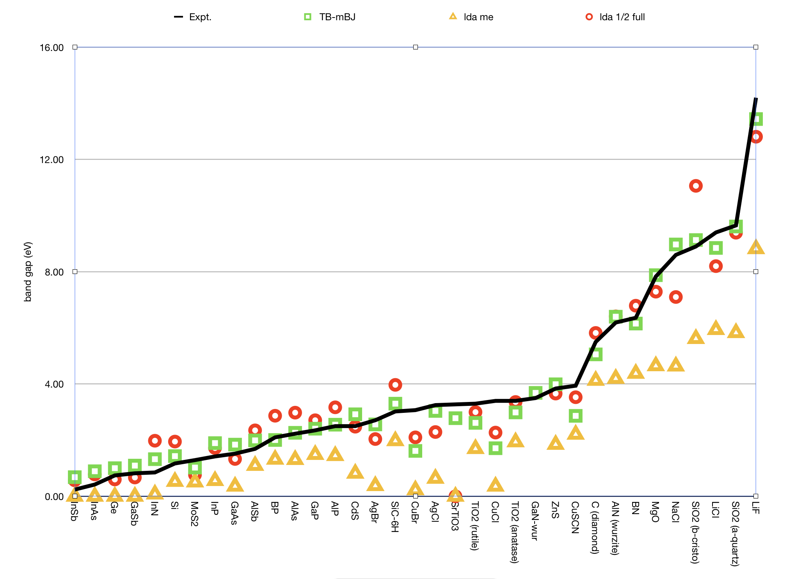

.. index:: Magnetization
.. index:: Collinear
.. index:: Non-Collinear

.. _XC:

Density Functional (XC)
=======================

The starting point for the XC functional is usually the result for the homogeneous electron gas, after which the so called non-local or generalized gradient approximation (GGA) can be added.

.. index:: Exchange-Correlation Functionals

The density functional approximation is controlled by the XC key.

Three classes of  XC functionals are supported: LDA, GGA, meta-GGA, and range-separated hybrid functionals. There is also the option to add an empirical dispersion correction. The only ingredient of the LDA energy density is the (local) density, the GGA depends additionally on the gradient of the density, and the meta-GGA has an extra dependency on the kinetic energy density. The range-separated hybrids are explained below in the section :ref:`Range-Separated Hybrids <Range Separated Hybrids>`.

In principle you may specify different functionals to be used for the *potential,* which determines the self-consistent charge density, and for the *energy* expression that is used to evaluate the (XC part of the) energy of the charge density. The *energy* functional is used for the nuclear gradients (geometry optimization), too. To be consistent, one should generally apply the same functional to evaluate the potential and energy respectively. Two reasons, however, may lead one to do otherwise:

#. The evaluation of the GGA part (especially for meta-GGAs) in the *potential* is rather time-consuming. The effect of the GGA term in the potential on the self-consistent charge density is often not very large. From the point of view of computational efficiency it may, therefore, be attractive to solve the SCF equations at the LDA level (i.e. not including GGA terms in the potential), and to apply the full expression, including GGA terms, to the energy evaluation *a posteriori*: post-SCF.

#. A particular XC functional may have only an implementation for the potential, but not for the energy (or vice versa). This is a rather special case, intended primarily for fundamental research of Density Functional Theory, rather than for run-of-the-mill production runs.

All subkeys of ``XC`` are optional and may occur twice in the data block: if one wants to specify different functionals for potential and energy evaluations respectively, see above.

.. _key-XC:

::

   XC
      {LDA  {Apply}   LDA {Stoll}}
      {GGA  {Apply}   GGA}
      {DiracGGA  GGA}
      {MetaGGA  {Apply}   GGA}
      {Dispersion {s6scaling} {RSCALE=r0scaling} {Grimme3} {BJDAMP} {PAR1=par1} {PAR2=par2} {PAR3=par3} {PAR4=par4}}
      {Dispersion Grimme4 {s6=...} {s8=...} {a1=...} {a2=...}}
      {Model [LB94|TB-mBJ|KTB-mBJ|JTS-MTB-MBJ|GLLB-SC|BGLLB-VWN|BGLLB-LYP]}
      {SpinOrbitMagnetization [None|NonCollinear|CollinearX|CollinearY|CollinearZ]}
      {LibXC {Functional}}
   End

The common use is to specify either an LDA or a (meta)GGA line. (Technically it is possible to have an LDA line *and* a GGA line, in which case the LDA part of the GGA functional (if applicable) is replaced by what is specified by the LDA line.)

``Apply``
   States whether the functional defined on the pertaining line will be used self-consistently (in the SCF-potential), or only post-SCF, i.e. to evaluate the XC energy corresponding to the charge density. The value of apply must be **SCF** or **POSTSCF**. (**default=SCF**)

LDA/GGA/metaGGA
^^^^^^^^^^^^^^^

.. _LDA:

``LDA``
   Defines the LDA part of the XC functional and can be any of the following:

   **Xonly**: The pure-exchange electron gas formula. Technically this is identical to the Xalpha form with a value 2/3 for the X-alpha parameter.

   **Xalpha**: the scaled (parameterized) exchange-only formula. When this option is used you may (optionally) specify the X-alpha *parameter* by typing a numerical value after the string Xalpha (**Default: 0.7**).

   **VWN**: the parametrization of electron gas data given by Vosko, Wilk and Nusair (ref [#ref1]_, formula version V). Among the available LDA options this is the more advanced one, including correlation effects to a fair extent.

   **Stoll**: For the VWN or GL variety of the LDA form you may include Stoll's correction [#ref2]_ by typing Stoll on the same line, after the main LDA specification. You must not use Stoll's correction in combination with the Xonly or the Xalpha form for the Local Density functional.

.. _GGA:

``GGA``
   Specifies the GGA part of the XC Functional. It uses derivatives (gradients) of the charge density. Separate choices can be made for the GGA exchange correction and the GGA correlation correction respectively. Both specifications must be typed (if at all) on the same line, after the GGA subkey.

   For the exchange part the options are:

   * **Becke**: the gradient correction proposed in 1988 by Becke [#ref3]_
   * **PW86x**: the correction advocated in 1986 by Perdew-Wang [#ref4]_
   * **PW91x**: the exchange correction proposed in 1991 by Perdew-Wang [#ref5]_
   * **mPWx**: the modified PW91 exchange correction proposed in 1998 by Adamo-Barone [#ref6]_
   * **PBEx**: the exchange correction proposed in 1996 by Perdew-Burke-Ernzerhof [#ref7]_
   * **HTBSx**: the HTBS exchange functional [#ref8]_
   * **RPBEx**: the revised PBE exchange correction proposed in 1999 by Hammer-Hansen-Norskov [#ref9]_
   * **revPBEx**: the revised PBE exchange correction proposed in 1998 by Zhang-Yang [#ref10]_
   * **mPBEx**: the modified PBE exchange correction proposed in 2002 by Adamo-Barone [#ref11]_
   * **OPTX**: the OPTX exchange correction proposed in 2001 by Handy-Cohen [#ref12]_

   For the correlation part the options are:

   * **Perdew**: the correlation term presented in 1986 by Perdew [#ref13]_
   * **PBEc**: the correlation term presented in 1996 by Perdew-Burke-Ernzerhof [#ref7]_
   * **PW91c**: the correlation correction of Perdew-Wang (1991), see [#ref5]_ [#ref16]_ [#ref17]_
   * **LYP**: the Lee-Yang-Parr 1988 correlation correction [#ref18]_

   Some GGA options define the exchange and correlation parts in one stroke. These are:

   * **BP86**: this is equivalent to **Becke** + **Perdew** together
   * **PW91**: this is equivalent to **pw91x** + **pw91c** together
   * **mPW**: this is equivalent to **mPWx** + **pw91c** together
   * **PBE**: this is equivalent to **PBEx** + **PBEc** together
   * **HTBS**: this is equivalent to **HTBSx** + **PBEc** together
   * **RPBE**: this is equivalent to **RPBEx** + **PBEc** together
   * **revPBE**: this is equivalent to **revPBEx** + **PBEc** together
   * **mPBE**: this is equivalent to **mPBEx** + **PBEc** together
   * **BLYP**: this is equivalent to **Becke** (exchange) + **LYP** (correlation)
   * **OLYP**: this is equivalent to **OPTX** (exchange) + **LYP** (correlation)
   * **OPBE**: this is equivalent to **OPTX** (exchange) + **PBEc** (correlation) [#ref19]_

``DiracGGA``
   (Expert option!) This key handles which XC functional is used during the Dirac calculations of the reference atoms. A string is expected which is not restricted to names of GGAs but can be LDA-like functionals, too.

   **Note**: In some cases using a GGA functional leads to slow convergence of matrix elements of the kinetic energy operator w. r. t. the ``Accuracy`` parameter. Then one can use the LDA potential for the calculation of the reference atom instead.

.. _MetaGGA:

``MetaGGA``
   Key to select the evaluation of a meta-GGA. A byproduct of this option is that the bonding energies of all known functionals are printed (using the same density). Meta-GGA calculations can be time consuming, especially when active during the SCF.

   Self consistency of the meta-GGA is implemented as suggested by Neuman, Nobes, and Handy [#ref20]_.

   The available functionals of this type are:

   * **TPSS**: The 2003 meta-GGA [#ref21]_
   * **M06L**: The meta-GGA as developed by the  Minesota group [#ref22]_
   * **revTPSS**: The 2009 revised meta-GGA [#ref23]_
   * **MVS**: Functional by Sun-Perdew-Ruzsinszky [#ref24]_
   * **MS0**: Functional by Sun et al. [#ref25]_
   * **MS1**: Functional by Sun et al. [#ref26]_
   * **MS2**: Functional by Sun et al. [#ref26]_
   * **SCAN**: Functional by Sun et al. [#ref28]_
   * **TASKxc**: by `Aschebrock et al <https://journals.aps.org/prresearch/abstract/10.1103/PhysRevResearch.1.033082>`__. Intended for band gaps and charge transfer systems.

   Note: For Meta-GGA XC functionals, it is recommended to use ``small`` or ``none`` :ref:`frozen core <band-key-Basis>` (the frozen orbitals are computed using LDA and not the selected Meta-GGA)

.. _DispersionCorrection:

Dispersion Correction
^^^^^^^^^^^^^^^^^^^^^

BAND supports the new :ref:`D4(EEQ) <GrimmeD4>` as well as the older :ref:`D3 and D3-BJ <GrimmeD3>` dispersion corrections from the group of Stefan Grimme:

.. index:: DFT-D4
.. _GrimmeD4:

D4(EEQ)
-------

``Dispersion Grimme4 {s6=...} {s8=...} {a1=...} {a2=...}``
  If ``Dispersion Grimme4`` is present in the ``XC`` block the D4(EEQ) dispersion correction (with the electronegativity equilibrium model) by the Grimme group [#ref36]_ [#ref36p]_ will be added to the total bonding energy, gradient and second derivatives, where applicable.

  The D4(EEQ) model has four parameters: :math:`s_6`, :math:`s_8`, :math:`a_1` and :math:`a_2` and their value should depend on the XC functional used. For the following functionals the D4(EEQ) parameters are **predefined**: B1B95, B3LYP, B3PW91, B97-D, BLYP, BP86, CAM-B3LYP, HartreeFock, OLYP, OPBE, PBE, PBE0, PW6B95, REVPBE, RPBE, TPSS, TPSSH. For these functionals it is enough to specify ``Dispersion Grimme4`` in the input block. E.g.:

  .. code-block:: none

    XC
      GGA BLYP
      Dispersion Grimme4
    END

  For all other functionals you should explicitly specify the D4(EEQ) parameters in the ``Dispersion`` key (otherwise the PBE parameters will be used). For example, for the PW91 functional you should use the following input:

  .. code-block:: none

    XC
      GGA PW91
      Dispersion Grimme4 s6=1.0 s8=0.7728 a1=0.3958 a2=4.9341
    END

  The D4(EEQ) parameters for many functionals can be found in the supporting information of the following paper: [#ref36]_.

.. index:: DFT-D3(BJ)
.. _GrimmeD3:

D3 and D3-BJ
------------

In BAND parameters for *Grimme3* and *Grimme3 BJDAMP* can be used according to version 3.1 (Rev. 1) of the coefficients, published on the Bonn `Bonn website <https://www.chemie.uni-bonn.de/pctc/mulliken-center/software/dft-d3/dft-d3>`__.

``DISPERSION Grimme3 BJDAMP {PAR1=par1 PAR2=par2 PAR3=par3 PAR4=par4}``
   If this key is present a dispersion correction (DFT-D3-BJ) by Grimme [#ref30]_ will be added to the total bonding energy, gradient and second derivatives, where applicable. Parametrizations are implemented e.g. for B3LYP, TPSS, BP86, BLYP, PBE, PBEsol [#ref29]_ , and RPBE. For SCAN parameters from Ref. [#ref31]_ are used. The parametrization has four parameters. One can override these using *PAR1=.. PAR2=..*, etc. In the table the relation is shown between the parameters and the real parameters in the dispersion correction.

   .. csv-table::

      variable, variable on `Bonn website <https://www.chemie.uni-bonn.de/pctc/mulliken-center/software/dft-d3/dft-d3>`__
      PAR1,    s6
      PAR2,    a1
      PAR3,    s8
      PAR4,    a2

.. index:: DFT-D3

``DISPERSION Grimme3 {PAR1=par1 PAR2=par2 PAR3=par3}``
   If this key is present a dispersion correction (DFT-D3) by Grimme [#ref33]_ will be added to the total bonding energy, gradient and second derivatives, where applicable. Parametrizations are available e.g. for B3LYP, TPSS, BP86, BLYP, revPBE, PBE, PBEsol [#ref29]_, and RPBE, and will be automatically set if one of these functionals is used. For SCAN parameters from Ref. [#ref31]_ are used. For all other functionals, PBE-D3 parameters are used as default. You can explicitly specify the three parameters.

   .. csv-table::

      variable, variable on `Bonn website <https://www.chemie.uni-bonn.de/pctc/mulliken-center/software/dft-d3/dft-d3>`__
      PAR1,    "s6"
      PAR2,    "sr,6"
      PAR3,    "s8"

``Dispersion {s6scaling RSCALE=r0scaling}``
   If the DISPERSION keyword is present a dispersion correction will be added to the total bonding energy, where applicable.  By default the correction of Grimme is applied [#ref35]_.  The term is added to the bonding energies of all printed functionals, here the LDA and a couple of GGAs are meant. The global scaling factor, with which the correction is added, depends on the XC functional used for SCF but it can be modified using the *s6scaling* parameter. The following scaling factors are used (with the XC functional in parentheses): 1.20 (BLYP), 1.05 (BP), 0.75 (PBE), 1.05 (B3LYP). In all other cases a factor 1.0 is used unless modified via the s6scaling parameter. The van der Waals radii, used in this implementation, are hard-coded. However, it is possible to modify the global scaling parameter for them using the *RSCALE=r0scaling* argument. The default value is 1.1 as proposed by Grimme [#ref35]_.

.. _ModelPotentials:

Model Potentials
^^^^^^^^^^^^^^^^

``Model``
  Some functionals give only a potential and have no energy expression.  We call such functionals model potentials. In BAND the following model potentials are available:

  LB94
    With this model the asymptotically correct potential of van Leeuwen and Baerends is invoked [#ref37]_.

  TB-mBJ
    This model potential can be used to correct for the band gap problem with GGAs for bulk systems [#ref38]_. This potential depends on a c-factor for which there is a density dependent automatic expression. However you can override the automatic value by specifying XC%TB_mBJCFactor cfac. In principle: the bigger the value the larger the gap. **KTB-mBJ**/**JTS-mTB-mBJ** are variations of **TB-mBJ**. The formula for C contains three parameters: A,B, and E. The logic is as follows

    .. csv-table::

      potential             ,       A ,     B ,   E
      TB-mBJ [#ref38]_      ,  -0.012 , 1.023 , 0.5
      KTB-mBJ [#ref40]_     ,   0.267 , 0.656 , 1.0
      JTS-mTB-mBJ [#ref41]_ ,     0.4 ,   1.0 , 0.5

    The three parameters (A,B, and E) can be user-defined set as follows:

    ::

      XC
         Model TB_mBJ
         TB_mBJAFactor valA
         TB_mBJBFactor valB
         TB_mBJEFactor valE
      End

  GLLB-SC
    This functional uses a model for the exchange response potential (based on J. Krieger, Y. Li and G. Iafrate response potential [#ref43]_) from which the derivative discontinuity follows [#ref42]_. This is an accurate functional for band gap predictions and Electric Field Gradient calculations. It is also a fast method and a very good compromise between accuracy and computational cost. This functional is composed of the GLLB exchange response potential and the PBESOL  exchange hole and the correlation potential [#ref42]_.

  BGLLB-VWN
    This functional is a variation of the GLLB-SC functional using the B88 exchange hole potential and the VWN correlation potential. This functional gives good results for Group I-VII and II-VI semi conductors.

  BGLLB-LYP
    This functional is a variation of the GLLB-SC functional using the B88 exchange hole potential and the LYP correlation potential. This functional gives good results for large band gap insulators.

One can change the K parameter for the GLLB functionals with the ``GLLBKParameter`` key::

  XC
     Model [GLLB-SC|BGLLB-VWN|BGLLB-LYP]
     GLLBKParameter val
  End

The default value is K=0.382 (value obtained from the electron gas model in the original publication).

.. _SpinOrbitMagnetization:

Non-Collinear Approach
^^^^^^^^^^^^^^^^^^^^^^

``SpinOrbitMagnetization``
   (**Default=CollinearZ**) Most XC functionals have as one ingredient the spin polarization. Normally the direction of the spin quantization axis is arbitrary and conveniently chosen to be the *z*-axis. However, in a :ref:`spin-orbit<spin_orbit>` calculation the direction matters, and it is arbitrary to put the z-component of the magnetization vector into the XC functional. It is also possible to plug the size of the magnetization vector into the XC functional. This is called the non-collinear approach. There is also the exotic option to choose the quantization axis along the *x* or *y* axis. To summarize, the value **NonCollinear** invokes the non-collinear method. The other three option **CollinearX**, **CollinearY** and **CollinearZ** causes either the x, y, or z component to be used as spin polarization for the XC functional.

.. _LIBXC:

LibXC Library Integration
^^^^^^^^^^^^^^^^^^^^^^^^^

.. index:: LIBXC

``LibXC functional``
  LibXC is a library of approximate XC functionals, see Ref. [#ref44]_. Version 5.1.2 of LibXC is used.. See the LibXC website for the complete list of functionals: `http://www.tddft.org/programs/Libxc <http://www.tddft.org/programs/Libxc>`__.

  The following functionals can be evaluated with LibXC (incomplete list):

  + **LDA:** LDA, PW92, TETER93
  + **GGA:** AM05, BGCP, B97-GGA1, B97-K, BLYP, BP86, EDF1, GAM, HCTH-93, HCTH-120, HCTH-147, HCTH-407, HCTH-407P, HCTH-P14, PBEINT, HTBS, KT2, MOHLYP, MOHLYP2, MPBE, MPW, N12, OLYP, PBE, PBEINT, PBESOL, PW91, Q2D, SOGGA, SOGGA11, TH-FL, TH-FC, TH-FCFO, TH-FCO, TH1, TH2, TH3, TH4, VV10, XLYP, XPBE, HLE16
  + **MetaGGA:** M06-L, M11-L, MN12-L, MS0, MS1, MS2, MVS, PKZB, TPSS, HLE17, rSCAN, r2SCAN
  + **Hybrids** (**only for non-periodic systems**): B1LYP, B1PW91, B1WC, B3LYP, B3LYP*, B3LYP5, B3LYP5, B3P86, B3PW91, B97, B97-1 B97-2, B97-3, BHANDH, BHANDHLYP, EDF2, MB3LYP-RC04, MPW1K, MPW1PW, MPW3LYP, MPW3PW, MPWLYP1M, O3LYP, OPBE, PBE0, PBE0-13, REVB3LYP, REVPBE, RPBE, SB98-1A, SB98-1B, SB98-1C, SB98-2A, SB98-2B, SB98-2C, SOGGA11-X, SSB, SSB-D, X3LYP
  + **MetaHybrids** (**only for non-periodic systems**): B86B95, B88B95, BB1K, M05, M05-2X, M06, M06-2X, M06-HF, M08-HX, M08-SO, MPW1B95, MPWB1K, MS2H, MVSH, PW6B95, PW86B95, PWB6K, REVTPSSH, TPSSH, X1B95, XB1K
  + **Range-separated** (**for periodic systems, only short range-separated functionals can be used**, see :ref:`Range Separated Hybrids`): CAM-B3LYP, CAMY-B3LYP, HJS-PBE, HJS-PBESOL, HJS-B97X, HSE03, HSE06, LRC_WPBE, LRC_WPBEH, LCY-BLYP, LCY-PBE, M11, MN12-SX, N12-SX, TUNED-CAM-B3LYP, WB97, WB97X

  Note that BAND can not calculate VV10 dependent LibXC functionals, like VV10, LC-VV10, B97M-V, WB97X-V.

  Example usage for the MVS functional::

    XC
      LibXC MVS
    End

  **Notes:**

  * **All electron basis sets should be used** (see ``CORE NONE`` in section :ref:`basis set`).
  * For periodic systems only short range-separated functionals can be used (see :ref:`Range Separated Hybrids`)
  * In case of LibXC the output of the BAND calculation will give the reference for the used functional, see also the LibXC website `http://www.tddft.org/programs/Libxc <http://www.tddft.org/programs/Libxc>`__.

  * Do not use any of the subkeys LDA, GGA, METAGGA, MODEL in combination with the subkey LIBXC.

  * One can use the DISPERSION key icw LIBXC. For a selected number of functionals the optimized dispersion parameters will be used automatically, please check the output in that case.

.. index:: HSE
.. index:: Range-Separated Hybrids
.. _Range Separated Hybrids:

Range-separated hybrid functionals
^^^^^^^^^^^^^^^^^^^^^^^^^^^^^^^^^^

Short range-separated hybrid functionals, like the **HSE03** functional [#ref45]_, can be useful for prediction of more accurate band gaps compared to GGAs. These must be specified via the :ref:`LibXC <LIBXC>` key

::

   XC
      LibXC functional {omega=value}
   End

``functional``
   The functional to be used. (Incomplete) list of available functionals: **HSE06**, **HSE03**, **HJS-B97X**, **HJS-PBE** and **HJS-PBESOL** (See the `LibXC website <http://www.tddft.org/programs/octopus/wiki/index.php/Libxc_functionals>`__ for a complete list of available functionals).

``omega``
   *Optional*. You can optionally specify the switching parameter omega of the range-separated hybrid. Only possible for the **HSE03** and **HSE06** functionals (See [#ref45]_).

**Notes:**

* Hybrid functionals can only be used in combination with all-electron basis sets (see ``CORE NONE`` in section :ref:`basis set`).

* The Hartree-Fock exchange matrix is calculated through a procedure known as Resolution of the Identity (RI). See :ref:`RIHartreeFock <band-key-RIHartreeFock>` key.

* Regular hybrids (such as B3LYP) and long range-separated hybrids (such as CAM-B3LYP) **cannot** be used in periodic boundary conditions calculations (they can only be used for non-periodic systems).

* There is some confusion in the scientific literature about the value of the switching parameter :math:`\omega` for the HSE functionals. In LibXC, and therefore in BAND, the HSE03 functional uses :math:`\omega=0.106066` while the HSE06 functional uses :math:`\omega=0.11`.

**Usage example**::

   XC
      LibXC HSE06 omega=0.1
   End

Defaults and special cases
^^^^^^^^^^^^^^^^^^^^^^^^^^

+ If the ``XC`` key is not used, the program will apply only the Local Density Approximation (no GGA terms). The chosen LDA form is then VWN.

+ If only a GGA part is specified, omitting the *LDA* subkey, the LDA part defaults to VWN, except when the LYP correlation correction is used: in that case the LDA default is Xonly: pure exchange.

+ The reason for this is that the LYP formulas assume the pure-exchange LDA form, while for instance the Perdew-86 correlation correction is a correction to a *correlated* LDA form. The precise form of this correlated LDA form assumed in the Perdew-86 correlation correction is not available as an option in ADF but the VWN formulas are fairly close to it.

+ Be aware that typing only the subkey *LDA*, without an argument, will activate the VWN form (also if LYP is specified in the GGA part).

.. index:: GGA+U
.. index:: HubbardU

.. _HubbardU:

GGA+U
^^^^^

A special way to treat correlation is with so-called LDA+U, or GGA+U calculations. It is intended to solve the band gap problem of traditional DFT, the problem being an underestimation of band gaps for transition-metal complexes. A Hubbard like term is added to the normal Hamiltonian, to model on-site interactions. In its very simplest form it depends on only one parameter, U, and this is the way it has been implemented in BAND. The energy expression is equation (11) in the work of Cococcioni [#ref48]_. See also the review article [#ref47]_.

.. scmautodoc:: band HubbardU Enabled LValue UValue PrintOccupations

An example to apply LDA+U to the d-orbitals of NiO looks like::

      ...
      Atoms
         Ni 0.000  0.000  0.000
         O 2.085  2.085  2.085
      End
      ...

      ...
      HubbardU
         printOccupations true
         Enabled          true
         uvalue           0.3 0.0
         lvalue           2   -1
      End
      ...

.. _OEP:
.. index:: OEP

OEP
^^^

(Expert options) When you are using a meta-GGA you are by default using a generalized Kohn-Sham method. However, it is possible to calculate a local potential, as is required for a strict Kohn-Sham calculation, via OEP, (see [#ref49]_).

The main options are controlled with the ``MetaGGA`` subkey of the XC block if ``OEP`` is present.
::

   XC
      [...]
      MetaGGA GGA OEP {approximation} {Fit} {Potential}
      [...]
   End

``GGA``
  specifies the name of the used meta-GGA. In combination with OEP only **PBE**, **TPSS**, **MVS**, **MS0**, **MS1**, **MS2**, and **SCAN** can be used!

``approximation``
  (**Default: KLI**) There are three flavors to approximate the OEP: **KLI**, **Slater**, and **ELP**

``Fit``
  By adding the string **Fit** on this line, one uses the fitted density instead of the exact density for the evaluation.

``Potential``
  If not specified, only the tau-dependent part of the OEP is evaluated and used. By adding the string **Potential** in addition the tau-independent part is added to the XC potential. (This is needed e.g. for plotting the 'vxc')

With the following subkeys of the ``XC`` blockkey you have extra control over the iterative OEP evaluation:

``MGGAOEPMaxIter``
  (**Default: 30**) defines the maximum number of cycles for the iterative OEP evaluation.

``MGGAOEPConvergence``
  (**Default: 1E-6**) defines convergence criterion for OEP evaluation.

``MGGAOEPWaitIter``
  (**Default: 0**) defines the number of SCF cycles with the regular meta-GGA before switching to the OEP scheme.

``MGGAOEPMaxAbortIter``
  (**Default: 0**) defines number of cycles for which the error is allowed to increase before the calculation is aborted. Here, zero means: do never abort.

``MGGAOEPMaxErrorIncrease``
  (**Default: 0.0**) defines the maximum rate of increasing error before the calculation is aborted. Here, zero means: do never abort.

An example for an OEP metaGGA calculation

::

      XC
         MetaGGA MVS OEP
      End

Note that a very fine Becke grid is needed.

::

         BeckeGrid
            Quality USER
            UserRadMulFactor 20.0
            UserCoreL 11
            UserInter1L 13
            UserInter2L 21
            UserExterL 31
            UserExterLBoost 35
          End

Note also: the gaps are typically not closer to experiment, and the calculations are more expensive. This option is mainly about academic interest.

.. _DFTHalf:
.. index:: DFT-1/2
.. index:: LDA-1/2
.. index:: GGA-1/2

DFT-1/2
^^^^^^^

The DFT-1/2 method due to Slater has been extended by Ferreira (`PRB,78,125116,2008 <https://doi.org/10.1103/PhysRevB.78.125116>`__) to address the band gap problem. DFT-1/2 can be used in combination with any XC functional (this method is also referred to as LDA-1/2 or GGA-1/2, depending on the functional used).

The physical picture is that the hole is localized having substantial self energy. Adding an electron to the solid is assumed to go to a very delocalized state with little or no self energy.
The method amounts to adding attractive spherical potentials at atomic sites and optimizing the screening parameter for maximal band gap, and can be used on top of any functional, relativistic option and spin option.
From this viewpoint the only freedom in the method is the list of active atom types, the ones for which we will add the potential and optimize the gap.
The l-dependent potential option from Ferreira is currently not supported.

The simplest approach is to optimize all the atom types. However, one can also look at the character of the top of the valence band, and determine which atoms are contributing to the PDOS there. This can be done by hand by using the bandstructure GUI module. In band there is an option to analyze this automatically, see the Prepare=true sub option.

.. seealso::

   :ref:`example DFTHalf_Si`

.. scmautodoc:: band XC DFTHalf
  :skipblockdescription:

Here are some results showing that LDA-1/2 can work quite well, but that the TB-mBJ functional works better for this set.

.. only:: html

  .. rubric:: References

.. [#ref1] S.H. Vosko, L. Wilk and M. Nusair,  *Accurate spin-dependent electron liquid correlation energies for local spin density calculations: a critical analysis.*  `Canadian Journal of Physics 58, 1200 (1980) <https://doi.org/10.1139/p80-159>`__.

.. [#ref2] H.\  Stoll, C.M.E. Pavlidou and H. Preuß,  *On the calculation of correlation energies in the spin-density functional formalism.*  `Theoretica Chimica Acta 49, 143 (1978) <https://doi.org/10.1007/PL00020511>`__.

.. [#ref3] A.D. Becke,  *Density-functional exchange-energy approximation with correct asymptotic behavior.*  `Physical Review A 38, 3098 (1988) <https://doi.org/10.1103/PhysRevA.38.3098>`__.

.. [#ref4] J.P. Perdew and Y. Wang,  *Accurate and simple density functional for the electronic exchange energy: generalized gradient approximation.*  `Physical Review B 33, 8800 (1986) <https://doi.org/10.1103/PhysRevB.33.8800>`__.

.. [#ref5] J.P. Perdew, J.A. Chevary, S.H. Vosko, K.A. Jackson, M.R. Pederson, D.J. Singh and C. Fiolhais,  *Atoms, molecules, solids, and surfaces: Applications of the generalized gradient approximation for exchange and correlation.*  `Physical Review B 46, 6671 (1992) <https://doi.org/10.1103/PhysRevB.46.6671>`__.

.. [#ref6] C.\  Adamo and V. Barone,  *Exchange functionals with improved long-range behavior and adiabatic connection methods without adjustable parameters: The mPW and mPW1PW models.*  `Journal of Chemical Physics 108, 664 (1998) <https://doi.org/10.1063/1.475428>`__.

.. [#ref7] J.P. Perdew, K. Burke and M. Ernzerhof,  *Generalized Gradient Approximation Made Simple.*  `Physical Review Letters 77, 3865 (1996) <https://doi.org/10.1103/PhysRevLett.77.3865>`__.

.. [#ref8] P.\  Haas, F. Tran, P. Blaha, and K. H. Schwarz, *Construction of an optimal GGA functional for molecules and solids*,  `Physical Review B 83, 205117 (2011) <https://doi.org/10.1103/PhysRevB.83.205117>`__.

.. [#ref9] B.\  Hammer, L.B. Hansen, and J.K.Nørskov,  *Improved adsorption energetics within density-functional theory using revised Perdew-Burke-Ernzerhof functionals.*  `Physical Review B 59, 7413 (1999) <https://doi.org/10.1103/PhysRevB.59.7413>`__.

.. [#ref10] Y.\  Zhang and W. Yang,  *Comment on "Generalized Gradient Approximation Made Simple".*  `Physical Review Letters 80, 890 (1998) <https://doi.org/10.1103/PhysRevLett.80.890>`__.

.. [#ref11] C.\  Adamo and V. Barone,  *Physically motivated density functionals with improved performances: The modified Perdew.Burke.Ernzerhof model.*  `Journal of Chemical Physics 116, 5933 (2002) <https://doi.org/10.1063/1.1458927>`__.

.. [#ref12] N.C. Handy and A.J. Cohen,  *Left-right correlation energy.*  `Molecular Physics 99, 403 (2001) <https://doi.org/10.1080/00268970010018431>`__.

.. [#ref13] J.P. Perdew, *Density-functional approximation for the correlation energy of the inhomogeneous electron gas.*  `Physical Review B 33, 8822 (1986) <https://doi.org/10.1103/PhysRevB.33.8822>`__.

.. [#ref16] B.G. Johnson, P.M.W. Gill and J.A. Pople,  *The performance of a family of density functional methods.*  `Journal of Chemical Physics 98, 5612 (1993) <https://doi.org/10.1063/1.464906>`__.

.. [#ref17] T.V. Russo, R.L. Martin and P.J. Hay,  *Density Functional calculations on first-row transition metals.*  `Journal of Chemical Physics 101, 7729 (1994) <https://doi.org/10.1063/1.468265>`__.

.. [#ref18] C.\  Lee, W. Yang and R.G. Parr,  *Development of the Colle-Salvetti correlation-energy formula into a functional of the electron density.*  `Physical Review B 37, 785 (1988) <https://doi.org/10.1103/PhysRevB.37.785>`__.

.. [#ref19] M.\  Swart, A.W. Ehlers and K. Lammertsma, *Performance of the OPBE exchange-correlation functional.*  `Molecular Physics 2004 102, 2467 (2004) <https://doi.org/10.1080/0026897042000275017>`__.

.. [#ref20] R.\  Neumann, R.H. Nobes and N.C. Handy,  *Exchange functionals and potentials.*  `Molecular Physics 87, 1 (1996) <https://doi.org/10.1080/00268979600100011>`__.

.. [#ref21] J.\  Tao, J.P. Perdew, V.N. Staroverov and G.E. Scuseria,  *Climbing the Density Functional Ladder: Nonempirical Meta-Generalized Gradient Approximation Designed for Molecules and Solids.*  `Physical Review Letters 91, 146401 (2003) <https://doi.org/10.1103/PhysRevLett.91.146401>`__.

.. [#ref22] Y.\  Zhao, D.G. Truhlar,  *A new local density functional for main-group thermochemistry, transition metal bonding, thermochemical kinetics, and noncovalent interactions.*  `Journal of Chemical Physics 125, 194101 (2006) <https://doi.org/10.1063/1.2370993>`__.

.. [#ref23] J.P. Perdew, A. Ruzsinszky, G. I. Csonka, L. A. Constantin, and J. Sun,  *Workhorse Semilocal Density Functional for Condensed Matter Physics and Quantum Chemistry.*,  `Physical Review Letters 103, 026403 (2009) <https://doi.org/10.1103/PhysRevLett.103.026403>`__.

.. [#ref24] J.\  Sun, J.P. Perdew, and A. Ruzsinszky, *Semilocal density functional obeying a strongly tightened bound for exchange*, `Proceedings of the National Academy of Sciences 112, 685 (2015) <https://doi.org/10.1073/pnas.1423145112>`__

.. [#ref25] J.\  Sun, B. Xiao, A. Ruzsinszky, *Communication: Effect of the orbital-overlap dependence in the meta generalized gradient approximation*, `Journal of Chemical Physics 137, 051101 (2012) <https://doi.org/10.1063/1.4742312>`__.

.. [#ref26] J.\  Sun, R. Haunschild, B. Xiao, I.W. Bulik, G.E. Scuseria, J.P. Perdew, *Semilocal and hybrid meta-generalized gradient approximations based on the understanding of the kinetic-energy-density dependence*, `Journal of Chemical Physics 138, 044113 (2013) <https://doi.org/10.1063/1.4789414>`__.

.. [#ref28] J.\  Sun, A. Ruzsinszky, J.P. Perdew, *Strongly Constrained and Appropriately Normed Semilocal Density Functional*, `Physical Review Letters 115, 036402 (2015) <https://doi.org/10.1103/PhysRevLett.115.036402>`__.

.. [#ref29] J.P. Perdew, A. Ruzsinszky, G.I. Csonka, O.A. Vydrov, G.E. Scuseria, L.A. Constantin, X. Zhou and K. Burke,  *Restoring the Density-Gradient Expansion for Exchange in Solids and Surfaces.*  `Physical Review Letters 100, 136406 (2008) <https://doi.org/10.1103/PhysRevLett.100.136406>`__.

.. [#ref30] S.\  Grimme, S. Ehrlich, and L. Goerigk, *Effect of the Damping Function in Dispersion Corrected Density Functional Theory*,  `Journal of Computational Chemistry 32, 1456 (2011) <https://doi.org/10.1002/jcc.21759>`__.

.. [#ref31] J.G.\  Brandenburg, J.E. Bates, J. Sun, and J.P. Perdew, *Benchmark tests of a strongly constrained semilocal functional with a long-range dispersion correction*, `Physical Review B 94, 115144 (2016) <https://doi.org/10.1103/PhysRevB.94.115144>`__

.. [#ref33] S.\  Grimme, J. Anthony, S. Ehrlich, and H. Krieg, *A consistent and accurate* ab initio *parametrization of density functional dispersion correction (DFT-D) for the 94 elements H-Pu*, `The Journal of Chemical Physics 132, 154104 (2010) <https://doi.org/10.1063/1.3382344>`__.

.. [#ref35] S.\  Grimme,  *Semiempirical GGA-Type Density Functional Constructed with a Long-Range Dispersion Correction.*  `Journal of Computational Chemistry 27, 1787 (2006) <https://doi.org/10.1002/jcc.20495>`__.

.. [#ref36]  E.\  Caldeweyher, S. Ehlert, A. Hansen, H. Neugebauer, S. Spicher, C. Bannwarth, S. Grimme, *A Generally Applicable Atomic-Charge Dependent London Dispersion Correction Scheme*, `J. Chem. Phys., 2019, 150, 154122 <https://doi.org/10.1063/1.5090222>`__
.. [#ref36p] E.\  Caldeweyher, J.-M. Mewes, S. Ehlert, S. Grimme, *Extension and evaluation of the D4 London-dispersion model for periodic systems*, `Phys. Chem. Chem. Phys., 2020, 22, 8499-8512 <https://doi.org/10.1039/D0CP00502A>`__

.. [#ref37] R.\  van Leeuwen and E.J. Baerends,  *Exchange-correlation potential with correct asymptotic behavior.*  `Physical Review A 49, 2421 (1994) <https://doi.org/10.1103/PhysRevA.49.2421>`__.

.. [#ref38] F.\  Tran, and P. Blaha,  *Accurate Band Gaps of Semiconductors and Insulators with a Semilocal Exchange-Correlation Potential*,  `Physical Review Letters 102, 226401 (2009) <https://doi.org/10.1103/PhysRevLett.102.226401>`__.

.. [#ref40] D.\  Koller, F. Tran, and P. Blaha,  *Improving the Modified Becke-Johnson Exchange Potential.*,  `Physical Review B 83, 155109 (2012) <https://doi.org/10.1103/PhysRevB.85.155109>`__.

.. [#ref41] R.\  A.Jishi, O. B. Ta, and A. Sharif,  *Modeling of Lead Halide Perovskites for Photovoltaic Applications.*,  `Archive <http://arxiv.org/abs/1405.1706>`__.

.. [#ref42] M.\  Kuisma, J. Ojanen, J. Enkovaara, and T.T. Rantala,  *Kohn-Sham potential with discontinuity for Band gap materials*,  `Physical review B 82, 115106 (2010) <https://doi.org/10.1103/PhysRevB.82.115106>`__.

.. [#ref43] J.B. Krieger, Yan Li, G.J. Iafrate, *Derivation and application of an accurate Kohn-Sham potential with integer discontinuity*, `Physics Letters A 8, 146 (1990) <https://doi.org/10.1016/0375-9601(90)90975-T>`__

.. [#ref44] M.A.L. Marques, M.J.T. Oliveira, and T. Burnus, *Libxc: a library of exchange and correlation functionals for density functional theory*, `Computer Physics Communications 183, 2272 (2012) <https://doi.org/10.1016/j.cpc.2012.05.007>`__.

.. [#ref45] J.\  Heyd, G.E. Scuseria and M. Ernzerhof, *Hybrid functionals based on a screened Coulomb potential*, `J. Chem. Phys. 118, 8207 (2003) <https://doi.org/10.1063/1.1564060>`__.

.. [#ref47] V.I. Anisimov, F. Aryasetiawan, and A.I. Lichtenstein,  *First-principles calculations of the electronic structure and spectra of strongly correlated systems: the LDA + U method*,  `Journal Physics: Condensed Matter 9, 767 (1997) <https://doi.org/10.1088/0953-8984/9/4/002>`__.

.. [#ref48] M.\  Cococcioni, and S. de Gironcoli,  *Linear response approach to the calculation of the effective interaction parameters in the LDA+U method*,  `Physical Review B 71, 035105 (2005) <https://doi.org/10.1103/PhysRevB.71.035105>`__.

.. [#ref49] Zeng-hui Yang, Haowei Peng, Jianwei Sun, and John P. Perdew, *More realistic band gaps from meta-generalized gradient approximations: Only in a generalized Kohn-Sham scheme*, `Physical Review B 93, 205205 (2016) <https://doi.org/10.1103/PhysRevB.93.205205>`__.
