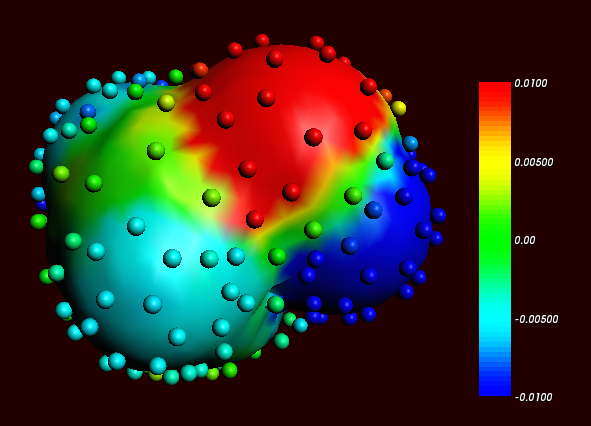
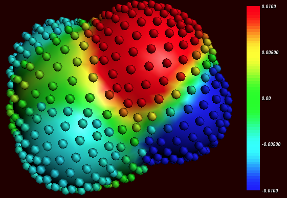
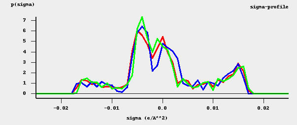

.. index:: ADF COSMO calculation

ADF COSMO calculation
*********************

.. _metatag ADF_SETTINGS: 
.. index:: ADF COSMO settings
.. index:: adf.rkf file
.. index:: .t21 file
.. index:: COSMO file
.. index:: .coskf file
.. index:: COSKF file

ADF COSMO settings
==================

Here it is described briefly how to make COSMO result files consistent with the way they were made for the ADF parametrization of COSMO-RS to ensure full parameter applicability. First a gas phase geometry optimization should be performed with ADF, with a small core TZP basis set, the  Becke-Perdew functional (BP86), the relativistic scalar ZORA method (which is the default in ADF2020), and good numerical integration quality::
   
   AMS_JOBNAME=GASPHASE "$AMSBIN/ams" << eor
   Task GeometryOptimization
   System
      Atoms
         ...
      End
   End
   Engine ADF
      Basis
         Type TZP
         Core Small
         PerAtomType Symbol=I File=ZORA/TZ2P/I.4p
      End
      XC
         GGA Becke Perdew
      End
      BeckeGrid
         Quality Good
      End
      Relativity 
         Level Scalar
         Method ZORA
      End
   EndEngine
   eor

For heavier elements than krypton (Z>36), like iodine, a small core TZ2P basis set is required. The resulting adf.rkf (previously ADF<=2019 TAPE21 file or .t21 file) of the molecule is used as a restart file in the COSMO calculation, and the system is loaded using the resulting ams.rkf. The ADF COSMO calculation is performed with the following settings::

   AMS_JOBNAME=COSMO "$AMSBIN/ams" << eor
   Task SinglePoint
   LoadSystem
      File GASPHASE/ams.rkf
   End
   EngineRestart GASPHASE/adf.rkf
   Engine ADF
      Basis    
         Type TZP
         Core Small
         PerAtomType Symbol=I File=ZORA/TZ2P/I.4p
      End
      XC
         GGA Becke Perdew
      End
      BeckeGrid
         Quality Good
      End
      Relativity
         Level Scalar
         Method ZORA
      End
      Symmetry NOSYM
      SOLVATION
         Surf Delley
         Solvent name=CRS emp=0.0 cav0=0.0 cav1=0.0
         Charged method=CONJ corr
         C-Mat EXACT
         SCF VAR ALL
         RADII
            H  1.30
            C  2.00
            N  1.83
            O  1.72
            F  1.72
            Si 2.48
            P  2.13
            S  2.16
            Cl 2.05
            Br 2.16
            I  2.32
         SubEnd
      END
   EndEngine
   eor

In this COSMO calculation the Delley type of cavity construction is chosen (See Ref. [#ref1]_ for details on the Delley surface construction). The name of the solvent is CRS, which sets the dielectric constant to infinite and sets the radius of the probing sphere to determine the solvent excluded part of the surface to 1.3 Angstrom. 

In case of a cation or an anion, in both the gas phase calculations as well as in the COSMO calculation one should include the charge with the subkey CHARGE of the key SYSTEM in the AMS part of the input.

In the Radii subblock key the Klamt atomic cavity radii are chosen. The parameters emp, cav0, and cav1 are zero. The corr option to the CHARGED subkey constrains the computed solvent surface charges to add up to the negative of the molecular charge. Specifying exact for the C-MAT subkey causes ADF to compute straightforwardly the Coulomb potential due to the charge *q* in each point of the molecular numerical integration grid and integrate against the electronic charge density. This is, in principle, exact but may have inaccuracies when the numerical integration points are very close to the positions of a charge *q*. To remedy this, starting from ADF2010 the electrostatic potential is damped in case of (very) close lying numerical integration points and COSMO surface points. The numerical stability of the results compare to those of ADF2009 was increased as a result of this. Specifying exact for the C-MAT subkey also requires that the ADF calculation uses SYMMETRY NOSYM.     

The resulting adf.rkf (previously ADF<=2019 TAPE21 file or .t21 file) of the COSMO calculation is a COSMO result file.     

In a COSMO-RS calculation only the 'COSMO' part of this file is needed. One can make a kf file compound.coskf, which only consists of the section 'COSMO' if one does::

   $AMSBIN/cpkf adf.rkf compound.coskf "COSMO"  

The file compound.coskf should not exist before this command is given. Note that such a .coskf file is not a complete adf.rkf anymore. For example, only the COSMO surface can be viewed with AMSview. It is useful mostly for COSMO-RS calculations.   

**Links** COSMO-RS GUI tutorial: COSMO result files [`1  <../Tutorials/COSMO-RS/COSMO_result_files.html>`__]  

Atomic cation or anion
======================

In case of an atomic calculation one should of course not perform a geometry optimization.
In case of a cation or an anion, in both the gas phase calculations as well as in the COSMO calculation one should include the charge with the key CHARGE.
Only for atomic calculations one should include the argument ``method=atom`` to the subkey Charged of the key SOLVATION:

::

   SOLVATION
     Surf Delley
     Solvent name=CRS cav0=0.0 cav1=0.0
     Charged method=atom corr
     C-Mat EXACT
     SCF VAR ALL 
   END

.. index:: COSMO accuracy: 

Accuracy
========

Several parameters in the COSMO calculation can influence the accuracy of the result of the quantum mechanical calculation. Some of these parameters will be discussed. Note that if one chooses different parameters in the COSMO calculation one may also have to reparametrize the ADF COSMO-RS parameters. A list of some of the ADF COSMO parameters. 

+ XC functional

+ basis set

+ fit set

+ atomic cavity radii and radius of the probing sphere

+ cavity construction

+ geometry

The atomic cavity radii and the radius of the probing sphere are the same as in Ref. [#ref2]_, which describes the COSMO-RS method developed by Klamt et al., which is implemented in ADF. The Becke Perdew functional is relatively good for weakly bound systems, but may not be so good in other cases. The basis set TZP is a compromise basis set. For heavier elements than krypton (Z>36), like iodine, a TZ2P basis set is required, including the relativistic scalar ZORA method. Since the relativistic method hardly cost extra time compared to a non-relativistic method, the scalar relativistic scalar ZORA method is recommended to be used also for light elements. The Delley type of cavity construction in ADF can give a large number of COSMO points. The XC functional, basis set, and cavity construction chosen in the ADF COSMO calculation have a similar accuracy as those that were used in Ref. [#ref2]_. Note that they are not exactly the same as were used in Ref. [#ref2]_, since in that paper a different quantum mechanical program was used. 

In the parametrization for ADF the same geometry was used for the gas phase and the COSMO calculation, which is different than in Ref. [#ref2]_. It depends on the actual solvent if reoptimizing the molecule in the COSMO calculation may give better results. Note that the dielectric medium used in the COSMO model has an infinite dielectric constant in the COSMO-RS model. Thus a geometry optimization of the molecule in the COSMO calculation might be more appropriate for a molecule dissolved in water than for a molecule dissolved in n-hexane. 

The fit set in ADF is not always able to describe the Coulomb potential accurately at each of the COSMO surface points. In regular ADF calculations this problem is not apparent since the numerical errors in the integrals computed in the vicinity of the COSMO surface have little impact. However, in COSMO calculations this may have some effect. This is why the option C-Mat exact was selected above, instead of the default C-Mat pot option. Another possibility is to add more fit functions, for example, using 'FitQuality Good' for the key ZlmFit in the input for the adf calculation. 

.. _metatag CAVITY: 
.. index:: COSMO cavity construction: 
.. index:: cavity construction: 

Cavity construction
===================

The Esurf type of cavity construction in ADF with default settings does not give a large number of COSMO points. Therefore it is recommended to use the so called Delley type of cavity construction (Ref. [#ref1]_), which allows one to construct a surface which has many more points. The Esurf type of cavity construction also allows many more points if one sets the option NFDiv of the subkey DIV of the key SOLVENT to a larger value than the default value of 1. This will not be discussed here further. In ADF2010 the numerical stability of the Delley surface has been improved, by merging close lying COSMO surface points,  and removing COSMO surface points with a small surface area. A figure of a COSMO surface with the Esurf type of cavity construction with default settings is given below. In this figure the small spheres represent the COSMO surface points that are used for the construction of the COSMO surface. The red part represents positive COSMO charge density, the blue part negative COSMO charge density (the coloring scheme is chosen to match the one by Klamt): 

Cosmo charge density on the COSMO surface of methanol, Esurf surface (picture made with AMSview).

One can construct a surface which has many more points using a so called Delley surface. For the subkey SURF of the key SOLVENT one can choose delley. The subkey DIV of the key SOLVENT has extra options leb1 (default value 23), leb2 (default value 29), and rleb (default value 1.5 Angstrom). If the cavity radius of an atom is lower than rleb use leb1, otherwise use leb2. These values can be changed: using a higher value for leb1 and leb2 gives more surface points (maximal value leb1, leb2 is 29). A value of 23 means 194 surface points in case of a single atom, and 29 means 302 surface points in case  of a single atom Typically one could use leb1 for the surface point of H, and leb2 for the surface points of other elements. 

The next figure is made with the following (default for the Delley surface) settings: 

::

   SOLVATION
       SURF Delley
       DIV leb1=23 leb2=29 rleb=1.5
   END

Cosmo charge density on the COSMO surface of methanol, Delley surface (picture made with AMSview).

The different ways of constructing the cavity has some consequences for the :math:`\sigma`-profile of methanol, see the figure below: 

:math:`\sigma`-profiles of methanol (picture made with the CRS-GUI). In this picture the blue line is the :math:`\sigma`-profile with the Esurf type of construction, the red line is that with the Delley type of construction with many surface points. For comparison, the green line is the :math:`\sigma`-profile of methanol if a large QZ4P basis set is used, again with the Delley type of construction with many surface points.

.. only:: html

  .. rubric:: References

.. [#ref1] B.\  Delley,  *The conductor-like screening model for polymers and surfaces.*  `Molecular Simulation 32, 117 (2006) <https://doi.org/10.1080/08927020600589684>`__ 

.. [#ref2] A.\  Klamt, V. Jonas, T. Bürger and J.C. Lohrenz,  *Refinement and Parametrization of COSMO-RS.*  `J. Phys. Chem. A 102, 5074 (1998) <https://doi.org/10.1021/jp980017s>`__ 
