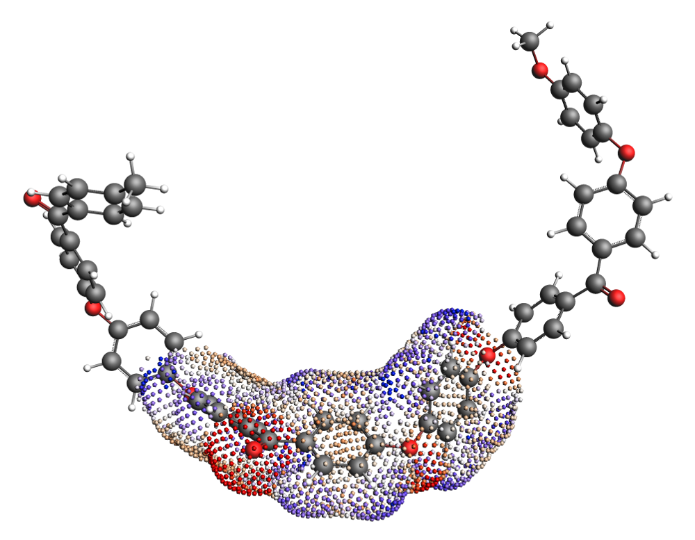
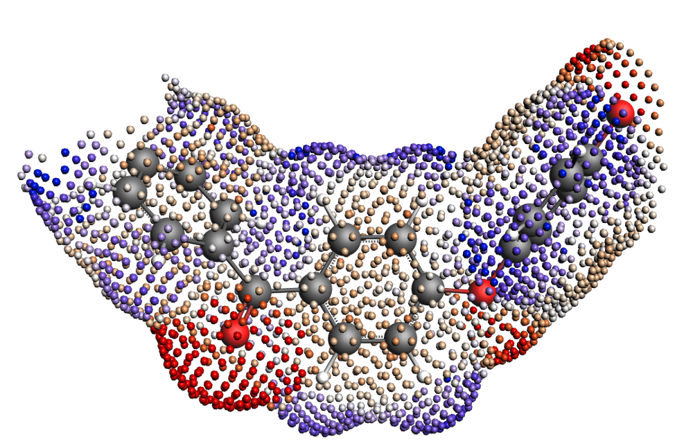

.. _metatag COSMORS_POLY: 

.. only:: html

   .. index:: polymers

Polymers with COSMO-RS(-SAC)
****************************

.. index:: polymer sigma-profile

Many types of polymers can be described with COSMO-RS theory.  However, the typical procedure for calculating :math:`\sigma`-profiles (a geometry optimization with ADF, a single point COSMO calculation, processing the surface points to make a :math:`\sigma`-profile) is far too expensive for generating the :math:`\sigma`-profiles of polymers.  Instead, the :math:`\sigma`-profile of a polymer can be represented as the :math:`\sigma`-profile of a monomer scaled to the size of the polymer.  This means that given a :math:`\sigma`-profile of an "average monomer," we can generate a :math:`\sigma`-profile for the polymer by multiplying the monomer :math:`\sigma`-profile by a factor equal to the number of repeat units in the polymer.  This procedure, though not without some shortcomings, makes the treatment of polymers with COSMO-RS computationally tractable.  

    COSMO surface of the Polyether ether ketone (PEEK) monomer within a trimer.  The "average monomer" :math:`\sigma`-profile is calculated from the central monomer unit of the trimer.

    COSMO surface of the isolated Polyether ether ketone (PEEK) monomer. 

There are many possible approaches to generating the :math:`\sigma`-profile for an "average monomer."  The approach used to generate the monomers in the 2019 ADFCRS-Polymer Database is the following:

.. rst-class:: steps

  \ 
    | (1) Construct a trimer from 3 units of the monomer
    | (2) Cap the ends of the outer two monomers with methyl groups
    | (3) Optimize the geometry of the trimer with ADF
    | (4) Do a single point COSMO calculation
    | (5) Generate the :math:`\sigma`-profile for *only the central unit* of the trimer

This method provides the :math:`\sigma`-profile of a monomer surrounded by two copies of itself on either side.  Though perhaps longer polymer chains could be considered in the determination of the "average monomer," the trimer representation was found to be sufficiently accurate for calculating various thermodynamic properties while not being exorbitantly expensive in the ADF step.  In cases where this monomer representation fails to capture the behavior of the polymer, the following alternative procedures are possible:

+ Generating a structure from a longer polymer chain and taking the "average monomer" :math:`\sigma`-profile as an average of the :math:`\sigma`-profiles of all of the interior monomers
+ Sampling the conformational space of the polymer and using different structures for different problems (e.g., a polymer with a possible intramolecular H-bond may exhibit this internal H-bonding in a neutral solvent but not in a more polar one)

Additional properties/units for polymer systems
===============================================

Average molecular weight
------------------------

As mentioned above, polymers in COSMO-RS are calculated using a scaled version of a monomer's :math:`\sigma`-profile.  However, because polymers come in many different lengths, we must be able to adjust the length of the polymer and accordingly adjust the scaling of the monomer :math:`\sigma`-profile.  This is done with an average molecular weight parameter, which represents the Number Average Molecular Weight :math:`M^N`, defined as the following:

.. math::
    M^{N} = \frac{\sum_j n_j w_j}{\sum_j n_j} 

where *j* is in index over all different molecules (different-length polymers are different molecules) in solution, :math:`w_j` is the weight of each molecule, and :math:`n_j` is the number of molecules of type *j* in solution.  Because this parameter is adjustable, the same monomer :math:`\sigma`-profile can be used for calculations with polymers of different lengths.  Note that a default value of 10000 g/mol is used if no input is given.

Mole fractions of the monomers and polymers
-------------------------------------------

Because a typical polymer consists of many polymer chains of different lengths, the mole fraction of the polymer is well-defined.  In the COSMO-RS program, there are two mole fractions defined:

x(monomer)
++++++++++

x(monomer) is simply the mole fraction of a monomer in the solution, treating all polymeric species as a number of monomers equal to the length of the polymer chain.  For non-polymeric components, x(monomer) is the mole fraction in relation to a solution of monomers.  

x(polymer)
++++++++++

x(polymer) defines a mol of each polymer chain using the average molecular weight parameter to determine the average chain length.  Specifically, we can define a term :math:`R_i` as the number of repeat units in the average polymer of species *i*.  For non-polymeric components, :math:`R_i=1`.  :math:`R_i` is shown below:

.. math::
    R_i = \frac{M_{i}^N}{M(monomer)_i}

where :math:`M(monomer)_i` refers to the molar mass of the monomer.  Using this :math:`R_i`, we can define :math:`x(polymer)_i`:

.. math::
    x(polymer)_i = \frac{ x(monomer)_i / R_i }{ \sum_j x(monomer)_j / R_j }

where now *j* is an index over all distinct components.  All polymers of the same type are assumed to be of length :math:`R_i`.

Weight- and volume-fraction activity coefficients
-------------------------------------------------

As a further consequence of the ill-defined mole fraction for polymer solutions, activity coefficients are often reported in the literature in terms of weight- or volume-fraction.  These are also reported for calculations in the COSMO-RS program in which at least one species is a polymer.  They are defined from the activity of each species:

.. math::
    a_i = \gamma_i x(polymer)_i

where :math:`\gamma_i` is the activity coefficient in relation to the polymer mole fractions.  Note: this is the default value for :math:`\gamma_i` in polymer calculations.  The weight-fraction activity coefficient (:math:`\Omega_i`) can then be calculated as:

.. math::
    \Omega_i = \frac{a_i}{w_i}

where :math:`w_i` is the weight fraction of component *i*.  Finally, the volume fraction activity coefficient (:math:`\gamma^{\phi}_i`) can be defined as follows:

.. math::
    \gamma^{\phi}_i = \frac{a_i}{\phi_i}

where :math:`\phi_i` is the volume fraction of component *i*.

.. index:: Flory-Huggins parameter

Flory-Huggins parameter
-----------------------

The Flory-Huggins model is used extensively for binary polymer/solvent and polymer/polymer mixtures.  In the Flory-Huggins model, the :math:`\chi` parameter is the single system-specific parameter and is intended to quantify the enthalpic interactions between system components.  Users of the Flory-Huggins model can deduce important system behavior (phase stability, solubility, etc.) from the value of the :math:`\chi` parameter.

The :math:`\chi` parameter was originally intended to be composition-and temperature- independent, although it is now known to vary significantly across compositions and temperatures for many systems.  Fortunately, system changes related to composition and temperature are captured in the COSMO-RS program and are reflected in the calculation of the Flory-Huggins :math:`\chi` parameter.  This is due to the calculation of the :math:`\chi` parameter from the free energy of mixing of two species:

.. math::
    \frac{G_{mix}}{RTV} = \frac{\phi_1}{v_1} ln(\phi_1) + \frac{\phi_2}{v_2} ln(\phi_2) + \frac{ \phi_1 \phi_2 \chi_{12} }{v_r}

where :math:`G_{mix}` is the free energy of mixing, *R* is the gas constant, *T* is the absolute temperature, *V* is the system volume, :math:`\phi_i` is the volume fraction of component *i*, :math:`v_i` is the molar volume of species *i*, and :math:`v_r` is a reference volume.  Note that the difference in :math:`v_1` and :math:`v_2` can be significant in the case of a polymer/solvent mixture.  Since :math:`G_{mix}` does vary with composition and temperature, the :math:`\chi` parameter will also exhibit this variance.

.. important:: **Reference volumes (** :math:`v_r` **) used in calculating the Flory-Huggins parameter**

    + polymer/solvent systems:  :math:`v_r` is equal to the molar volume of the solvent
    + polymer/polymer systems: :math:`v_r` is set to a value of :math:`0.6022140857\ L/mol`, which corresponds to a site size of :math:`1\ nm^{3}` 

The COSMO-RS program can calculate thermodynamic properties for multi-component systems, including polymer-containing systems.  However, the Flory-Huggins :math:`\chi` parameter is traditionally defined for binary mixtures (although some extensions to multi-component mixtures exist).  In the case of multi-component mixtures containing polymers, we calculate a :math:`\chi` parameter for each species.  This is summarized in the following:

.. note:: **Calculating the Flory-Huggins parameter for systems with more than 2 components**

    For systems with more than 2 components, a :math:`\chi` parameter is defined for each component.  This :math:`\chi_i` parameter is calculated as the :math:`\chi` parameter for a species *i* as if all the other species in solution were combined into one component.  This means that for a ternary mixture of solvent/polymer A/polymer B, the :math:`\chi` parameter of the solvent would correspond to the :math:`\chi` parameter of the system defined by the solvent and the *co-polymer* of A and B.  Similarly, the :math:`\chi` parameter of polymer A would correspond to the :math:`\chi` parameter of the binary system of polymer A and the meta-solvent of a combination of polymer B and the solvent.

Modified combinatorial term
===========================

The entropy of polymer solutions cannot be calculated in the same way as the entropy of small molecule solutions.  For this reason, the normal combinatorial term in COSMO-RS is replaced with a polymer-specific combinatorial term.  Specifically, the combinatorial term used is that of Elbro (1990) [#ref1]_, which has previously been applied successfully in the context of COSMO-RS [#ref2]_.  The Elbro combinatorial requires the free volume fraction (:math:`\phi^{fv}_i`) of each component:

.. math:: 
    \phi^{fv}_i = \frac{x_i (v_i - v^*_i) }{ \sum_j x_j (v_j - v^*_j )}

where :math:`x_i` is the (polymer) mole fraction of compound *i*, :math:`v_i` is the molar volume of compound *i*, :math:`v^*_i` is the molar hard-core volume of compound *i*, and *j* is also an index over the compounds.  Using the values of :math:`\phi^{fv}_i` for each component, the combinatorial contribution to the activity coefficient can be defined as follows:

.. math:: 
    ln(\gamma^{fv}_i) = ln \left( \frac{ \phi^{fv}_i }{x_i} \right) + 1 - \frac{ \phi^{fv}_i }{x_i} 

Finally, this combinatorial term is used to calculate the final activity coefficient:

.. math:: 
    ln(\gamma_i) = ln(\gamma^{crs}_i) + ln(\gamma^{fv}_i)

where :math:`\gamma^{crs}_i` is the activity coefficient calculated with COSMO-RS without any combinatorial corrections.

General application guidelines/warnings
=======================================

At present, the quality of the predictions of the COSMO-RS program is *unreliable* or *untested* for the following types of systems:

+ **Cross-linked polymers.**  The structures of cross-linked polymers are not perfectly compatible with the assumptions in the COSMO-RS model for polymers.  These types of systems are not recommended to be used with COSMO-RS.
+ **Polymers with significant swelling behavior.**  Polymer swelling is not easily captured with COSMO-RS.  It is likely that some of the error due to swelling can be offset by using correct molar volume values for the polymers in different solvents/at different temperatures.  

Downloading the ADFCRS-POLYMER-2019 database
============================================

See the :ref:`section on the ADFCRS-POLYMER-2019 database <ADFCRS-POLYMERS-2019>` on how to download this database.

Tutorial on polymer calculations
================================

There is a `tutorial on COSMO-RS calculations with polymers <../Tutorials/COSMO-RS/COSMO-RS_polymers.html>`__ that demonstrates basic the basic functionality of the COSMO-RS GUI with polymers.  This will cover calculations using the polymer database as well as *inputting your own polymer structures.*

.. only:: html

  .. rubric:: References

.. [#ref1] H.S. Elbro, A. Fredenslund, and P. Rasmussen, *A new simple equation for the prediction of solvent activities in polymer solutions*,  `Macromolecules 23, 4707 (1990) <https://doi.org/10.1039/c7cp02317k>`__ 

.. [#ref2] C.\  Loschen and A. Klamt, *Prediction of solubilities and partition coefficients in polymers using COSMO-RS*, `Industrial & Engineering Chemistry Research 53, 11478 (2014) <https://doi.org/10.1021/ie501669z>`_
