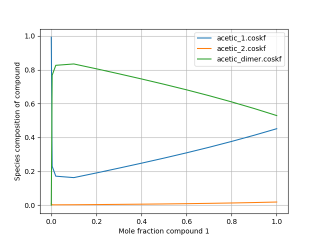

.. _metatag ms_dist: 

Distribution of species in multispecies calculations
****************************************************

COSMO-RS can be used with `compounds which can be composed of multiple possible species <../../Tutorials/COSMO-RS/COSMO-RS_multispecies.html>`__ .  For these types of calculations, it is often desirable to know the distribution of the various possible forms/species that constitute a certain compound.  In the following script, a binary mixture calculation is performed using benzene and an acetic acid compound which is capable of existing as either of 2 conformers or as a dimer.  The distribution of these species is plotted as a function of mole fraction. 

Python code (Binary mixture)
============================

.. raw:: html

   

   
[show/hide code]

.. code-block:: python

     import os
     import matplotlib.pyplot as plt
     from scm.plams import *

     ##################  Note: Be sure to add the path to your own AMSCRS directory here  ##################
     database_path = os.getcwd()

     if not os.path.exists(database_path):
         raise OSError(f'The provided path does not exist. Exiting.')

     def adjust_name(s):
         return os.path.basename(s)

     init()
     #suppress plams output
     config.log.stdout = 0

     # initialize settings object
     settings = Settings()
     settings.input.property._h = 'BINMIXCOEF'
     # optionally, change to the COSMOSAC2013 method
     # settings.input.method = 'COSMOSAC2013'

     # set the number of compounds
     num_compounds = 2
     compounds = [Settings() for i in range(num_compounds)]

     compounds[1].name = "acetic_acid"
     form = [Settings() for i in range(3)]

     form[0]._h = os.path.join( database_path, "acetic_1.coskf" )

     form[1]._h = os.path.join( database_path, "acetic_2.coskf" )

     form[2]._h = os.path.join( database_path, "acetic_dimer.coskf" )
     form[2].count = 2
     form[2].Hcorr = 9.25

     compounds[0].form = form

     compounds[1]._h = os.path.join( database_path, "Benzene.coskf" )
     compounds[1].name = "comp1"

     settings.input.temperature = 298.15

     # specify the compounds as the compounds to be used in the calculation
     settings.input.compound = compounds
     # create a job that can be run by COSMO-RS
     my_job = CRSJob(settings=settings)
     # run the job
     out = my_job.run()

     # convert all the results into a python dict
     res = out.get_results()
             
     struct_names = res['struct names'].split()
     valid_structs = [[] for _ in range(len(compounds))]
     for i in range(len(struct_names)):
         for j in range(len(compounds)):
             if res['valid structs'][i*len(compounds)+j]:
                 valid_structs[j].append(struct_names[i])

     compositions = [ {vs:[] for vs in valid_structs[i]} for i in range(len(compounds)) ]
     idx = 0 
     for i in range(len(compounds)):
         for nfrac in range(len(res['molar fraction'][0])):
             for j in range(len(valid_structs[i])):
                 compositions[i][valid_structs[i][j]].append(res['comp distribution'][idx])
                 idx += 1

     mf1 = res['molar fraction'][0]

     plot_comp = 0 # we'll plot the first compound (acetic acid)
     for struct, vals in compositions[plot_comp].items():
         plt.plot(mf1,vals,label=adjust_name(struct))

     plt.xlabel("Mole fraction compound 1")
     plt.ylabel("Species composition of compound")
     plt.legend(loc='upper right')
     plt.grid()
     plt.show()

     finish()

.. raw:: html

    

This code produces the following output:

