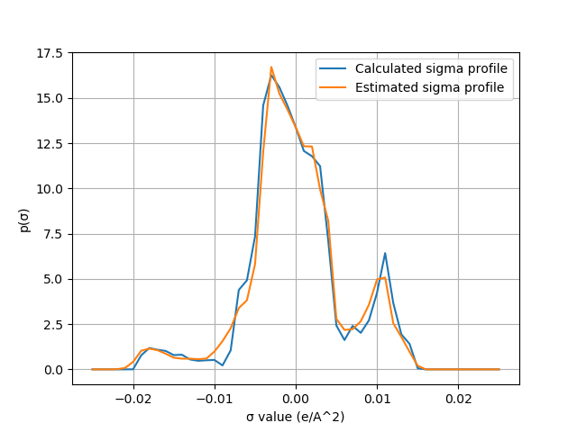

.. _metatag scripting_sigma_profiles: 

Calculating and estimating sigma profiles
*****************************************

Sigma profiles are one of the fundamental pieces of a COSMO-RS/-SAC calculation.  They are also widely used as an important empirical descriptor for a molecule's behavior in a solution as well as for a molecule's properties in a number of applications.  In the standard COSMO-RS/-SAC workflow, sigma profiles are generated after a sequence of DFT calculations which -- for large molecular systems -- can take considerable time to complete.  For computationally expensive systems or high-throughput screening applications, it is sometimes advantageous to approximate sigma profiles using tools like ``fast_sigma`` from AMS.  

In the following python script, we generate sigma profiles for n-Hexanoic acid using the two approaches discussed above.  The function ``calc_sigma_profile`` will generate sigma profiles from ``.coskf`` files, and the function ``fast_sigma`` will generate sigma profiles from SMILES strings using the ``fast_sigma`` tool.

Python code
===========

.. raw:: html

   

   
[show/hide code]

.. code-block:: python

     import os
     import numpy as np
     import matplotlib.pyplot as plt
     from scm.utils.runsubprocess import RunSubprocess
     from scm.plams import *
     import subprocess

     ##################  Note: Be sure to add the path to your own AMSCRS directory here  ##################
     database_path = os.getcwd()

     if not os.path.exists(database_path):
         raise OSError(f'The provided path does not exist. Exiting.')

     init()
     #suppress plams output
     config.log.stdout = 0

     class SigmaProfile:
         def __init__(self,chdens,profiles,profile_names):
             if len(profiles) != len(profile_names):
                 print("Error: profiles_names and profiles of different sizes")
             self.chdens   = chdens.flatten() if isinstance(chdens,np.ndarray) else chdens
             self.profiles = {name:prof.flatten() if isinstance(prof,np.ndarray) else prof for name,prof in zip(profile_names,profiles)}

         def __str__(self):
             line = "─"*(15*(1+len(self.profiles)))
             ret =  line + '\n'+ "".join( ["Charge Dens.".ljust(15)]+[name.ljust(15) for name in self.profiles] ) + '\n' + line + '\n'
             for i in range(len(self.chdens)):
                 ret += "{0:.5g}".format(self.chdens[i]).ljust(15) + "".join(["{0:.5g}".format(v[i]).ljust(15) for k,v in self.profiles.items()])
                 ret += '\n'
             return ret

     def fast_sigma( smiles ):

         results_file =  "tmp_results18954.crskf" 
         subprocess_string = " --smiles '" + smiles + "'"

         if not os.path.isfile(os.path.join( os.path.expandvars("$AMSBIN") , "fast_sigma" )):
             kf_and_sys_exit("ERROR: cannot find fast_sigma ... has amsbashrc been executed?")

         fs = os.path.join( os.path.expandvars("$AMSBIN") , "fast_sigma" )
         scm_sp = RunSubprocess( fs + subprocess_string + " -o " + results_file )

         if os.path.isfile(results_file):
             crskf   =    KFFile( results_file )
             res     =    crskf.read_section( "PURESIGMAPROFILE"  )
             sp = SigmaProfile(chdens=res['chdval'],profiles=[res['profil'],res['hbprofil']],profile_names=["total_profile","HB_profile"])
             os.remove(results_file)
             return sp, scm_sp
         else:
             return None, scm_sp

     def calc_sigma_profile(coskf_file,cosmosac=False):

         # initialize settings object
         settings = Settings()
         settings.input.property._h = 'PURESIGMAPROFILE'

         # set the number of compounds
         compounds = [Settings()]
         compounds[0]._h = os.path.join( database_path, coskf_file )

         # to change to the COSMOSAC2013 method
         if cosmosac:
             settings.input.method = 'COSMOSAC2013'

         # specify the compounds as the compounds to be used in the calculation
         settings.input.compound = compounds
         # create a job that can be run by COSMO-RS
         my_job = CRSJob(settings=settings)

         out = my_job.run()
         res = out.get_results()

         if cosmosac:
             prof_len = len(res['hbprofil'])//3
             sp = SigmaProfile(chdens=res['chdval'],profiles=[res['profil']]+[res['hbprofil'][i*prof_len:(i+1)*prof_len] for i in range(3) ],profile_names=["total_profile","HB","HB-OH","HB-OT"])
         else:
             sp = SigmaProfile(chdens=res['chdval'],profiles=[res['profil'],res['hbprofil']],profile_names=["total_profile","HB_profile"])
         return sp

     # regular way to generate a sigma profile from a .coskf file
     filename = "n-Hexanoic_acid.coskf"
     sp = calc_sigma_profile(filename,cosmosac=False)

     # way using the fast_sigma estimation method
     fs_sp, err = fast_sigma("CCCCCC(=O)O")
     if fs_sp is None or len(err[1])>0:
         print("fast_sigma generated the following output:\n"+err[1])

     plt.xlabel("σ value (e/A^2)")
     plt.ylabel("p(σ)")

     plt.plot(sp.chdens   ,   sp.profiles['total_profile'],label="Calculated sigma profile")
     if fs_sp is not None:
         plt.plot(fs_sp.chdens,fs_sp.profiles['total_profile'],label="Estimated sigma profile")

     plt.legend(loc='upper right')
     plt.grid()
     plt.show()

     finish()

.. raw:: html

    

This code produces the following output:

