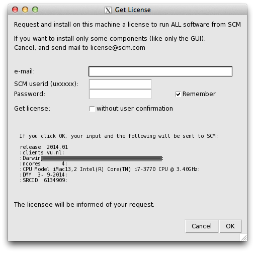
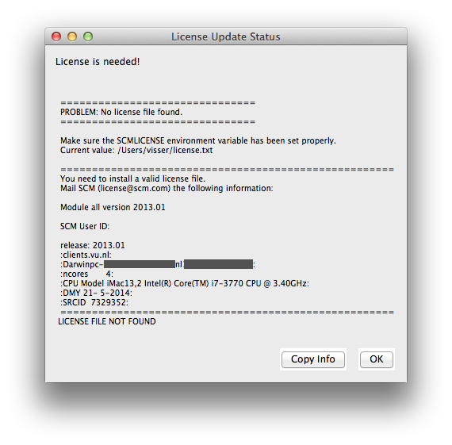

.. _metatag INSTRUCTIONS:

Installation
############

Typically installation of the AMS package is simple and straightforward. If you have problems installing it, contact us for assistance at  `support@scm.com <mailto:support@scm.com>`__.

To install the AMS package you have to go through the following steps:

+  :ref:`1. Decide which version to install <version>`
+  :ref:`2. Download and install the software <install>`
+  :ref:`3. Set up environment <environment>`
+  :ref:`4. Set up the license <license>`
+  :ref:`5. Set up the scratch space <scratch>`
+  :ref:`6. Test your installation <test>`
+  :ref:`7. Configure AMSjobs queues and 3rd party software (optional) <configure>`

Below we discuss each step separately.

.. _version:

Decide which version to install
*******************************

**Choose the released version or a snapshot.** Normally, you will install the released version from the `main download page <http://www.scm.com/support/downloads/>`__. The `bug-fixed binaries <http://www.scm.com/support/downloads/bug-fixes/>`__ contains the most recent bug fixes. You may want to install a snapshot version if you know that some bugs have been fixed recently. The `development snapshots page <http://www.scm.com/support/downloads/development-snapshots/>`__ contains the latest developments. You will only want to download it if you need to use the latest functionality not available in AMS2021.

**Choose a platform.** AMS is available for a number of platforms. A platform is a combination of the processor architecture, operating system, MPI implementation, and any other specialties such as CUDA or "MKL for AMD-Zen".  Currently, the following platforms are officially supported and available from our website:

+ Linux: x86-64 (64-bit): IntelMPI, OpenMPI, IntelMPI+CUDA (beta version only), IntelMPI optimized for AMD-Zen (Optimized for Ryzen/Threadripper/EPYC processors)
+ Mac OS X Mavericks and later (10.13+): x86-64 (64-bit) with OpenMPI
+ Windows: x86-64 (64-bit) with IntelMPI

**32 vs. 64 bits.** AMS2021 is only supported on 64-bit Operating Systems (and hardware). On 32-bit Windows ADF2017 can be used.

**Choose MPI (on Linux).** We advise to use the IntelMPI version if possible. It has been tested on both desktop and cluster machines and should work out-of-the-box on most cluster batch systems. The IntelMPI runtime environment is distributed with AMS. If you prefer to use the OpenMPI version instead, keep in mind that if you wish to run multi-node calculations you need to use a local copy of OpenMPI 2.1 with support for your batch system build in. The OpenMPI runtime environment is distributed with AMS but it is limited to single-node (or desktop) usage.

**Cray XC.** Cray users can use the IntelMPI version of AMS because it is binary-compatible with Cray MPI shared libraries. Read the MPICH ABI compatibility section in the Cray documentation for more information, and talk to your local system administrator. If the machine has a "cray-mpich-abi" module available, you can try using that in combination with the SCM_USE_LOCAL_IMPI=1 environment setting.

**GPU acceleration**: **note: the CUDA version of AMS2021 is considered beta software** ADF can use NVidia GPUs for accelerating SCF cycles and frequency calculations. The GPU should have good double precision performance, be of the Pascal architecture or newer, and the operating system needs to be Linux with CUDA 11.0 installed. Examples of good cards for this are: Tesla P100, Quaddro GP100, Tesla V100, and Titan V. You can find the double precision performance on the `wikipedia list of nvidia GPUs <https://en.wikipedia.org/wiki/List_of_Nvidia_graphics_processing_units#GeForce_10_series>`__

**Optimized for AMD-Zen**: AMS2018 introduced a new supported platform, optimized for AMD Zen (Ryzen/Threadripper/EPYC) processors. Intially this used the OpenBLAS library, but now this platform also uses Intel MKL. The MKL library is forced to run in AVX-2 mode, combined with AVX-2 optimized binaries. This version will NOT work on older AMD processors. Starting with AMS2020 we also have this version available for Windows.

.. _install:

Download and install the software
*********************************

**All systems:** Download an installation package from one of the download pages mentioned above.

**Unix and Linux:** The installation package is a compressed tar archive. Untar it in the directory of your choice. Desktop users can follow the `Linux Quickstart Guide <Linux_Quickstart_Guide.html>`__ to install AMS2021. Please note that in a cluster environment AMS must be installed on a shared file system accessible from all nodes of the cluster. The archive contains one directory, adf2021.xxx, which, when installed, will be referred to as *$AMSHOME*. The installation package has the IntelMPI runtime and Intel MKL libraries included, you do not need to install these separately!

**Mac OS X:** The installation package is a disk image (.dmg) file. To install AMS on Mac OS X, double click on the downloaded disk image and drag *AMS2021.xxx* somewhere on your hard disk, such as the *Applications* directory.  Be sure to **read the enclosed ReadMe** file for further important details!

**Windows:** The downloaded file is an executable Microsoft Installer package containing an installation wizard that will guide you through the installation process. Open the file after downloading, and follow the instructions. **note: Do not close the console window that pops up during the installation!** . Please note that you need Administrator privileges to install AMS. After or during the installer you might be asked by the Windows Firewall to grant network access to some executables, this permission is optional. For third-party firewall applications you will need to grant access from scmd.exe to the localhost.

.. _environment:
.. _metatag ENVIRONMENT:

Set up the environment
**********************

**Windows** users can skip to the next section since for them the environment is set up by the installation wizard.

**Mac** users may follow the UNIX instructions if they (also) wish to run from the command line. However, read the ReadMe file inside the dmg file for some important extra details! Alternatively, Mac users can start by double clicking the AMS2021.xxx application. The AMS2021.xxx application will automatically set the environment, and start AMSjobs for you. Next, all tasks (GUI or computational engines) started from this AMSjobs will inherit the proper environment.

For users of any **Unix-like** system the following step is mandatory.

For a **single-user** installation, the end-user is likely also the person installing AMS. If the user has a bash shell, it should be sufficient to source the $AMSHOME/amsbashrc.sh:

::

   . $HOME/ams2021.xxx/amsbashrc.sh

Alternatively, it is also possible to **edit** the $AMSHOME/Utils/amsrc.sh (for sh/bash/zsh users) or $AMSHOME/Utils/amsrc.csh (for csh/tcsh users) file to set a number of important environment variables and source the file:

::

   . $HOME/ams2021.xxx/Utils/amsrc.sh

or (for tcsh)

::

   source $HOME/ams2021.xxx/Utils/amsrc.csh

**Note:** If the amsrc.sh or amsrc.csh file is missing from your Utils folder, you can download then here: :download:`Download amsrc.sh <../../Utils/amsrc.sh>` , :download:`Download amsrc.csh <../../Utils/amsrc.csh>`

To set up the environment automatically when starting a new terminal, add the source command to the $HOME/.bashrc file. It is also possible to create a launcher icon for the GUI by running the $AMSBIN/create_linux_icon.sh script AFTER the environment has been set:

::

   $AMSBIN/create_linux_icon.sh

For a **multi-user** installation, you can either copy both adfrc.* files to the /etc/profile.d directory (after editing them) or, if your system supports modules, create a module file for AMS2021. The following environment variables must be defined in the module file:

+ AMSHOME: AMS installation directory

+ AMSBIN: should be equal to $AMSHOME/bin

+ AMSRESOURCES: should be equal to $AMSHOME/atomicdata

+ SCMLICENSE: complete path of the license file, typically $AMSHOME/license.txt

+ SCM_TMPDIR: path to the user's scratch directory, for example, /scratch/$USER. This directory must exist prior to the first execution of any program from the AMS package by that user. Thus it may be a good idea to add to the user's profile a command that creates the directory in case it does not exist. You can also choose to use the same directory for all users. See `SCM_TMPDIR Environment variable <Appendix_A_Environment_Variables.html#more-on-the-scm-tmpdir-variable>`__ for more details.

A complete list of environment variables is provided in `Appendix A <Appendix_A_Environment_Variables.html>`__.

If you are planning on using the GUI on a remote machine (for example via ssh with X-forwarding), make sure to also take a look at `Using the GUI on a remote machine <Remote_GUI.html>`__.

If you plan on running jobs directly from the command line, please do **not** mpirun the programs directly. The MPI startup is done automatically, for more information see the `Additional Information on running MPI jobs <Additional_Information_and_Known_Issues.html#running-mpi-jobs>`__.

.. _license:
.. _metatag LICENSE:

Set up the license
******************

Which functionality can be used on each computer is determined by the license file pointed to by the SCMLICENSE environment variable.

When you start any GUI program from the AMS package (like ADF, BAND, AMSjobs or AMSinput) it will try to install a license file for you if necessary. To do this, some information is needed:

``e-mail:``
   Your e-mail address, this may be used to contact you and send you a license file.

``SCM userid (uxxxxx):``
   The same as the download login you should have received.

``Password:``
   The download password belonging to the SCM userid

``Remember:``
   If checked, the SCM userid and password will be saved on your computer, so you do not have to enter them again. They are saved in a readable format, so only do this on a computer and account you trust.

``Get license without user confirmation:``
   If checked, a license request will automatically be issued when necessary, without user intervention. The intended use is for running on clusters, or for use in classroom/workshop situations. It will work only after arranging this with SCM first.

Click OK to request and install a license to run on your current machine. The information will be sent to the SCM license server.

The same autolicense procedure can also be started from a shell environment:

::

   $AMSBIN/autolicense nogui -u username -p password -m mailaddress

If a license is available, or can be generated by the license server (for **trial** users) it will be installed automatically. Obviously you will need to have an internet connection with access to the outside world for this to work.

For **Non-trial** users, license requests are handled manually. After some time (between hours and days) you will be notified by mail that a license file has been prepared for you.

Run the software again (on the same machine with the same SCM userid), and in many cases the license will automatically be installed for you. If not, follow the "Manual license installation" instructions (further down on this page).

Click Cancel when you do not want to request a license to run on the current machine, if your machine has no internet connection, or if you wish to request and install a license file manually.

A window will appear (either a regular Text editor on your system, or the (License Update Status) appears telling you a license is needed:

It will show the info that needs to be mailed to SCM to get a license.  You can copy that information to your clipboard by clicking the Copy Info button, or the usual copy tool in your editor.

Next, mail this information to  `license@scm.com <mailto:license@scm.com>`__ if you indeed wish to request a license for this machine.

After some time (hours-days as the license request is processed manually) you should receive a mail from SCM containing the license file.

You have receive a new license file via email. **Do not make any changes to it**, as that will break the license!

Mac users can normally just drop the license file on the AMS2021 application icon.

Other users should save the license file such that $SCMLICENSE points to it. Note the value of SCMLICENSE was shown in the License Update Status dialogue.

The default location of the license file (for Windows and the default SCMLICENSE value from a adfrc.* file) is set to $AMSHOME/license.txt, which means you should save the file as license.txt in the AMS installation directory. For macs the default location is "$HOME/Library/Application Support/SCM/license.txt".

**Unix-like** users can generate the license information by running the following command at the shell prompt in a terminal window:

::

   $AMSBIN/dirac info

Output of this command from all computers on which AMS will be running, including all nodes of a cluster if applicable, must be sent to `license@scm.com <mailto:license@scm.com>`__.

After receiving this information SCM will prepare a license file matching your license conditions and e-mail it to you with instructions on how to install it.

After receiving your license file you will need to save it so that $SCMLICENSE points to it.

In a multi-user environment, make sure that permissions on the license file allow read access for everyone who is going to run AMS.

.. _floating:

Floating license
----------------

Note: floating licenses are only intended for Linux clusters.

If you have a floating license, you will need to follow these instructions below to set it up. The instructions are simple, but it is important you follow them exactly.

If you do not have a floating license you may skip this section.

**Create a floating license directory**

Make a new directory, for example FloatADF, to keep track of the running ADF processes.

This FloatADF directory must be:

+ in a fixed location (the directory name should not change!)

+ shared between / mounted on all nodes where you want to run ADF

+ writable by all users that want to run ADF

+ FloatADF must **not** be a subdirectory of $AMSHOME

For example:

::

   cd /usr/share
   mkdir FloatADF
   chmod 1777 FloatADF

If you (also) have a floating license for BAND, DFTB or ReaxFF, you need to similarly set up directories FloatBAND, FloatDFTB, FloatReaxFF. The permissions can also be slightly more restrictive, like 1770, if the folder is group-owned for a specific unix group of AMS users.

In the example, we have given all users read, write and execute permissions to this directory. If you wish to restrict this for security reasons, you may do so as long as all ADF users will have read, write and search permission for this directory. You may create an ADF user group for this purpose.

**Important:** the directory should **not** be a sub-directory of $AMSHOME as the directory name will change if you update to a new version! Also, do **not** put the license.txt file in the FloatADF directory.

**The FloatADF directory may not be moved, deleted or renamed for the duration of your license** because these actions will invalidate it!

**E-mail us the license information**
Send the result of the following commands (using again the name FloatADF and the location /usr/share as an example) to license@scm.com:

::

   cd /usr/share
   ls -lid $PWD/FloatADF

Please note that output of the ls command must include the full path of the FloatADF directory.

Together with the output of the ls command above, you also need to send us output of the *$AMSBIN/dirac info* command from each computer on which ADF will possibly run, as the license file is still host-locked.

In the case of very large clusters, it is often sufficient if you send us the output of the *$AMSBIN/dirac info* command from the head node and 2 or 3 compute nodes. As most compute node names have the same beginning, we can then add them with a wild card (for example Linuxchem*). It is important when you use this facility, to let us know that the info you are sending are not all compute nodes. Otherwise the license will only run on these few compute nodes.

.. _scratch:

Set up the scratch space
************************

Most programs from the ADF package use disk for temporary data. This data often takes a significant amount of space and is used frequently. To avoid run-time errors and performance loss you may want to make sure that the file system used for temporary files is both big and fast. The SCM_TMPDIR environment variable is used to tell the programs where to put their temporary data. Please note that SCM_TMPDIR should always be set. If it is not set then each process will create its own directory in the current working directory where is was started.

Please see `Appendix A <Appendix_A_Environment_Variables.html#more-on-the-scm-tmpdir-variable>`__ on additional information about the SCM_TMPDIR variable.

**Using multiple disks**

Sometimes, if you have multiple non-RAID disks in your system, you may want to spread scratch files across different physical disks for better performance. It is possible to request that every AMS MPI-rank creates its files in a different directory by adding "%d" in $SCM_TMPDIR. If a "%d" string is encountered in the value of SCM_TMPDIR variable it will be replaced by the MPI rank number of the process at run-time. This means, however, that you may have to create up to 128 or more (depending on the maximum number of processes in one parallel calculation) symbolic links on each node where AMS is supposed to run. You should also create a directory matching the SCM_TMPDIR's value literally so that any process that does not interpret '%d' could also run.

Example: suppose there are two scratch file systems, /scratch1 and /scratch2 located on two different physical disks of an 8-core workstation. We want the odd rank numbers to use /scratch2 and the even numbers to use /scratch1. One way to achieve this is to create an empty /scratch directory and create nine symlinks in it as follows:

::

    ln -s /scratch1 /scratch/%d
    ln -s /scratch1 /scratch/0
    ln -s /scratch2 /scratch/1
    ln -s /scratch1 /scratch/2
    ln -s /scratch2 /scratch/3
    ln -s /scratch1 /scratch/4
    ln -s /scratch2 /scratch/5
    ln -s /scratch1 /scratch/6
    ln -s /scratch2 /scratch/7

After that set SCM_TMPDIR to "/scratch/%d" and the ranks 0, 2, 4, 6 will use /scratch1 while ranks 1, 3, 5, and 7 will use /scratch2. When running AMS on a cluster it is better to combine multiple disks in a RAID 0 (striping) configuration as you probably do not want to create hundreds of symbolic links on each node.

.. _test:

Test your installation
**********************

This is a very important step and it should never be skipped.

Check the license file
----------------------

**Windows users** test their license by double-clicking the makelicinfo.bat file in the AMS installation folder.

**Unix users**: first check that the license file has been installed correctly by running (at the shell prompt):

::

   $AMSBIN/dirac check

This should produce the output similar to the following:

::

   Checked: /home/testadf/ams2021.xxx/license.txt

    License termination date (mm/dd/yyyy):  1/ 8/2021

    According to it, you are allowed to run:
              ADF version 2021.990
             BAND version 2021.990
             DFTB version 2021.990
           DCDFTB version 2022.000
           QNDFTB version 2021.990
           REAXFF version 2021.990
           ADFGUI version 2021.990
          BANDGUI version 2021.990
          DFTBGUI version 2021.990
        REAXFFGUI version 2021.990
         MOPACGUI version 2021.990
            QEGUI version 2021.990
              CRS version 2021.990
              GUI version 2021.990
            MOPAC version 2021.990
              NBO version 2021.990
             NBO6 version    6.000
              AMS version 2021.990
            Utils version 2021.990

    Number of procs you are allowed to use for:

    ADF    :    1024 procs
    BAND   :    1024 procs
    DFTB   :    1024 procs
    ReaxFF :    1024 procs

    =====================================================
    SCM User ID: u999999
    release: 2021.101
    :example.com:
    :Linuxmaster.example.com00:11:22:33:44:55:
    :ncores      12:
    :CPU Model Intel(R) Xeon(R) CPU E5-2630 v2 @ 2.60GHz:
    :DMY  1- 7-2016:
    :SRCID  3217288:
    =====================================================
   LICENSE INFO READY

If the license check is successful (i.e. you get the "LICENCE INFO READY" message) you can move on. Otherwise check that the license file has been installed according to instructions above.

Run some basic tests
--------------------

Verify that you can now run examples provided with AMS and that they give correct results. We recommend that you consult the Examples document for notes on such comparisons: non-negligible differences do not necessarily indicate an error. If you have a license for the GUI you can also run a few GUI tutorials as a test.

**Note:** the example *.run files are complete Bourne shell scripts that should be executed as such, they are **not** input files to be fed into any program. The easiest way to run them is using AMSjobs.

Test the GUI
------------

If the GUI is included in your license, check that you can start any of the GUI modules.

**UNIX users:**

Enter the following command:

::

    $AMSBIN/amsjobs

An AMSjobs window should appear. If your GUI crashes, especially when starting AMSinput, try setting the SCM_OPENGL_SOFTWARE=1 environment variable before launching the GUI:

::

    export SCM_OPENGL_SOFTWARE=1
    $AMSBIN/amsjobs

**Mac users:**

Double click the AMS2021.xxx application to start it. An AMSjobs window should appear.

**Windows users:**

Double click the AMSjobs icon to start it. An AMSjobs window should appear.  If the window does not appear or appears after a long delay then check the AMS-GUI requirements and check the firewall rules that should allow local communication.

**All users** should now be able to start AMSinput via the SCM menu on the top left of the menu bar.

Test parallel execution
-----------------------

It is very important to make sure that computer resources are utilized with the maximum efficiency.  Therefore, you should check that each AMS job uses all processors/cores allocated to it and that the network is not overloaded with the disk I/O traffic.

Typically, when you submit a parallel job to the batch system you have a possibility to specify how many processors per node (ppn) to use. If the batch system you are using allows this, then make sure that you request ppn equal to the number of physical cores on each node.
Note that old AMD processors based on the so-called "Bulldozer" architecture have one floating-point unit (module) per two physical cores. On this architecture and its successors (Piledriver, Steamroller) AMS will probably perform best when you only run on half the physical cores. When running outside of a batch system AMS tries to detect the optimal number of processes to start automatically, but when running under a batch system it's the user's responsibility set the ppn to an appropriate value. This is no longer a problem with the AMD Zen (Ryzen/Threadripper/Epyc) architecture. However, for these processors it is advisable to use the "IntelMPI optimized for AMD-Zen" version of AMS2021. This version forces the Intel Math Kernel Library (MKL) to run in AVX2 mode for the best performance, because otherwise the auto-detection mechanism in MKL switches it to the slowest code-path for non-Intel processors.

It is also possible that your batch system does not allow you to specify ppn but instead it always assumes that there only one processor per node. In this case, you will need to edit the $AMSBIN/start file and add some commands for processing the hostfile.

In order to check that everything is working as intended, pick one of the jobs found in the examples/Benchmarks folder, depending on which functionality you are mostly interested in. For example, take the ADF/Si35_TZ2P for molecular DFT, BAND/GuanineRing2D_gga for periodic DFT, DFTB/ubiquitin for approximate DFT (DFTB), or Reaxff/AMS_PETN_LAMMPS for reactive force-field MD with AMS. Additional information for some of the examples can be found in the corresponding Readme.txt and/or timings.txt files, where available. 

Copy the run file from the selected example to an empty directory and start it using amsjobs, preferably on more than one node. After the job has finished (which can take anywhere from a few minutes to hours, depending on the example), open the job's out file and find the table that looks like the following:

::

    Parallel Execution: Process Information
    ==============================================================================
    Rank   Node Name                              NodeID   MyNodeRank  NodeMaster
       0   compute-0-0                               0          0          0
       1   compute-0-0                               0          1         -1
       2   compute-0-0                               0          2         -1
       3   compute-0-0                               0          3         -1
       4   compute-0-1                               1          0          1
       5   compute-0-1                               1          1         -1
       6   compute-0-1                               1          2         -1
       7   compute-0-1                               1          3         -1
    ==============================================================================

Check the names in the "Node Name" column and verify that the number of tasks per node is as expected. If it is, then move on to the next section. 

Please note that there may be more than one AMS node (distinguished by the NodeID) per physical node (distinguished by the Node Name) depending on the node's NUMA settings and the values of the SCM_SHAR_NCORES and SCM_SHAR_PER_SOCKET environment variables, see `Environment Variables <Appendix_A_Environment_Variables.html>`__ for details.

Test parallel performance
-------------------------

If the process allocation to nodes looks as expected then scroll down a bit to the *Temporary files are created in* line and make sure you do not see anything like *Temporary file I/O may be slow*. If you see it then you should consider setting the SCM_TMPDIR environment variable to a path on a local or a high-performance distributed file system. Do not point SCM_TMPDIR to a directory on an NFS file system because doing so may slow down your computations to a crawl!

Scroll down a bit more to the lines that look like this:

::

   Communication costs MPI_COMM_WORLD:      1.026 usec per message,   0.0320 usec per 8-byte item
   Communication costs for intra-node:      1.023 usec per message,   0.0318 usec per 8-byte item

Make sure that you get reasonable numbers (less than 100 usec per message) both for intra-node and MPI_COMM_WORLD communication costs. Otherwise contact your system administrator. High communication cost for intra-node may mean the CPU affinity is not configured correctly or the machine is oversubscribed (which is extremely bad). If only the MPI_COMM_WORLD communication cost is high but the intra-node one looks reasonable, this may mean that the network link between machines is very slow and you may want to run single-node jobs only.

If this is OK then scroll down to the "NORMAL TERMINATION" line. The basic timing statistics is printed after the line, which may look like this:

::

        Total cpu time:      58.28
     Total system time:       0.84
    Total elapsed time:      59.72

This shows how much time (in seconds) was spent in the AMS code (cpu time) and in the kernel (system time), and how long did it take for the calculation to complete (elapsed time). Ideally, the system time should be small compared to the cpu time and the latter should be close to the elapsed time. The system time will not always be a small number but the total of the system and cpu time should always give a number very close to the elapsed time. If this is not the case then it means that AMS has to spend a lot of time waiting for something. This can be, for example, disk I/O or network communication.

If you notice that the system time portion is large or that there is a large difference between the cpu+system and the elapsed time, then send the output file to the SCM support. Alternatively, you can analyze the detailed timings table that follows the basic stats yourself. Make a note of the timers that contribute to the irregularities the most and compare them with the same table found in the example's directory. The timer name may provide a hint of what part is slow (for example, if you see something like 'read' or 'write' in the timer name then it's likely related to the disk I/O). If you have trouble interpreting the results then you can still send the file to SCM support.

.. _configure:

Configure AMSjobs queues and 3rd party software (optional)
**********************************************************

If you would like to use the GUI as a front-end to submit your jobs to queues, you should configure those queues in AMSjobs. Third party software MOPAC and ffmpeg (export movies) may also be installed separately.

AMSjobs queues
--------------

A video shows `how to set up remote queues on Windows <https://www.scm.com/wp-content/uploads/Videos/RemoteQueuesWithAMSjobs.mp4>`__, other platforms are even easier.

AMSjobs can submit and monitor jobs for you on different queues, both locally and remotely. You can use the GUI on your desktop or laptop for creating, submitting and analyzing your jobs, while running the jobs on remote compute clusters. In that case you should establish and ssh-agent connection, to enable remote job managing by the GUI. If you just run local jobs without a queuing system, skip this section.

To set up a new batch queue, select **Queue → New...  →** and choose an example queuing system to starting with (LSF, PBS, or SGE). Modify the input files such that they correspond to your queue configuration:

+ change the **Name** of the queue

+ set the **Remote host** to the hostname of your cluster

+ set **Remote user** to your username on that cluster

+ change the **Run command** in accordance with your typical queue set up. The **$options** corresponds to the input box that can be modified in AMSjobs before submitting, e.g. the time or number of nodes

+ you can set what $options defaults to in the **Default Options** field

+ change the **Kill**, **Job status**, **System status commands**, if necessary

+ you may define a **Prolog** or **Epilog** command

Managing remote jobs
--------------------

To manage remote jobs, you need automatic authentication with an ssh-agent via an ssh key pair. This is most easily set up on MacOS or Linux, but is a bit more involved for Windows.

**ssh connection on MacOS and Linux**

If you don't have an ssh key pair already, you can generate one in a terminal: ssh-keygen -t rsa Put your pass-word protected public key on the compute cluster(s) in ~/.ssh/authorized_keys.

Next, you should establish a connection via an ssh-agent. On MacOS an ssh-agent runs by default, and with keychain you just have to type your password once when you make the first connection.

On various Linux installations ssh-agent is also running by default. If an ssh-agent daemon is not yet running in the terminal where you will run AMSjobs, start the daemon, e.g. by adding eval $(ssh-agent bash) to your .bashrc. You need to add your private key to the ssh-agent daemon: ssh-add.

AMSjobs will use SSH to connect to the remote systems, making a new connection for everything it does. This means that there will be many connections to the remove machine(s). If you are using OpenSSH (both on the local and the remote machine), you can instead use one ssh connection and keep it alive, reusing it for many things. This makes AMSjobs faster, and may avoid complaining system administrators of the remote machines.

To do this, set the environment variable SCM_SSH_MULTIPLEXING to yes (for example via the AMSprefs application).

**ssh connection on Windows**

PuTTY tools, automatically installed with ADF, can be used to set up an ssh-agent connection. Follow these steps, using the PuTTY programs located in the bin\\Putty directory in your AMS installation directory.

+ Run puttygen.exe, set the key length to at least 2048 bits and press the Generate button. This will generate an ssh key pair. Type a key passphrase and save the private key to a file. Add the corresponding public key to the ~/.ssh/authorized_keys file on the remote host. 

+ Run pageant.exe and add your private ssh key (right-click on the Pageant icon in the task bar) with the correct passphrase.

+ Open AMSjobs menu Help|Command-line and run "ssh user@host uptime" using correct username and hostname. Type **yes** if prompted to store the key in cache. If you get prompted for a password or get authentication errors then something is not configured correctly. The remote job submission will not work until all problems are resolved.

Now you can close the prompt and start using AMSjobs to manage remote jobs. You may test your queue configuration: **Jobs → Generate Test Job** and assign it to your new queue before running the test job.

**Centrally defined queues**

A system administrator may also define a queue centrally, which may then be picked up by any user automatically via Dynamic queues. Consult the `GUI manual <../GUI/AMSjobs.html#example-queue-configurations-for-sge-and-pbs>`__ for information on how to set these up in AMSjobs.

**ffmpeg**

The AMSmovie GUI module can make MPEG videos of the system as you see it in the AMSmovie window. This can be an MD trajectory or vibrational modes, or the course of geometry optimization. For this to work, you need to install the free ffmpeg program from the  `FFmpeg website <http://ffmpeg.mplayerhq.hu/>`__ and make sure it can be found in the path. The simplest way to do this is to copy the ffmpeg executable to $AMSBIN.
