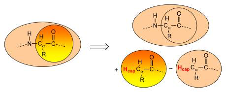

AddRemove method for capping atoms
##################################

Whenever the definition of a region splits through a covalent bond (or better put, whenever QUILD notices that there are dangling bonds within a certain job), it will automatically add capping atoms to satisfy the valence of the boundary atoms (see for instance Figure below). For the moment, the program automatically adds hydrogen as capping atoms, which in the future may be changed to include other elements as well, if needed. 

The capping atoms are added according to the AddRemove methodology  [:ref:`40<reference 40>`],  in which the capping atoms follow the position of the real atoms in the total system. I.e. the capping atoms are positioned along the vector of the dangling covalent bond, and at a distance that corresponds to the sum of the covalent radii of the capping atom and the atom to which the capping atom is attached. Because the capping atoms are added to the active site for both the high- and low-level QM calculation, with a presumably similar effect in both cases, the interactions of the capping atoms with the true active site atoms are in good approximation canceled out (the total effect is removed) between the lower- and higher-level QM calculations. Within the AddRemove model, the energy and gradients are treated in similar fashion (unlike other models that project the gradients of the "artificial" capping atoms onto the gradients of the "real" atoms). The AddRemove model was previously [:ref:`40<reference 40>`] shown to perform well for geometries around the boundary between the QM and MM region in QM/MM calculations. 

In summary, the AddRemove model [:ref:`40<reference 40>`] has several advantages: it is simple, the energy and gradients (and Hessian) are treated in similar fashion (unlike other models that for instance project the gradients of the capping atoms onto the gradients of the real atoms). Furthermore, the capping atoms follow the real atoms, at a predefined distance, and therefore no artificial degrees of freedom are added by including the capping atoms. In a strict sense, one could even argue that the replacement of the interactions of the capping atoms is performed consistently with the choices made for the multi-level approach. 

There is only one case where the use of the AddRemove model within the QUILD program is not straightforward, and that is posed by MM regions with dangling bonds (see Figure above, bottom right). The description of the MM region depends explicitly on a force field, that in turn needs for each atom in the MM region an atomtype that should be supplied by the user on input, together with all connection tables for all atoms. As the QUILD program automatically adds capping atoms (:math:`H_\text{cap}` in the Figure above), the DESCRIPTION subblock for the NEWMM description of the capped region (Figure above, bottom right) should include the atomtype and connections for the automatically added capping (hydrogen) atoms. 

The program checks for each job in a multi-level scheme, if they have atoms with dangling bonds. It does this by going over all regions that are included in that particular job; the order in which the regions are checked depends on how the regions are given on input (!). For instance, in the following line, region 2 is checked first and then region 1 as second: 

::

     REPLACE region 2 region 1    description 3 for description 2

For checking the dangling bonds in each region, the program goes sequentially through all atoms and checks if they belong to that particular region; if so, and if the atom has a dangling bond (as the C\ :math:`_\alpha`  atom has in the Figure above) a capping atom is added, which is positioned along this dangling bond. 

