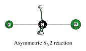

Improved geometry optimization
##############################

One of the strong points of the QUILD program  [:ref:`1-2<reference 1>`] apart from its flexible setup of the multi-level approach, is its enhanced geometry optimization capabilities. These result in part from the use of adapted delocalized coordinates  [:ref:`41<reference 41>`], a modification of the original delocalized coordinates setup [:ref:`42<reference 42>`], that enables the use on weak coordinates as well. Further enhancements are obtained through the use of regulated GDIIS  [:ref:`43-44<reference 43>`], Restricted Second Order model (trust region)  [:ref:`45-46<reference 45>`], and a model Hessian [:ref:`41<reference 41>`]. The latter includes the generation of a model Hessian for transition state searches by preparing the initial Hessian with the correct curvature and number of negative eigenvalues, which moreover correspond to the reaction coordinates (TSRC) for the transition state under study. The user has to specify on input what the relevant TSRC coordinates are, which will not only be used for the generation of the initial Hessian, but also to select the appropriate Hessian eigenvector when there are more (or less) than 1 negative Hessian eigenvalues. 

The details of setting up the delocalized coordinates, its adaptation to facilitate the use on weak and strong coordinates, and their characteristics can be found in refs.  [:ref:`41<reference 41>`] and  [:ref:`2<reference 2>`].  Here we briefly mention the performance of the QUILD program for the Baker test set (a set with 30 organic molecules) and a test set with 18 weakly-bound molecules [:ref:`2<reference 2>`]. For the Baker set, we need 167 iterations to fully converge all molecules to a gradient of 3.0 10\ :sup:`-4`  a.u. at RHF/STO-3G (results obtained using the interface to ORCA), and 164 at PW91/TZ2P. For comparison, the old-style optimizer in ADF using Cartesians needed 222 iterations. For the weakly-bound set, we need 175 iterations to fully optimize the molecules to a gradient of 1.0 10\ :sup:`-5`  a.u. at PW91/TZ2P. Again for comparison, the old-style optimizer in ADF using Cartesians needed 748 iterations. 

As an example, below is the relevant input for performing a transition state search for the bimolecular nucleophilic substitution reaction of fluoride on methyl chloride (see figure): 

::

   Geometry
     TransitionState
   End
   
   QUILD
     TSRC
       dist 1 5
       dist 1 6
     SUBEND
   END
   
   ATOMS
      C             0.000000     0.000000        0.000000
      H            -0.530807     0.919384693     0.112892
      H            -0.530807    -0.919384693     0.112892
      H             1.061614     0.000000        0.112892
      Cl            0.000000     0.000000       -2.124300
      F             0.000000     0.000000        2.019100
   END
   Charge -1
   
   INTEGRATION 6.0 6.0
   
   SCF
    converge 1.0e-6 1.0e-6
    diis ok=0.01
    iterations 99
   END

The QUILD program will scan the input for the existence of a Geometry block (that indicates that QUILD should do an optimization), and will scan the Geometry block for the presence of the TransitionState keyword. If it is found, it will set the number of negative Hessian eigenvalues that are needed (nrnegneed) to 1, otherwise it will remain 0. 

The QUILD block should in this case contain a TSRC subblock where the coordinates involved in the transition state are given. In the example above, there are two TSRC coordinates, the C-Cl and the C-F bond, as indicated by the atom numbers. For the construction of the initial Hessian, a negative force constant is assigned to these coordinates. For instance in the outputfile, first the definition is given for the primitive coordinates as they are constructed by the QUILD program (with the TSRC coordinates shown below in blue): 

::

   Number of MM coordinates (valence,intramol,intermol) :    32 (   32,    0,    0)
   --------------------------------------------------------------------------------
                                valence coordinates
   --------------------------------------------------------------------------------
        1  bnd                2       1       0       0       1             1.02076
        2  bnd                3       1       0       0       1             1.02076
        3  bnd                4       1       0       0       1             1.02076
        4  bnd                5       1       0       0       1             0.50000
        5  bnd                6       1       0       0       1             0.50000
        6  ang                3       1       2       0       2             0.90892
        7  ang                4       1       2       0       2             0.90892
   etc.

Further down in the output, the force constants for the different MM coordinates are shown (with the ones for the TSRC coordinates given in blue): 

::

   Force Constants used:
   
    bnd     1   0.40831      bnd     2   0.40831      bnd     3   0.40831      bnd     4  -0.03252
    bnd     5  -0.02804      ang     6   0.20839      ang     7   0.20839      ang     8   0.20839
   etc.

which are also coupled with each other: 

::

   Off-diagonal TSRC Hessian-element :        5       4  -0.04271            -0.02804  -0.03252

And finally, the contributions of the TSRC coordinates to the Hessian eigenvalues is reported: 

::

   Weight TSRC-coord     1    4   1.00000 Flindh    0.50000
   Weight TSRC-coord     2    5   1.00000 Flindh    0.50000
   
   Contributions of TSRC coordinates to negative Hessian eigenvalue     1 is    0.99996
   Contribution from primitive     5   0.49998     Bnd     F    6     C    1
   Contribution from primitive     4   0.49998     Bnd     CL   5     C    1     
   Contribution from primitive    17   0.00001     Imp     H    3     C    1     H    4     H    2
   Contribution from primitive    15   0.00001     Imp     H    4     C    1     H    2     H    3
   Contribution from primitive    16   0.00001     Imp     H    4     C    1     H    3     H    2
   
   Contributions of TSRC coordinates to all Hessian eigenvalues:  
   Eigval     1  -0.07305    Contrib_All    0.99996   per_tsrc    0.49998   0.49998
   Eigval     2   0.01248    Contrib_All    0.93816   per_tsrc    0.46908   0.46908

As a result, the optimization converges within 10 cycles: 

::

   QUILD summary for sn2_ts_orig.out 
   
    Stp#       Energy      Gmax,adf      Grms,adf   Gmax,deloc.   Grms,deloc.   Symm #negH
           (kcal/mol)        (a.u.)        (a.u.)        (a.u.)        (a.u.)
   =======================================================================================
       1    -620.9561   0.007101756   0.003028991   0.011855992   0.003715738    C(3V)   1
       2    -620.8929   0.023635611   0.007391899   0.013690739   0.005638699    C(3V)   1
       3    -621.2068   0.016710875   0.005351311   0.026217447   0.007807519    C(3V)   1
       4    -620.8176   0.004699225   0.001709580   0.011879183   0.003484516    C(3V)   1
       5    -620.3782   0.008811234   0.002829390   0.018504386   0.005671159    C(3V)   1
       6    -620.8564   0.001689444   0.000533251   0.002432001   0.001015262    C(3V)   1
       7    -620.9381   0.002213820   0.000584005   0.000987755   0.000448095    C(3V)   1
       8    -620.8942   0.000576597   0.000161025   0.000424960   0.000141833    C(3V)   1
       9    -620.8840   0.000112994   0.000037557   0.000241219   0.000074629    C(3V)   1
      10    -620.8831   0.000010191   0.000003368   0.000021158   0.000006610    C(3V)   1
   +++++++++++++++++++++++++++++++++++++++++++++++++++++++++++++++++++++++++++++++++++++++
                    Geometry CONVERGED !!!
                    Energy at optimized geometry :        -620.8831 (kcal/mol)
   +++++++++++++++++++++++++++++++++++++++++++++++++++++++++++++++++++++++++++++++++++++++

Additionally, the QUILD optimizer allows to constrain bonds, angles or dihedrals during the optimization, in which it uses the method by Baker  [:ref:`47<reference 47>`]. This method has the nice feature that the constraints do not have to be met in the initial geometry, but are enforced through the use of Lagrangian multipliers. The ability of adding constraints has been extended to perform a LinearTransit, i.e. a series of constrained optimizations, that can be used to scan a potential energy surface as function of e.g. a bond. For the S\ :sub:`N` 2 reaction shown above, the relevant input to do a LinearTransit would be: 

::

   QUILD
     nrlt 11
     CONSTR
       dist 1 6 2.5 1.5
     SUBEND
   END

This means that the C-F distance is reduced (while constrained) in 11 steps, starting from 2.5 Å and going to 1.5 Å, in steps of 0.1 Å. All other coordinates are free to optimize in this example, however a combination of more than one constrained coordinates is possible; either by including them also as LT coordinate, or simply as constraint. 

