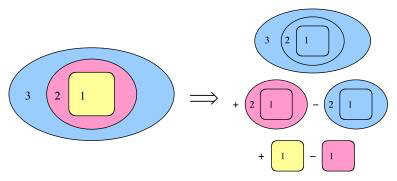
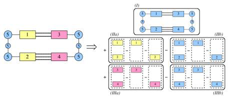

Multi-level energy expression
#############################

Similar to the ONIOM approach [:ref:`38-39<reference 38>`]  the total energy within the multi-level approach is obtained by combining the different energies, for instance, for the interactions in a protein depicted schematically below, with the active site (region 1, in yellow), the rest of the protein (region 2, in pink) and solvent (region 3, in blue).  

Suppose we want to treat the active site using a GGA functional in a large basis set, the rest of the protein by LDA in a small basis, and the solvent at MM level. The energy expression is then obtained by a sequence of 5 jobs: 

E = E\ :sub:`MM`  (1,2,3) + E\ :sub:`LDA`  (1,2) - E\ :sub:`MM`  (1,2) + E\ :sub:`GGA`  (1) - E\ :sub:`LDA`  (1) 

First, the total system is described at the MM level (top-right), then the MM description for regions 1 and 2 is replaced by LDA (middle-right), and finally the LDA description for region 1 is replaced by the GGA description (bottom-right). This splitting up of the total system into different jobs is fully automated, the user only has to assign the different regions and give descriptions for the QM and MM methods to be used.  

A second example of using a multi-level approach is posed by the application to DNA. In this case we do not want to replace all interactions within one region, but merely the *interaction* between two different regions. This is again achieved by a sequence of jobs, as indicated in the figure above on the right hand side. First, we have a BP86 job for the whole system (top, in blue). Second, we add the LDA interaction energy for the left-side stacked basepair in a series of three jobs (middle, in yellow) and remove the corresponding BP86 interaction energy (middle, in blue). Third, we add the LDA interaction energy (bottom, in pink) and remove the corresponding BP86 interaction energy (bottom, in blue) for the right-side stacked basepair. 

The corresponding input for the second example would be schematically: 

::

   QUILD
     NR_REGIONS 5
   
     REGION 1
       17-30
     SUBEND
     REGION 2
       77-91
     SUBEND
     REGION 3
       47-60
     SUBEND
     REGION 4
       111-122
     SUBEND
     REGION 5
       1-16 31-46 61-76 92-110 123-125
     SUBEND
   
     DESCRIPTION 1
       CHARGE -2
       XC
         GGA Becke-Perdew
       END
       BASIS
         type TZ2P
         core SMALL
       END
     SUBEND
     DESCRIPTION 2
       XC
         GGA Becke-Perdew
       END
       BASIS
         type TZ2P
         core SMALL
       END
     SUBEND
     DESCRIPTION 3
       BASIS
         type TZ2P
         core SMALL
       END
     SUBEND
   
     INTERACTIONS
       TOTAL     description 1
       INTXN region 1 region 2       description 3 for description 2
       INTXN region 3 region 4       description 3 for description 2
     SUBEND
   
   END

Next, we provide a line-by-line explanation of the above input: 

::

     QUILD

All input relevant for performing the QUILD job must be specified within a QUILD block. QUILD takes care of the remaining input that is needed in runs of ADF or other programs that are invoked (in a "black-box" manner) by QUILD. Exceptions are, for example, GEOMETRY, GEOVAR, etc., which are specified according to the ADF input syntax. Thus, detailed input parameters for the various programs that QUILD communicates with can be passed through to these programs via the QUILD input block (within DESCRIPTION subblocks, see below). Therefore, any option that is available in ADF (ZORA, COSMO, LDA, GGA, MGGA, HYBRIDS) or in the other programs (NEWMM, ORCA, DFTB, MOPAC, GENERIC) is also available in QUILD. 

::

   NR_REGIONS 5

The number of regions is set to five. The definition of the atoms that belong to each region is given in the REGION subblocks below: 

::

     REGION 1
       17-30
     SUBEND
     REGION 2
       77-91
     SUBEND
     REGION 3
       47-60
     SUBEND
     REGION 4
       111-122
     SUBEND
     REGION 5
       1-16 31-46 61-76 92-110 123-125
     SUBEND

In the above example, atoms 17 to 30 make up region 1 (an equivalent input would be to specify each atom number individually, i.e.: "17 18 19 20 21 22 23 24 25 26 27 28 29 30"), atoms 77 to 91 region 2, atoms 47 to 60 region 3, atoms 111 to 122 region 4, and the remaining atoms region 5. *It is not necessary to define all regions explicitly: the first job (with the description as defined by the* TOTAL *line in the* INTERACTIONS* subblock) includes all atoms automatically. Only those regions which are explicitly used within the*INTERACTIONS* subblock need to be defined, i.e. in this case the definition of region 5 is not actually used.* Note that the atom numbers are obtained by counting consecutively the atoms in the ATOMS block on input. 

::

     DESCRIPTION 1
       CHARGE -2
       XC
         GGA Becke-Perdew
       END
       BASIS
         type TZ2P
         core SMALL
       END
     SUBEND
     DESCRIPTION 2
       XC
         GGA Becke-Perdew
       END
       BASIS
         type TZ2P
         core SMALL
       END
     SUBEND
     DESCRIPTION 3
       BASIS
         type TZ2P
         core SMALL
       END
     SUBEND

Given here are the different descriptions that are needed for the BP86 and LDA treatments of the different regions. Note that there are two different descriptions using BP86, one (DESCRIPTION 1) for the complete system that has total charge -2, and a second one (DESCRIPTION 2) for the interaction between two stacked bases. For non-ADF (i.e. NEWMM, ORCA, DFTB, MOPAC, or GENERIC) jobs, on the first line of the corresponding DESCRIPTION subblock it should say so, as given in the example below for description 4 (HF/STO-3G with ORCA): 

::

     DESCRIPTION 4 ORCA   ! Options are ADF, DFTB, NEWMM, MOPAC, ORCA, GENERIC
       %coords
         mult 2
         charge -1
       end
       %method method hf
       end
       %basis basis sto_3g
       end
     SUBEND

Note that in case of geometry optimizations where one of the jobs uses ORCA, the run-type (keyword runtyp) should be set to "gradient" in order that a "job*.engrad" file is written (by ORCA) that contains the ORCA energy and gradient. The QUILD program will automatically add this runtyp keyword to the corresponding input block. If the ORCA job deals with either an unrestricted job, or with a non-zero charge, it is best to put these data in the %coords block as shown above. 

Together with the general input (apart from ATOMS, GEOMETRY, etc. blocks that are automatically generated by the QUILD program) the contents of these DESCRIPTION subblocks will constitute the "black-box" inputfile for the different programs. If there are differences in charge (*vide supra*), the charges of the total system and the regions should be given in these DESCRIPTION subblocks. Also when either the region is Unrestricted and the total system not (or vice versa), the description of being unrestricted (or not) should be given in the DESCRIPTION subblocks. Note that the general input contents is pasted only into input files for programs within the ADF program package, for external programs such as ORCA **only the automatically generated atomic coordinates part and the part given in the DESCRIPTION subblock is put into the input file for the ORCA job.** 

::

     INTERACTIONS
       TOTAL     description 1
       INTXN region 1 region 2       description 3 for description 2
       INTXN region 3 region 4       description 3 for description 2
     SUBEND

This is the subblock that determines how the multi-level job is setup. The total system will be treated by description 1, i.e. BP86 for all atoms. Then in the second line, the BP86 interaction between regions 1 and 2 is replaced by the corresponding LDA interaction. In the last line, the BP86 interaction between regions 3 and 4 is replaced by the LDA interaction. In total there are therefore 5 ADF(by jobs per geometry cycle. When the ADF program package is setup to run in parallel, and this is taken care of properly in the $AMSBIN/start script, then also within QUILD this is used. At present no attempt has been made yet to prepare the interface for the parallel version of ORCA, the user is responsible for installing the ORCA program. 

