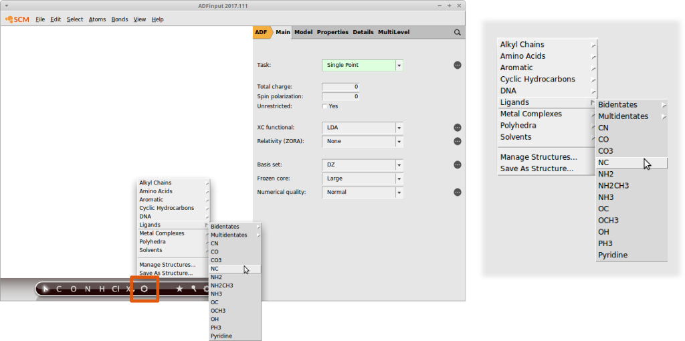
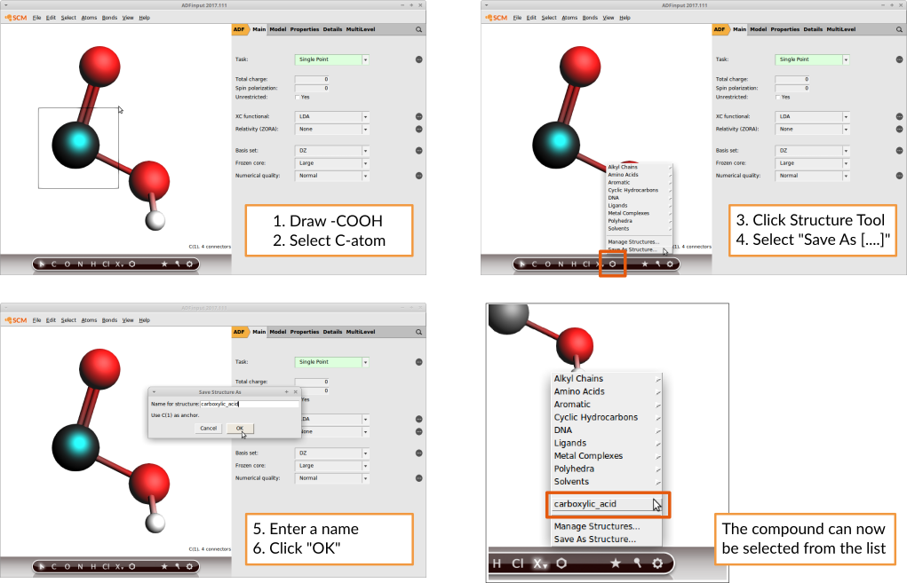

Tutorial: Generate structures for substituent effects screening
===============================================================

**Overview** 

Screening substituent patterns of a base compound is a common task in computer aided materials design. 
In the following short tutorial we demonstrate how you can use amsprep to automatize the replacement of substituents with just a few lines of simple shell scripting.

Contents:

+ The library of substituents in AMSinput
+ Exchanging substituents with AMSprep 
+ Combining AMSprep and AMSreport in shell script

**The substituent library in AMSinput** 

AMSinput comes with a customizable library of common substituents that we can use for our screening purposes right away. 
It can be accessed via the structure builder tool in AMSinput:

Note how the entries are organized. For example the isocyanide functional group ("NC") can be found in "Ligands".

Its also possible to add your own compounds:
Simply draw the structure of interest and select the atom which will serve as an anchor. 

This is how you would add a carboxylic acid group:

AMSinput will always consider the atom that lies in the origin of the coordinate system to be the anchor.
If you use the Save As Structure command this will be done for you. More information, including another 
example, can be found in the `Building Molecules GUI tutorial. <../../Tutorials/BuildingStructures/BuildingMolecules.html#your-own-structures-library>`__

**Exchanging substituents with amsprep**

Let us consider a simple benzene ring as the base compound:

The amsprep command to exchange Hydrogen atom #12 with an isocyanide group ("NC") and create a runfile for a UFF geometry optimization is:

.. code-block:: bash

   "$AMSBIN/amsprep" -t UFF-GO -m benzene.xyz -structure "12 Ligands/NC.ams" > "benzene_NC.run"

Remember that the "CN" group was located in the "Ligands" menu hence "Ligands/NC.ams". In case the path contains whitespace, you need to escape the whitespace as in this example

.. code-block:: bash

   "$AMSBIN/amsprep" -t UFF-GO -m benzene.xyz -structure "12 Alkyl\ Chains/Ethyl.ams" > "ethyl_benzene.run"

When using custom substituents, e.g. the hydroxylic_acid in the above example, a full path need to be provided to amsprep. 
The path is displayed when clicking on the Structure Tool in AMSinput and selecting "Manage your structures". 
On an ubuntu linux system the path is "/home/[your_username]/.scm_gui/Structures" and the command to use your own structures becomes:

.. code-block:: bash
  
   "$AMSBIN/amsprep" -t UFF-GO -m benzene.xyz -structure "12 /home/[your_username]/.scm_gui/Structures/carboxylic_acid.ams" > "benzoic_acid.run"

**Bringing it all together**

The following few lines of shell script demonstrate how to automatically exchange the substituents on a benzene ring, run a UFF optimization on the new structure and extract the optimized geometry with amsreport.

.. code-block:: bash

   #! /bin/sh
   #
   # copy the file benzene.xyz from the ADF compounds database
   #
   cp "$AMSHOME/atomicdata/Molecules/ADF/Benzene.xyz" .
   #
   # loop through different substituents
   #
   for ligand in CN CO CO3 NC NH2 NH2CH3 NH3 OC OCH3 OH PH3 Pyridine; do
      #
      # prepare the coordinates and the UFF calculation     
      #
      "$AMSBIN/amsprep" -t UFF-GO -m Benzene.xyz -structure "12 Ligands/$ligand.ams" > "benzene_$ligand.run" 
      #
      # run UFF GeoOpt
      #
      sh "./benzene_$ligand.run"
      #
      # extract the optimized geometry via amsreport
      #
      "$AMSBIN/amsreport" uff.rkf SDF > "benzene_$ligand.mol"
      #
      # rename the generic UFF output file
      #
      mv uff.rkf "benzene_$ligand.rkf"
   done

**Running the script**

Linux and Mac: Copy and paste the above into a file called ``substituents_script`` and execute it in the command line

.. code-block:: bash

   sh substituents_script

Windows: Just use the pre-configured shell ``ams_command_line.bat`` shipped with ADF to run the same command as the Linux and Mac users.

