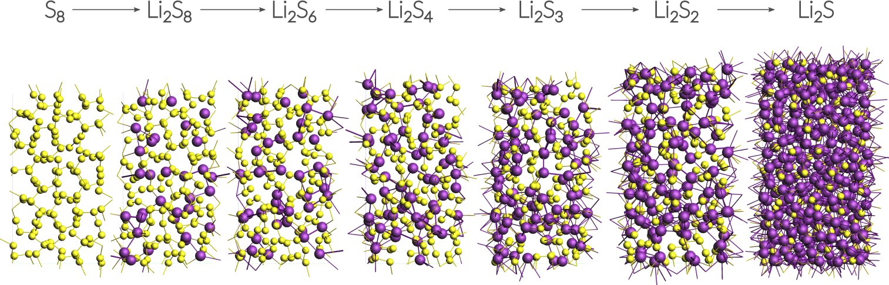
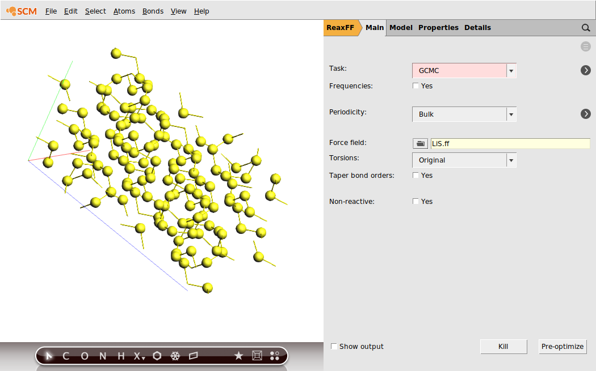
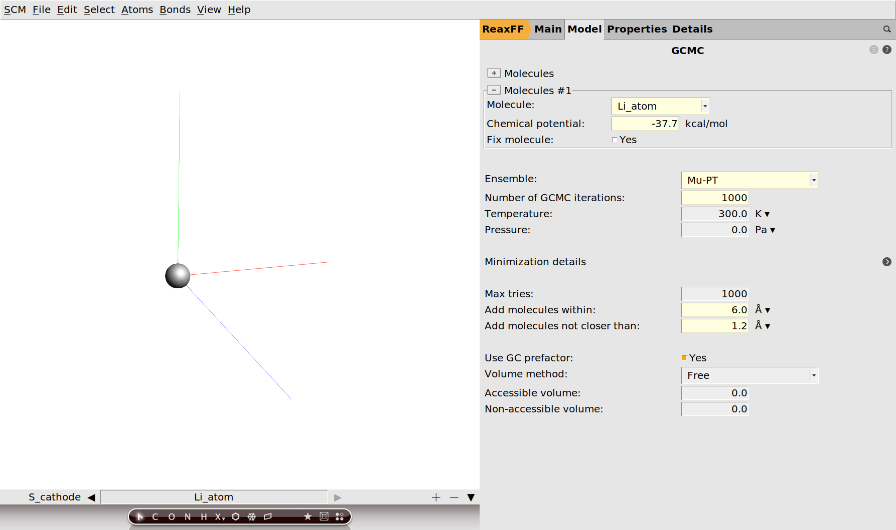
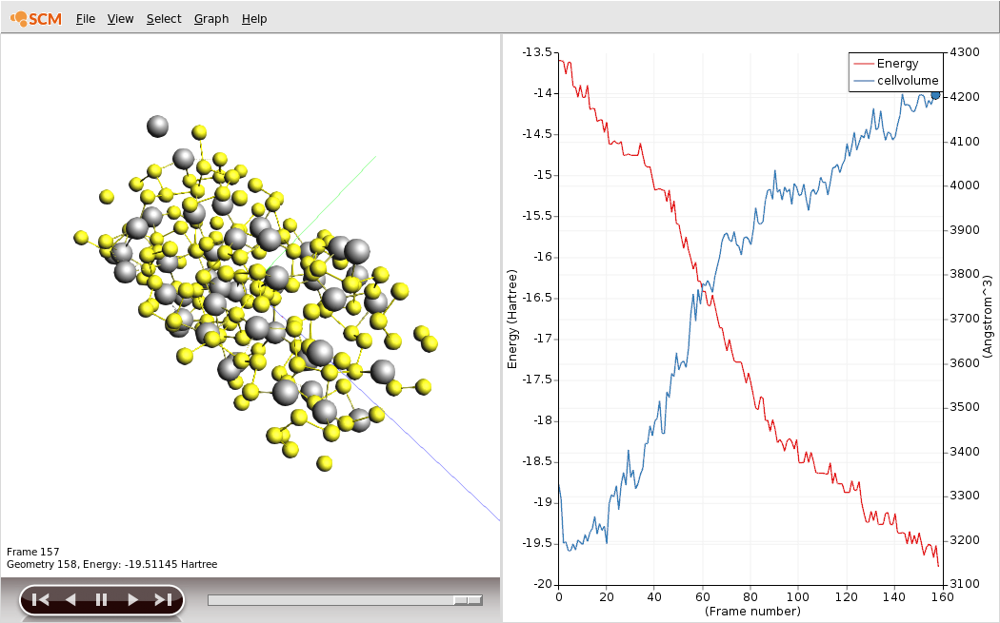
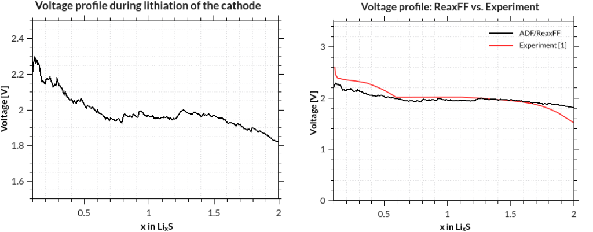

.. This tutorial has been recorded: examples/tutorials/ams-gcmc-battery
.. Keep the recording in sync so it may be used to generate the images!

.. _AMS_GCMC_LiSBattery:

Battery discharge voltage profiles using Grand Canonical Monte Carlo
********************************************************************

Overview
--------

In this tutorial we use the ReaxFF engine and the `GCMC <../../AMS/Tasks/GCMC.html>`__ method in the AMS driver to calculate the discharge voltage profile of a LiS battery.

Contents of this tutorial:

+ Importing a CIF file from an external database and equilibrating the structure.
+ Calculating the chemical potential for Li.
+ Setting up a Grand Canonical Monte Carlo (GCMC) simulation with AMS.
+ Analysis: Writing a Python script that calculates the discharge voltage profile.

This tutorial assumes a basic familiarity with the GUI. If you are not familiar with using the GUI yet, you might take a look at the :ref:`GUI introduction tutorials<Introduction>` before continuing.

.. note::
   The GCMC calculation we are going to run later in this tutorial takes approximately an hour to finish on a typical desktop computer.

The System
----------

This tutorial uses a small alpha-sulfur system consisting of 128 atoms.
Both the system and the workflow presented here are originally described in the publication `"ReaxFF molecular dynamics simulations on lithiated sulfur cathode materials" by M.M. Islam et al. <https://doi.org/10.1039/C4CP04532G>`__.

The discharge process is simulated using ReaxFF in a Grand Canonical Monte Carlo scheme.
Volume changes upon lithiation are accounted for by using an N\ :sub:`S`\PT-μ\ :sub:`Li`\ scheme.
The discharge voltage can be calculated from the total energies of the lithiated compounds.

Importing and optimizing the Sulfur(α) crystal structure
--------------------------------------------------------

The crystal structure can be directly imported from a CIF file.
There are several resources for crystallographic data available online and you can choose according to your liking.
Here we use a structure of  S\ :sub:`8`\  alpha sulfur from the `American Mineralogist Crystal Structure Database <http://rruff.geo.arizona.edu/AMS/amcsd.php>`__.

.. rst-class:: steps

  \
    | **1.** Download the :download:`CIF file by clicking here <../downloads/S_8_alpha.cif>`
    | **2.** In AMSinput: **File → Import Coordinates**
    | **3.** Select the CIF file you just downloaded using the file dialogue window

Before adding any Li-ions to the system, we need to relax the structure using a geometry and cell optimization, i.e. including the optimization of lattice vectors.

.. rst-class:: steps

  \
    | **1.** Select the ReaxFF panel: |ADFPanel| **→** |ReaxFFPanel|
    | **2.** Select the **LiS.ff** force field
    | **3.** Select **Task → Geometry Optimization**
    | **4.** Switch to **Details → Geometry Optimization**
    | **5.** Tick the **Optimize lattice** box

Save and run the calculation to yield a total energy of:

.. math::

  E_\mathrm{S} \approx -8540~\textrm{kcal/mol}

Calculating the chemical potential for Li
-----------------------------------------

Following the literature approach, we fix the external chemical potential of Li at the total energy of a single lithium atom in body-centered cubic lithium.
The structure of bcc Lithium can be created easily via the crystal builder from within AMSinput:

.. rst-class:: steps

  \
    | **1.** Create a new job by clicking **SCM → New Input**
    | **2.** **Edit → Crystal → Cubic → bcc**
    | **3.** **Select Li from the Presets and click OK**
    | **4.** **Edit → Crystal → Generate Supercell**
    | **5.** Enter ``8``, ``8`` , ``8`` on the diagonal to create an 8x8x8 supercell (512 atoms)

Optimize the resulting structure and lattice using the same settings as with the sulfur, yielding a total energy of:

.. math::
  E_\mathrm{Li,bulk} \approx -19304~\textrm{kcal/mol}

The chemical potential is calculated as the total energy / number of atoms, which for our supercell with 512 atoms yields:

.. math::

  \mu_\mathrm{Li} = -37.7~\textrm{kcal/mol}

.. note::

   The exact value depends to some minor extent on the chosen force field and for consistency one should always use the value predicted by the force field at use. Throughout this tutorial we use the ``LiS.ff`` forcefield.

Setting up the GCMC calculation
-------------------------------

Our previously optimized S\ :sub:`8`\  structure will serve as the system:

.. rst-class:: steps

  \
    | **1.** **Task → GCMC**
    | **2.** Switch to the GCMC panel **Model → GCMC** (or click on |MoreBtn|)
    | **3.** Select **MC ensemble → Mu-PT**
    | **4.** Set **Number of GCMC iterations** to **1000**

This will be enough steps to fully lithiate the cathode in the current calculation. However, this value is not known beforehand and one might want to choose a larger number of iterations for larger systems.

.. rst-class:: steps

  \
    | **1.** Add molecules within 6 Å but not closer than 1.2 Å

These fields correspond to the ``Rmax`` and ``Rmin`` values in the GCMC input, and refer to the distance to other atoms of the system. As a completely empirical rule of thumb: setting ``Rmin`` to roughly ½ of the shortest expected bond and ``Rmax`` approx. half of the shortest lattice vector seems a good starting point.

Now we need to specify that we want to add Lithium atoms to the cathode.

.. rst-class:: steps

  \
    | **1.** Press the button labeled **+** next to the **Molecules** label
    | **2.** In the appearing **Molecule** drop down menu, select **New Molecule**
    | **3.** A second tab in the viewport on the left will appear and be selected.
    | **4.** Add a single Li atom to the empty unit cell using the periodic table tool from the toolbar below. The position of the Li atom within the cell is irrelevant.
    | **5.** *Optional:* Rename the tabs in the viewport (by clicking into the label): **Mol-1 → S_cathode** and **Mol-2 → Li_atom**
    | **6.** Set the **Chemical potential** of the Li atom to **-37.7 kcal/mol**. (The default unit there is Hartree, but you can click on the unit and select kcal/mol.)

Save your changes and run the calculation. The calculation should take around an hour on a typical desktop computer, but you can follow its progress in AMSmovie.

You should see the battery expand as it discharges. There is about a factor of two in volume between the charged and discharged states!

.. rst-class:: steps

  \
    | **1.** Plot the cell volume by clicking **Graph → Cell Volume**.
    | **2.** Enable showing the unit cell as a box by clicking **View → Periodic → Show Unit Cell**.

.. raw:: html

   

      <video controls width="700" src="../_downloads/gcmc.mp4"></video>
   

You can download the movie :download:`here </downloads/gcmc.mp4>` if it does not play in your browser.

GCMC Troubleshoot
-----------------

No MC-moves are accepted:

+ Check if you set the correct chemical potential and that you use the right units. Remember to use the one calculated with the method you are also using for the GCMC calculation!
+ Change ``Rmax`` and ``Rmin`` settings.
+ Try to optimize the system (here: the sulfur cathode) with tighter optimization settings.

The calculation takes a lot of time:

+ Loosen the convergence criteria, e.g. less steps and a lower convergence criterion.
+ The obvious: Try a smaller system.

Analyzing the results
---------------------

The discharge voltage profiles can be calculated as a function of Li intercalation content from

.. math::

   V(x) =  - F \frac{G_{Li_x} - x \cdot G_{Li} - G_S}{x}

where :math:`G` denotes the Gibbs free energy and :math:`x` the concentration of Li-ions. :math:`F` is Faraday's constant.
The enthalpic (pV) and entropic (TS) contributions can be neglected and thus the Gibbs free energy replaced by the ground state energy.

In this case and many other cases of non-standard trajectory analysis, writing a short Python script using the `PLAMS <../../plams/index.html>`__ library is the most efficient way to obtain results.
Remember there is no need to take any further action than writing the script: Both Python and PLAMS are shipped with every copy of the Amsterdam Modeling Suite.
Our script might look like this:

.. literalinclude:: /downloads/GCMCLiSBattery/LiVoltageProfile.py
   :language: python

The script called ``LiVoltageProfile.py`` is available :download:`here </downloads/GCMCLiSBattery/LiVoltageProfile.py>`  and can be run as follows from the command line with

``$AMSBIN/plams LiVoltageProfile.py -v resultsdir=GCMC.results``

assuming that your job was called ``GCMC`` and your terminal is in the directory where it was run. The results are printed to the terminal after a few seconds, but you can of course redirect them into a file, which you can plot with standard tools:

[1] M. M. Islam, A. Ostadhossein, O. Borodin, A. Todd Yeates, W. W. Tipton, R. G. Hennig, N. Kumar and A. C. T. van Duin
*ReaxFF molecular dynamics simulations on lithiated sulfur cathode materials*,
`Phys. Chem. Chem. Phys. 17, 3383-3393 (2015). <https://doi.org/10.1039/C4CP04532G>`__
