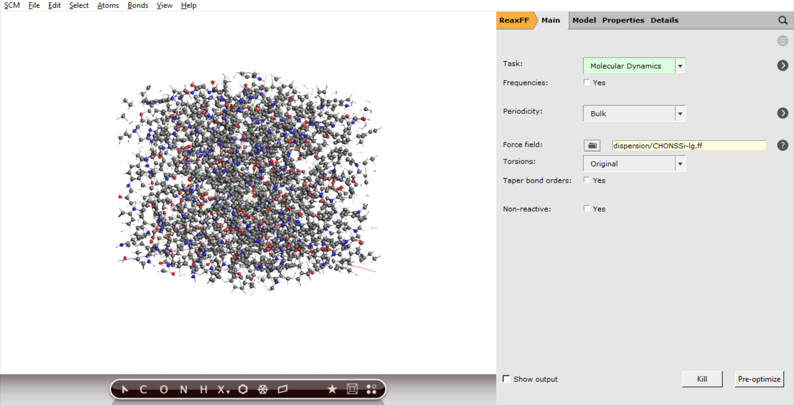
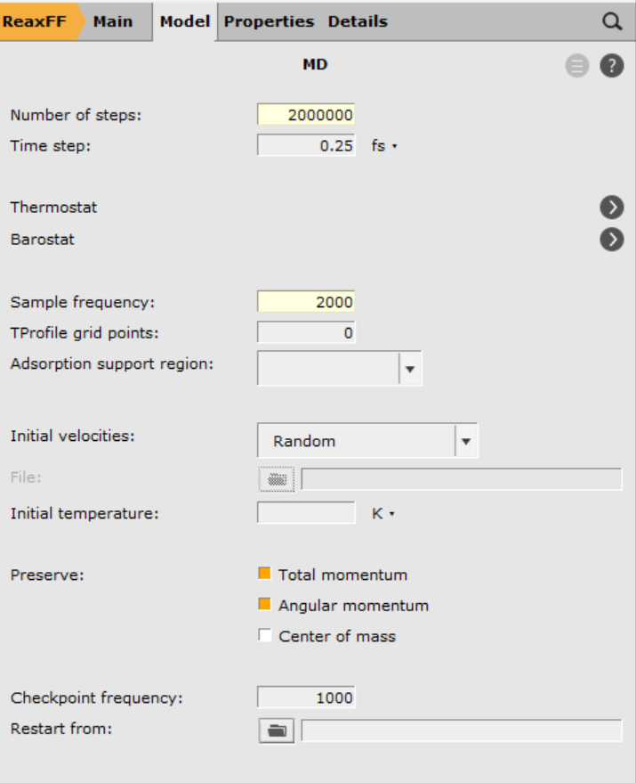
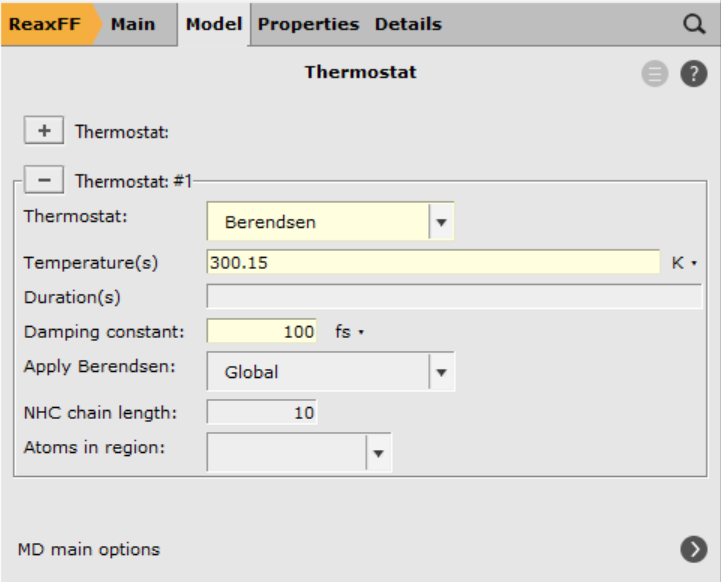
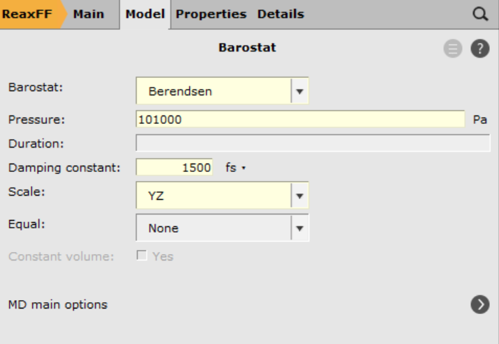
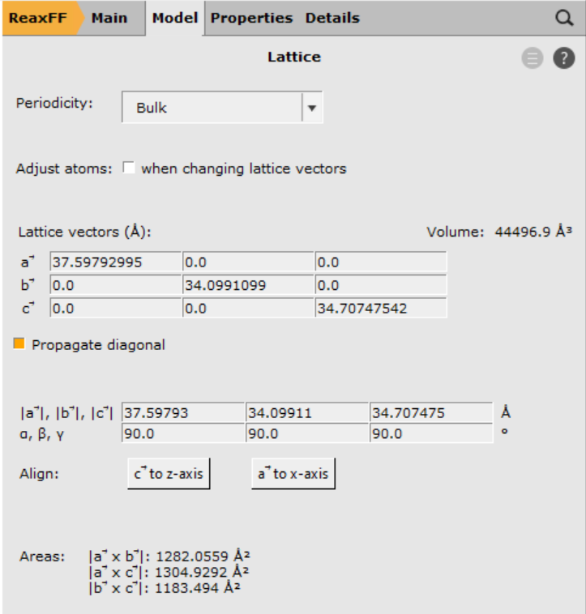
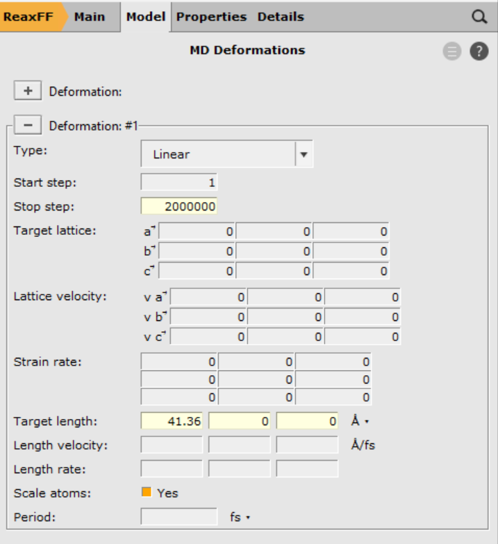
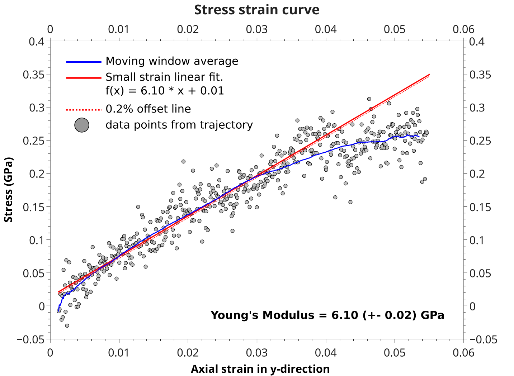
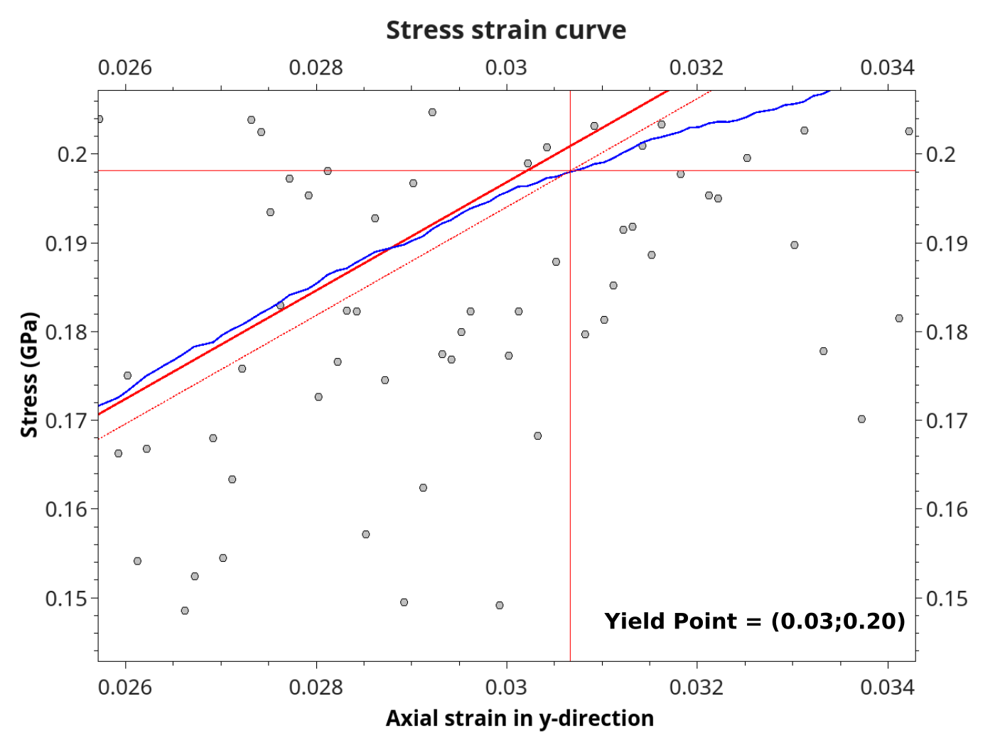
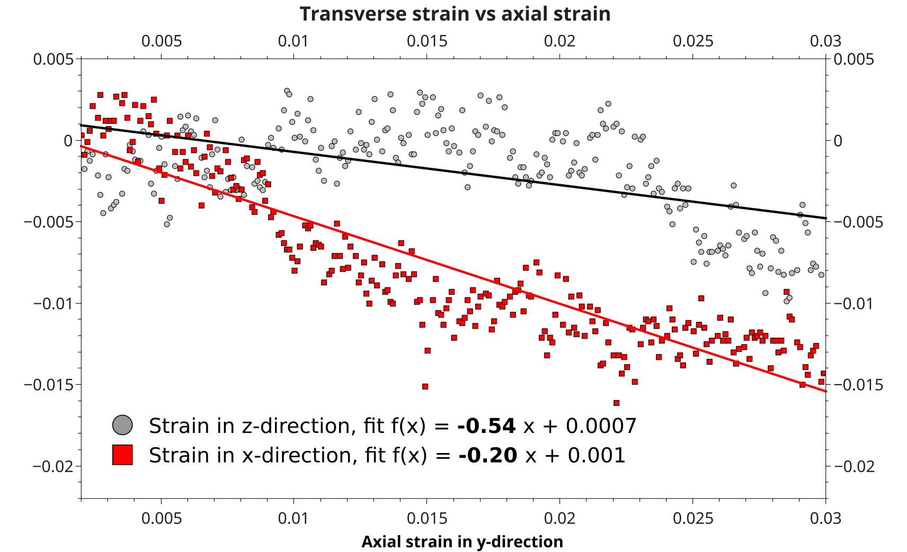

.. _ReaxFF_polymers_mechanical_properties:

Mechanical properties of epoxy polymers
***************************************

Details on the calculation of atomic stresses can be found in the `ReaxFF manual <../../OldReaxFF/Properties.html#per-atoms-stress-tensor>`__ .

.. Note::
  The calculations are *computationally demanding*.
  For optimal performance, a parallel execution on a compute cluster is advised.
  This can best be done by using the `remote job management of the GUI <../../GUI/Set_up.html#running-remotely>`__

Overview
--------

This advanced ReaxFF tutorial is based on `Radue, Jensen, Gowtham, Klimek-McDonald, King and Odegard, J. Polym. Sci. B, 56, 255-264 (2018) <https://doi.org/10.1002/polb.24539>`__ [1].
It will demonstrate how to calculate stress-strain curves of an epoxy polymer.

Contents:

+ Setting up a strain rate
+ Calcuate the atomic stresses
+ Results: stress-strain curves, Young's modulus, yield points...

.. tip::
   The molecular structure used in this tutorial was kindly provided by Matthew S. Radue. Other highly cross linked epoxy polymers
   can effectively be created with a novel bond boost acceleration method (see :ref:`tutorial <ReaxFF_polymers_bond_boost>`).

Setting up
----------

The polymer used in this tutorial is referred to as Tetra(-epoxy) in [2]
since it was build from the tetrafunctional resin epoxy TGDDM (tetra-glycidyl-4,4 0 -
diaminodiphenylmethane, Araldite MY 721) and DETDA as hardener.
The following cross linking reaction was used to create the polymer structure:

Start by importing the polymer structure into AMSinput

.. rst-class:: steps

  \
    | Click :download:`here <../downloads/tetra_epoxy.xyz>` to download the .xyz file **tetra_epoxy.xyz**
    | Import the coordinates in AMSinput:
    | **File →  Import Coordinates**

Before setting up the strain rate, start with the general molecular dynamics settings.
Begin by selecting a force field

.. rst-class:: steps

  \
    | Force field **dispersion/CHONSSi-lg.ff**
    | Click on |MoreBtn| next to Molecular Dynamics

.. rst-class:: steps

  \
    | Select ``2000000`` as **Number of steps** (500 ps)
    | Select ``2000``  as **Sample frequency**

Next we set up the thermo- and barostat

.. rst-class:: steps

  \
    | Click on |MoreBtn| next to **Thermostat**
    | Click on the |AddButton|
    | Select **Berendsen** from the menu **Thermostat**
    | Set the **Temperature** to ``300.15`` K and the **Damping constant** to ``100`` fs

.. rst-class:: steps

  \
    | Click on |MoreBtn| next to **MD main options**
    | Click on |AddButton| next to **Barostat**
    | Select **Berendsen** from the menu **Barostat**
    | Set the **Pressure** to ``101000`` Pa and the **Damping constant** to ``1500`` fs
    | From the **Scale** menu, select **YZ**

.. Note::
  We are applying uni-axial strain, i.e. alongside one lattice vector, and apply the barostat only in the lateral directions.
  This will allow us to account for Poisson contractions.

Setting up the strain rate
--------------------------

The publication [2] put a linear strain of 20% over the course of 1 ns.
Since we are simulating only 500 ps, for the sake of computational efficiency, the total strain reduces to 10%.

The straightforward way to defining this strain is by defining the strain type to be linear, followed by the final
length of the vector at the end of the straining.

Let's first find and note the length of the a-lattice vector.

.. rst-class:: steps

  \
    |  **Model → Lattice**

The length of the a-lattice vector a (:math:`\mid\vec{a}\mid`) is found to be 37.59793 Å.
The endpoint, after stretching it 10%, will then be 41.36 Å.
To define this strain, change to the MD deformation panel

.. rst-class:: steps

  \
    | **Model → MD deformation**
    | Click on |AddButton|
    | Enter ``2000000`` as the final step
    | Enter ``41.36``,``0``,``0``  as the final lengths of the lattice vectors

.. tip::
  Putting a 0 as final length tells the program to ignore that particular lattice vector.
  You can learn about the meaning of each input field by hovering your mouse pointer over it.

Save the input files with a suitable name, e.g. ``tetra_strain_a``, and run the calculation.
On 16 cores, it will typically take a bit less than 1 day to compute the trajectory depending on your hardware.

Results
-------

Once the calculation has finished, the stress-strain curves can be extracted from the binary results file
with the help of a Python script using the `PLAMS <../../plams/started.html>`__ library.

The script called :download:`stress_strain_curve.py <../downloads/stress_strain_curve.py>` can be run from the command line:

``$AMSBIN/amspython stress_strain_curve.py tetra_strain_a``

Be sure to match the job name correctly.

The stress-strain curve is written to a file called ``stress-strain-curve.csv``::

 # strain_x, strain_y, strain_z, stress_xx, stress_yy, stress_zz
 0.0001 -0.0012 0.0016 -0.0126 0.0107 -0.0142
 0.0002 0.0003 0.0025 ...

It can be plotted with any graph plotting software, e.g. gnuplot or qtiplot.

The following example shows how to obtain the mechanical properties from stress-strain plot for an uniaxial strain in y-direction:

A Young's modulus of 6.10 GPa was calculated from the slope of a linear fit to the small strain regime (< 0.03).
The Yield point is then found as the intersection between the smoothed blue curve (moving window average, 200 points for smoothing) and
a 0.2% offset line of the linear fit.

Poisson's ratio is obtained from the ratio of transverse and uniaxial strains, i.e. plotting column #1 and #3 against column #2 (the system was strained in y-direction)

Since the system is amorphous, Poisson's ratio becomes (0.54 + 0.20)/2 = 0.37.

.. Note::
	In order to get *statistically meaningful results*, it's advised to average
	the mechanical properties, both over different starting structures as well as all three unaxial strain directions.
	To obtain quality results as in [1], an averaging over 5 different polymer structures using 3 strains each -> 15 trajectories
	is required.

Lit.:

[1] M. S. Radue, B. D. Jensen, S. Gowtham, D. R. Klimek‐McDonald, J. A. King and G. M. Odegard,
*Comparing the mechanical response of di‐, tri‐, and tetra‐functional resin epoxies with reactive molecular dynamics*,
`Inc. J. Polym. Sci., Part B: Polym. Phys. 56, 255–264 (2018). <https://doi.org/10.1002/polb.24539>`__
