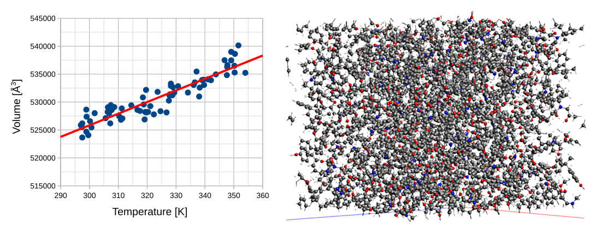
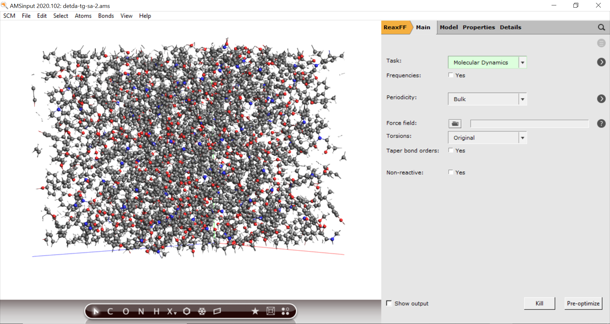
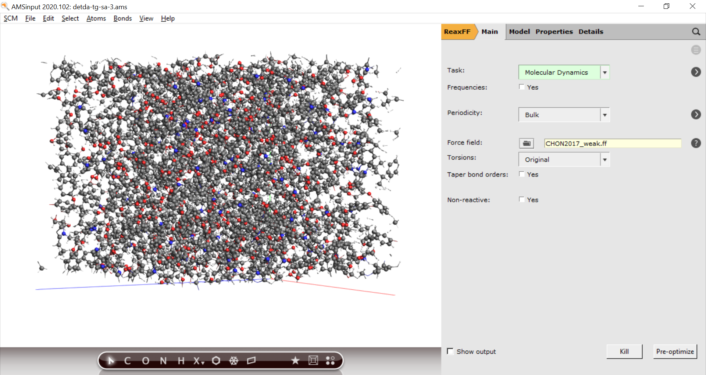
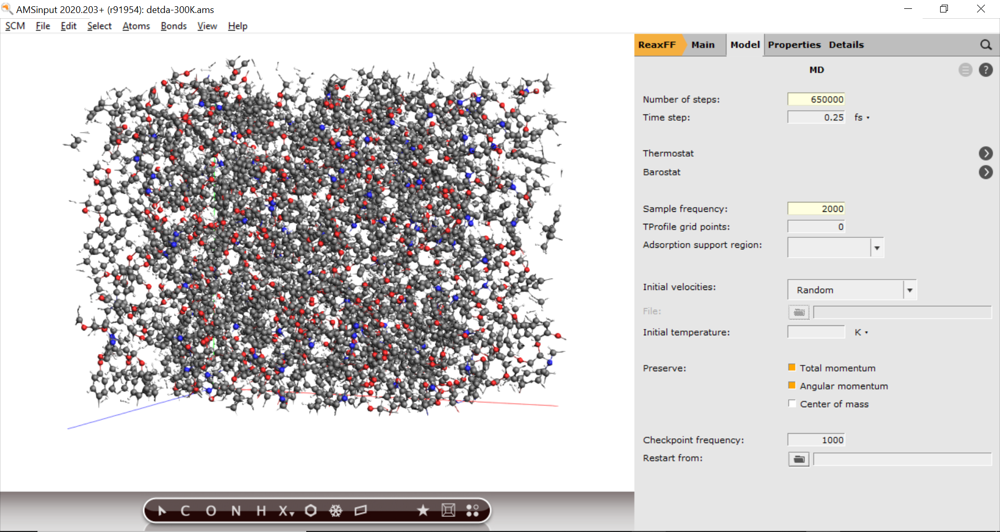
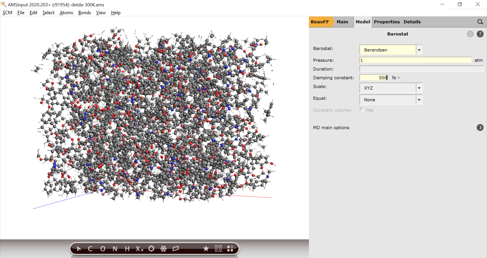
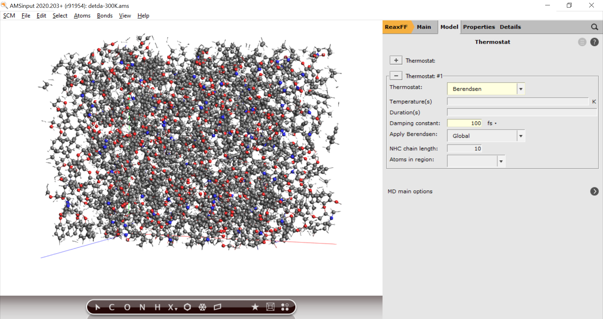
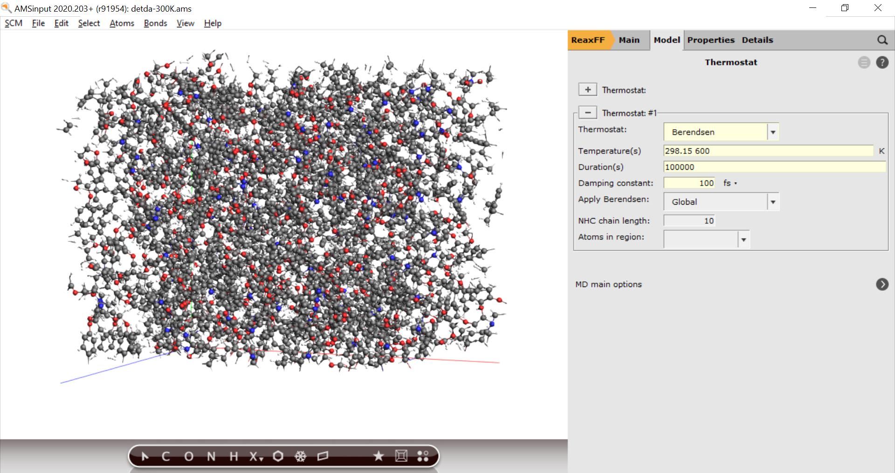
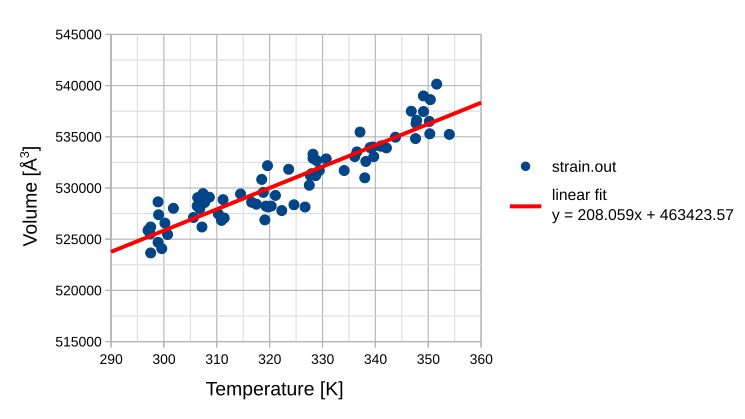

.. _ReaxFF_thermal_expansion_coefficient:

Thermal expansion coefficients of thermoset polymers
****************************************************

In this ReaxFF tutorial thermal expansion coefficients, CTE, are calculated from a polymer's strain vs. temperature dependence.

The systems and workflows presented here are originally described in the publication **Effect of chemical structure on thermo-mechanical properties of epoxy polymers: Comparison of accelerated ReaxFF simulations and experiments**, `Polymer 159, 354-368 (2018) <https://doi.org/10.1016/j.polymer.2018.11.005>`__.

The tutorial consists of the following steps:

+ :ref:`Importing the polymer structure <CTE_importing_polymer>`
+ :ref:`Annealing the polymer <CTE_SA>`
+ :ref:`Extracting strain vs. temperature profiles <CTE_strain>`
+ :ref:`Calculation of the thermal expansion coefficient <CTE_calc>`

.. Note::
  The calculations are *computationally demanding*.
  For optimal performance, a parallel execution on a compute cluster is advised.
  This can best be done by using the `remote job management of the GUI <../../GUI/Set_up.html#running-remotely>`__

.. _CTE_importing_polymer:

Importing the polymer structure
^^^^^^^^^^^^^^^^^^^^^^^^^^^^^^^

The tutorial will use a cross-linked epoxy polymer generated with the bond boost method (see also `bond boost tutorial <PolymersBondBoost>`__ ). 

Begin by downloading the polymer and import into AMSinput:

.. rst-class:: steps

  \
    | Click :download:`here <../downloads/detda_epoxy.xyz>` to download the .xyz file **detda_epoxy.xyz**
    | Import the coordinates in AMSinput:
    | **File →  Import Coordinates**

.. _CTE_SA:

Annealing the polymer
^^^^^^^^^^^^^^^^^^^^^

For the calculation of the thermal expansion coefficient we determine the volume change caused by increasing of the temperature. The data points will be sampled within the temperature range of 300-340K. Before the actual sampling, a short `simulated annealing <PolymersGlassTransitionTemp.html#simulated-annealing>`__ sequence was found produce less noisy results. However, if the sampling intervals are chosen long enough the simulated annealing can also be left out.  

Start by choosing the MD settings:

.. rst-class:: steps

  \ 
    | **1.** In the main panel, select **Task → Molecular Dynamics**
    | **2.** Choose the force field **CHON2017_weak.ff**

.. rst-class:: steps

    | **3.** Click on |MoreBtn| next to **Task: Molecular Dynamics** to go to the MD details
    | **4.** Set the **Number of steps** to ``650000``
    | **5.** Set the **Sample frequency** to ``2000``

To allow the unit cell to shrink or expand we further add a barostat:

.. rst-class:: steps

  \ 
    | **1.** Click on |MoreBtn| next to **Barostat**
    | **2.** Select **Berendsen** from the **Barostat** dropdown menu.
    | **3.** Set the desired **Pressure** to ``1.0`` atm. 
    | **4.** Set the **Damping constant** to ``500`` fs.

The annealing is defined in the thermostat panel

.. rst-class:: steps

  \ 
    | **1.** Click on |MoreBtn| next to **MD Main options**
    | **2.** Click on |MoreBtn| next to **Thermostat**
    | **3.** Select **Thermostat → Berendsen**
    | **4.** Set the **damping constant** to ``100 fs``

To increase the temperature from 298.15 to 600K over a duration of 100000 steps, followed by a cooling down back to 350K
over a duration of 200000

.. rst-class:: steps

  \ 
    | **5.** Enter ``298.15 600 350`` into the **Temperature(s)** field
    | **6.** Enter ``100000 200000`` into the **Duration(s)** field 

then to stepwise cool down to 300K again:

.. rst-class:: steps

  \ 
    | **7.** Add ``350 340 340 330 330 320 320 310 310 300 300`` to the **Temperature(s)** field
    | **8.** Add ``50000 10000 50000 10000 50000 10000 50000 10000 50000 10000 50000`` into the **Duration(s)** field 

We are now ready to start the calculation

.. rst-class:: steps

  \ 
    | **1.** **File → Save As...** and give it an appropriate name (e.g. "CTE")
    | **2.** **File → Run**

.. _CTE_strain:

Extracting strain vs. temperature profiles
^^^^^^^^^^^^^^^^^^^^^^^^^^^^^^^^^^^^^^^^^^

To extract the strain and temperatures from the trajectory for post-processing we make use of a Python script. 

.. rst-class:: steps

  \ 
    | **1.** Download the script ``strain.py`` from :download:`here </downloads/strain.py>`
    | **2.** Place it in the same folder as your CTE.ams inputfile

Next, you need to open the command line to execute the script with the AMS Python interpreter. 

.. tip::
  Windows and Mac users should open a `pre-configured command-line from the GUI <../../Scripting/GettingStarted.html>`__ 

In the command line, the script can be executed as follows

``$AMSBIN/plams strain.py -v resultsdir=CTE.results -v startstep=300000``

.. code-block:: none

 # T[K] a[Å]     b[Å]    c[Å]    V [Å**3] 
 350.4 85.121 70.228 90.103 538628.483
 349.1 85.056 70.040 90.475 538988.118
 347.8 85.309 69.796 90.124 536617.975
 350.3 84.836 69.976 90.170 535290.469
 350.2 84.862 70.100 90.187 536503.084
 349.1 84.613 70.046 90.683 537466.316

but you can easily write them to file called **strain.out** instead:

``$AMSBIN/plams strain.py -v resultsdir=CTE.results > strain.out``

.. _CTE_calc:

Calculation of the thermal expansion coefficient
^^^^^^^^^^^^^^^^^^^^^^^^^^^^^^^^^^^^^^^^^^^^^^^^

The strain can be plotted with any graph plotting software, e.g. gnuplot or any spreadsheet software.
Import the results file into the software of choice and plot two column #5 (volume) against column #1 (temperature) and  

Perform a regression analysis and determine the slope. 
Calculate the thermal expansion coefficient (α\ :sub:`0`\) from the volume of the first data point (V\ :sub:`0`\) and the slope of the linear fit curve:

.. math::

  \alpha_V = \frac{1}{V_0} \frac{\partial V}{\partial T}_p = \frac{1}{538628.483} \cdot 208.059 = 38.6 \cdot 10^{-6} [1/C^{\circ}]

The simulated expansion coefficients is in the correct order of magnitude but underestimating the experimental expansion coefficient of 52.4 · 10\ :sup:`-6`\ [1/°C]. This result is in line with the findings of the original publication **Effect of chemical structure on thermo-mechanical properties of epoxy polymers: Comparison of accelerated ReaxFF simulations and experiments**, `Polymer 159, 354-368 (2018) <https://doi.org/10.1016/j.polymer.2018.11.005>`__.
