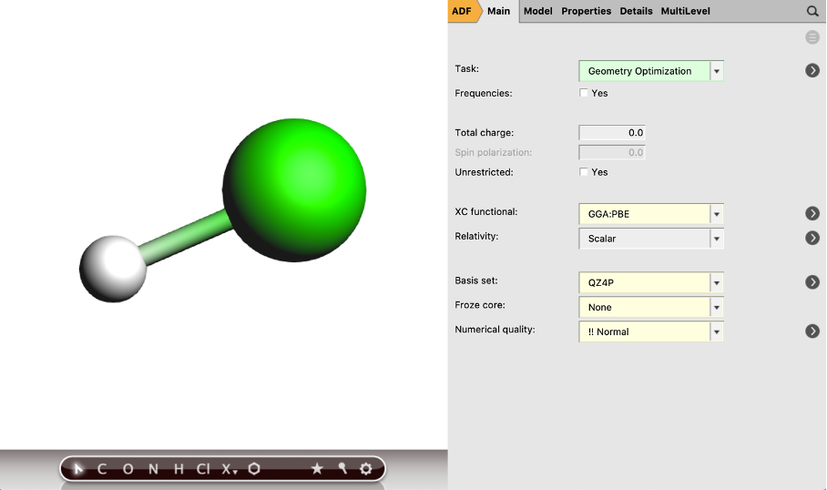
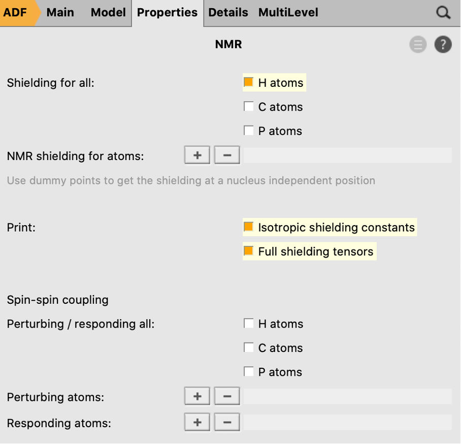
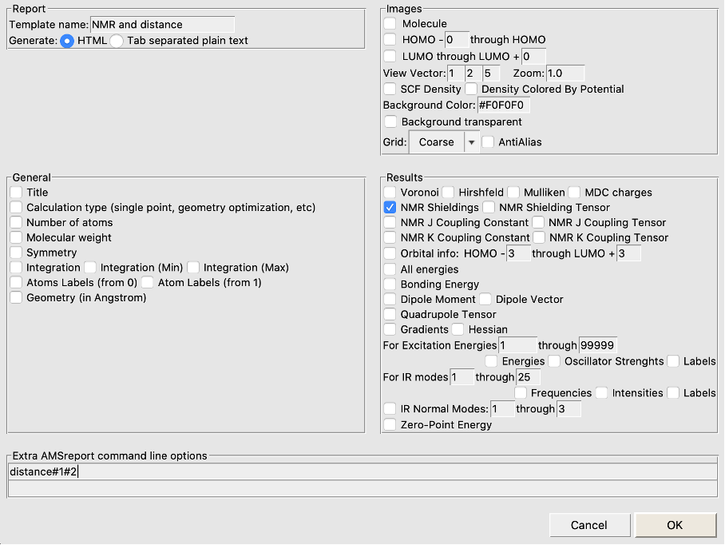

.. _NMR_Relativistic_DFT:

NMR shifts with relativistic DFT
********************************

See also the `FAQ on recommend settings for NMR calculations. <https://www.scm.com/applications/spectroscopy/calculate-nmr-chemical-shifts-shielding-tensors-couplings-with-relativistic-dft/nmr-shifts-with-relativistic-dft/>`__ 

Scalar relativistic & spin-orbit coupling calculations of NMR chemical shifts
=============================================================================
In this tutorial you will learn how to optimize the geometry of a molecule and calculate NMR chemical shifts. You will study the effect of the relativistic approximation and of the exchange-correlation functional used: the PBE GGA or the PBE0 hybrid GGA.

The exercise addresses how the chemical shift of the hydrogen halides series is affected by relativistic spin-orbit coupling, following the problem formulated in `Jochen Autschbach‘s <https://ja01.chem.buffalo.edu/index.html>`__ chapter in `High Resolution NMR Spectroscopy <https://www.sciencedirect.com/bookseries/science-and-technology-of-atomic-molecular-condensed-matter-and-biological-systems>`__ edited by Rubén Contreras.

Geometry optimization and NMR chemical shifts for the H-X series
================================================================
First, we will make and optimize the geometry of an HF molecule. You will perform a geometry optimization with the PBE functional and the ZORA scalar relativistic Hamiltonian, using an all-electron QZ4P basis set with a ‘Good Becke’ grid:

.. rst-class:: steps

 \
  | **1.** Start up **AMSinput**
  | **2.** Press 'h' to switch to the building mode and click somewhere in the canvas to draw an H atom
  | **3.** Press ‘f’ and click somewhere close to the H to attach a fluorine atom to the H
  | **4.** In the ADF Main panel, select the task **Geometry Optimization**
  | **5.** Select the XC functional **GGA:PBE**
  | **7.** Select the **QZ4P** Basis set
  | **8.** Select the Frozen core **none**
  | **9.** Press the |MoreBtn| button next to **Numerical quality**
  | **10.** Select the Integration **Becke Good**

Now we will define the NMR calculation that will be performed after the geometry optimization:

.. rst-class:: steps

 \
  | **11.** In the panel bar, select **Properties** → **NMR**
  | **12.** Tick the **H atoms** box to apply the shielding for the H
  | **13.** Select the two boxes to print the **Isotropic shielding constants** and **Full shielding tensors**
  | **14.** Save the file (**File** → **Save as**) and run the calculation (Ctrl/cmd + r)

After the calculation is finished, you can look at the results:

.. rst-class:: steps

 \
  | Open the logfile by clicking at **SCM** → **Logfile**

You can find here at the bottom the NMR Shielding of 29.15 ppm.
The interatomic distance of HF can be found by, at first, reading in the new coordinates and bonds after the geometry optimization. Then, if you select both atoms, H and F, you can read the interatomic distance from the geometry input box on the bottom right. If you have performed the calculations for the entire H-X series, you can also extract the geometric data and NMR shifts in one go by using the ADFreport tool (see below).

Run calculations for the other hydrogen halides
===============================================
Starting from HF, you can go down the periodic table by either making new inputs, or changing the halide:

.. rst-class:: steps

 \
  | Right-click on fluorine
  | Select **Change Atom Type** and chose Cl for example

This will not change the interatomic distance, so it is recommended you pre-optimize before running the DFT calculations. Do not forget to save the new molecule under a different job name.
In the same manner, you can replace Cl by Br and then Br by I.

These calculations will take increasingly more time to complete. Collect the distances and NMR Shieldings.
We will compare the distances to the experimental H-X distances from the `NIST Chemistry Webbook <https://webbook.nist.gov/chemistry/#>`__ , type in the molecular formula and look for the equilibrium distance r\ :sub:`e`. The NMR shieldings will be compared with the experimental chemical shift with respect to H-F, which are -2.58, -6.43, and -15.34 ppm. The absolute experimental shielding for HF is reported as 28.72 ppm.

Vary the relativistic approach and density functional (XC)
==========================================================
You will have found that the PBE distances are slightly longer than the experimental ones and that the scalar-relativistic NMR shieldings for HBr and HI are overestimated.

Now we will change the XC functional and relativistic treatment. The easiest is probably to take the converged geometries for the PBE + SR (scalar-relativistic treatment) and change the XC functional or the relativistic treatment, or both.

.. rst-class:: steps

 \
  | This can be done in the **Main** input panel
  | Change the XC potential: **Hybrid** → **PBE0**
  | Select the Relativity **Spin-Orbit**

Make sure you save each new input file under a different name.
The spin-orbit coupling NMR calculations will warn you that symmetry will be switched off. Click OK to proceed. Hybrid calculations (PBE0) will take longer than GGA calculations (PBE). Spin-orbit calculations will take much longer than scalar relativistic ones.

Convince yourself that PBE0 (a hybrid functional) gives bond distances in excellent agreement with experiment. PBE also gives good results, but slightly overestimates the bond lengths.
Also convince yourself that switching the relativistic treatment from scalar relativistic to spin-orbit coupling hardly affects the geometries even for the heaviest I atom, but it strongly influences NMR shielding. In particular it gives NMR shieldings in good agreement with experiment for the heavier halides, where the scalar relativistic treatment is insufficient.

Analyze multiple jobs with ADFreport
====================================

If you want to analyze the 16 calculations in one go, you can make use of the AMSreport tool in AMSJobs (the window with your jobs listed):

.. rst-class:: steps

 \
  | **1.** Open AMSJobs and select **Tools** → **New Report Template**
  | **2.** Type in a name in the top-left entry (e.g. NMR and distance)
  | **3.** Untick everything, tick the **NMR Shieldings** box (if you want other things reported, leave those ticks on)
  | **4.** In the bottom field type **distance#1#2** to report the distance between atoms 1 and 2
  | **5.** Click **OK** to save this report template

.. rst-class:: steps

 \
  | **6.** Select all 16 jobs
  | **7.** Select **Tools** → **Build NMR and distance Report** (or whatever you called your report template)

You will get an html file reporting all distances and NMR chemical shifts in your default browser.

If you have calculated chemical shifts with scalar relativistic, spin-orbit coupling, PBE, and PBE0 Hamiltonians, you can compare them with the experimental values which you can find tabulated in the paper by Wolff and Ziegler in `J. Chem. Phys. 109, 895-905 (1998) <https://aip.scitation.org/doi/10.1063/1.476630>`__ . Your findings should look something like this when you set the chemical shift of HF at 0 ppm and compare the NMR shieldings of the other HX species with the NMR shielding of HF. The higher the NMR shielding, the lower the chemical shift.

.. image:: /Images/NMRShiftsRelativisticDFT/NMR_graph.png
  :width: 80%
