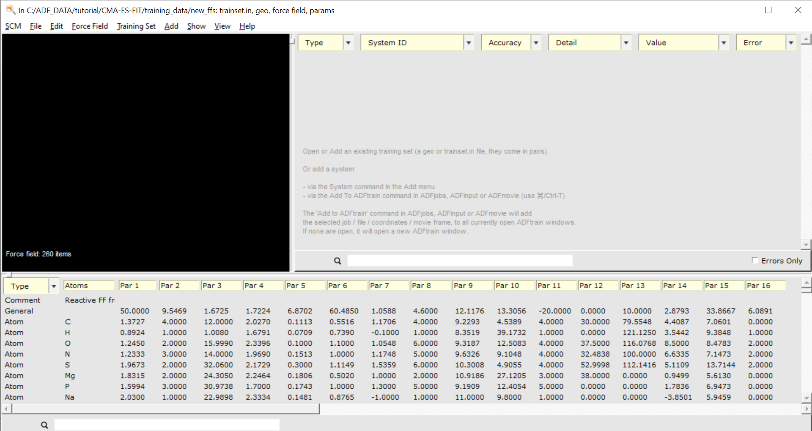
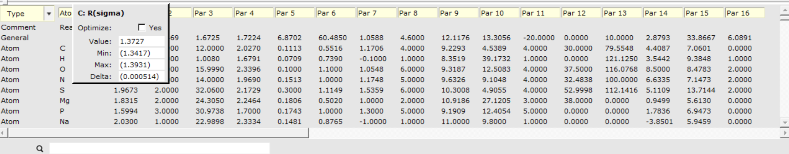
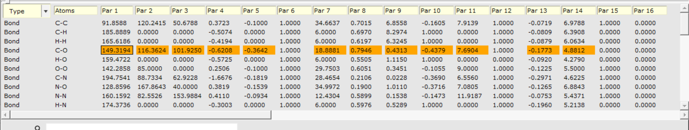

.. _ReaxFF_AMStrain_FF_Edit: 

Force Field editing with AMStrain
=================================

In the advanced ReaxFF parametrization tutorial, AMStrain is used to visualize and manage a training set but it can do much more than that. This tutorial will introduce you to some of the Force Field editing functionality most useful when preparing an optimization run:

+ Set active or freeze parameters during the optimization
+ Set or guess parameter ranges

In the following few lines, you will learn how the initial guess and parameter ranges for the reparametrization tutorial were chosen and activated using AMStrain.

.. Tip::
   The Force Field editing tools allow extensive inspection and modification of both params and force field files. This goes as far as having it create a completely guessed force field from a bare training set. Take a look at the `AMStrain manual <../../GUI/AMStrain.html>`__  for an overview of all functionality. 

Load a force field into AMStrain
********************************

Begin by placing a copy of the force field file you want to edit into a new folder:

.. rst-class:: steps

  \
    | Download the :download:`CHON-weak.ff <../downloads/CHON-weak.ff>` force field
    | Place it into a new (empty!) folder

.. Tip::
   You can find all force fields shipped with the Amsterdam Modeling Suite in the AMS home directory (AMS2020.101) → atomicdata → ForceFields → ReaxFF.  *Always* make a copy before editing any of these files. 

Now open a new instance of AMStrain and load the force field file:

.. rst-class:: steps

  \
    | SCM → Train
    | File → Open

You will see that contents of the force field file are displayed on the bottom part of AMStrain

.. Note::
  AMStrain will automatically check the directory from where it reads the force field for trainset.in, params or other relevant optimization related files and load them if present.

Inspect the parameters
**********************

Once the force field has been loaded into AMStrain you can inspect the parameters by double clicking on any one of table entries.

In the small pop up window you will be presented with information regarding that particular parameter:

+ **Optimize**: Whether or not it should be optimized
+ **Value**: Its current value in the force field
+ **Min**: Its lower limit in the optimization
+ **Max**: Its upper limit in the optimization
+ **Delta**: The finite stepsize in which the parameter is allowed to vary in the optimization.

The values presented in the optimization fields stem from an analysis of all ReaxFF force fields included in the Amsterdam Modeling Suite. These guesses are provided by the powerful command line tool `rxffutil <../../OldReaxFF/Miscellaneous.html#the-rxffutil-utility>`__. The options AMStrain uses for rxffutil parameter guessing can be set from the **Force Field → RXFFUtil Options** menu.

.. Tip::
   Hover your mouse pointer of any of the parameters and AMStrain will show help balloon with the name of the parameter. Use this name to look up the parameter in the `ffield file description. <../../OldReaxFF/ffield_descrp.html#ffield>`__ 
  
Edit the parameters
*******************

Following the reasoning outlined in the ReaxFF Parametrization tutorial, we want to refit the parameters related to the atom (pairs) C-O, C-N and N-H.

We begin with applying a filter so we only see the bonding parameters:

.. rst-class:: steps

  \
    | From the **Type** menu, select **Bonds**

Next we unfreeze the parameters of the C-O bond during the optimization. We can either double-click and tick the checkbox in the popup window or we use an AMStrain shortcut:

.. rst-class:: steps

  \
    | Right-click on the first parameter of the C-O bond to activate it
    | activate all C-O parameters the same way (**except** constants #6, #12 and boolean flags #15, #16)

As soon as one parameter is set active for the optimization, AMStrain will write a params file that can be used for the actual optimization runs. 

.. rst-class:: steps

  \
    | File → Save
    | Go to the folder were you saved ``CHON-weak.ff`` to find a ``params`` file

More information about the params file is found in the `params file documentation. <../../OldReaxFF/ffopt_Input_files.html>`__ 

To generate the exact same params file used in the parametrization tutorial, activate the following parameters:

+ Bond parameters: C-O, C-N, N-H
+ Off-diagonal parameters: C-O, C-N, N-H
+ Angle parameters: C-C-N, H-N-H, O-C-N, C-O-C, C-N-H, C-C-O, H-C-O
+ H-bond parameters: O-H-N, N-H-O, N-H-N

If you want to use your new params file with the :ref:`parametrization
tutorial <ReaxFF_parametrization_hands_on_tutorial>`, copy and replace the params file located in the folder
training_data of the :download:`CMA-ES parametrization package
<../downloads/CMA-ES-FIT.zip>`.

