.. This tutorial has been recorded: examples/tutorials/diels-alder-click
.. Keep the recording in sync so it may be used to generate the images!

.. _AMS_ts_tutorial:

Tips and Tricks for Transition State Searches for Click Reactions
=================================================================

Introduction
------------

The Diels-Alder reaction mechanism is a click reaction to build six membered rings from scratch using a diene and a dienophile. The simplest six membered ring can be formed with a molecule of butadiene as diene and a molecule of ethene as dienophile which react to form Cyclo-1-hexene.

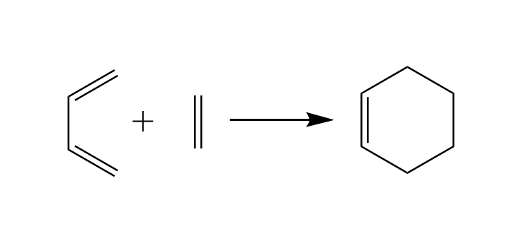

The reaction above is presented correctly but simplified. If you study the literature you will find out that

* Diene and Dienophile are not approaching each other in the same plane.
* Cyclo-1-hexene is not flat.

As Cyclo-1-hexene is non-aromatic and has only one double bond we expect the ring to be more a distorted chair than a planar ring. Equipped with this information we will use the ADF GUI and start our work from there.

Tools
-----

We will work with the `ADF <../../ADF/index.html>`__ and `DFTB <../../DFTB/index.html>`__ engines. We will use routines in the `AMS driver <../../AMS/index.html>`__ for `geometry optimization <../../AMS/Tasks/Geometry_Optimization.html>`__, `frequency calculations <../../AMS/Vibrational_Spectroscopy.html#ir-frequencies-and-normal-modes>`__, `Potential Energy Surface (PES) scans <../../AMS/Tasks/PES_Scan.html>`__, and `Nudged Elastic Band method (NEB) <../../AMS/Tasks/NEB.html>`__.

Pre-requisites
--------------

You should be proficient to comfortably draw a structure, set up a calculation when given hints, run it and retrieve results. You may want to refresh your skill in the :ref:`GUI tutorials <GO_ETHANOL>`.

Setting up the Structure
------------------------

There are many ways how diene and dienophile can approach each other – too many to try them all. We are, however, very certain what the result of our reaction looks like, so we will start from there.

.. rst-class:: steps

  \
    | Open AMSinput
    | Use the drawing tools create a molecule of Cyclo-1-hexene
    | Make sure it's not planar and pull one of the carbon atoms out of the plane

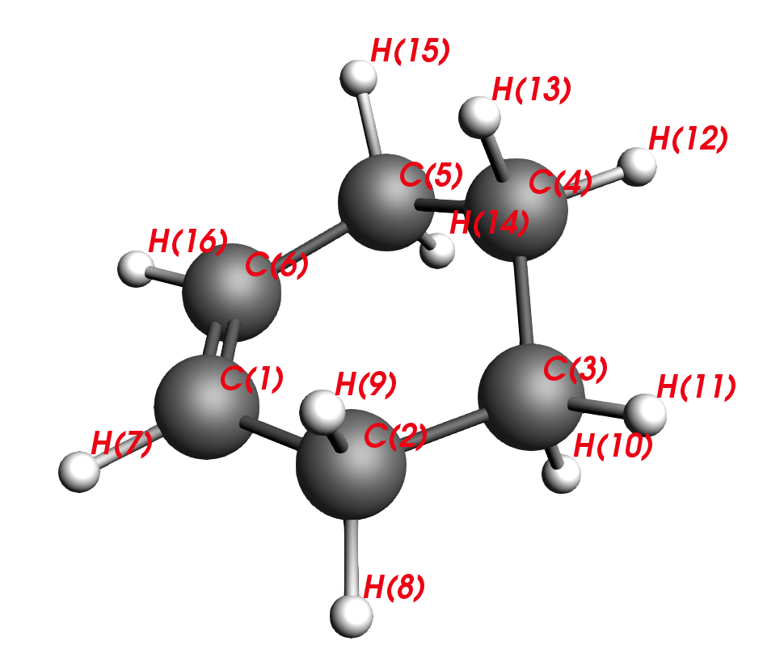

  Tiled structure

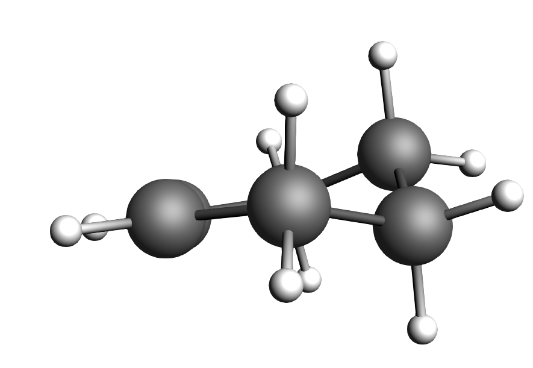

  Side-view, aplanar

.. note::
   The algorithm to find a minimum in ADF is programmed in such a way to find the nearest local minimum. By forcing the ring to be planar, indeed, a minimum can be found. If you perform frequency calculations on this planar structure, you would notice that there are 2 small negative frequencies – and you are stuck on some saddle point of the second order. Making the structure aplanar opens a new search space and you will find a true local minimum with no negative frequencies.

If you are uncertain how to manipulate, you can use a start structure from :download:`here <../downloads/start_input.xyz>`

Setting up the calculations
---------------------------

After manipulating our input to an aplanar structure we will perform an optimization to find a minimum for Cyclo-1-hexene.

.. rst-class:: steps

  \
    | From the Main tab choose the following options
    | **Task → Geometry Optimization**
    | **XC-Functional → GGA-D → PBE-D3(BJ)**
    | **Basis set → TZP**
    | **Frozen Core → None**

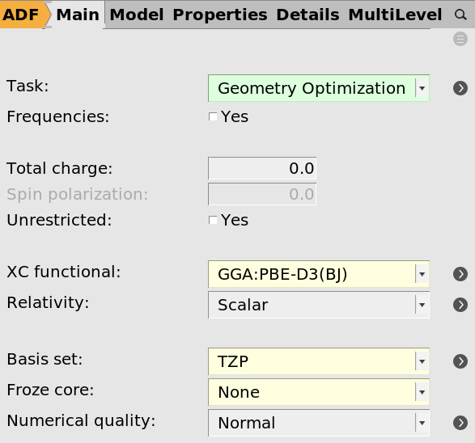

.. note::
   These settings will provide you with a good starting point for organic reactions in general.

.. rst-class:: steps

  \
    | **Save** the file as DA_product.ams and run the calculation

When you look at the output split the molecule in your mind to the reaction partners that must have formed this product.

C2-C1-C6-C5 are carbons that stem from the diene and C3-C4 are carbons that stem from the dienophile. Thus, our next task will be to reverse the reaction and move the reactants apart, similar to unclicking of LEGO bars. This is the intuitive approach to finding a transition state.

Follow your intuition
---------------------

Starting from the optimized structure from the previous section, we will setup a PES scan and we will use a DFTB method to speed up the process.

.. rst-class:: steps

  \
    | Switch from |ADFPanel| to |DFTBPanel|
    | In the Main tab chose
    | **Task → PES Scan**

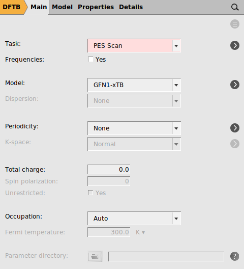

.. rst-class:: steps

  \
    | In the same tab press the button labeled |MoreBtn| next to PES scan
    | Select the C2 and C3 atoms in the GUI using your left mouse button.
    | Press **+** to add the scan coordinate.
    | Set Number of scan points for coordinate to ``10``.
    | Set the scan range from ``1.53`` to ``3`` Å.
    | **Save** the file as ``DA_PES_DFTB.ams`` and run the calculation.

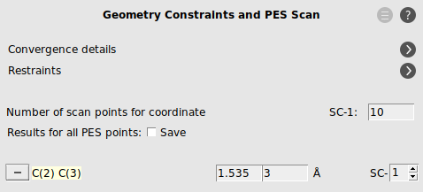

The calculation may finish with a warning such as:

This is ok for us as we are just after a good intuitive guess, so we can ignore this message.

.. rst-class:: steps

  \
    | From the **SCM** **→ Movie**
    | **Click** on the **maximum point** of the red curve.

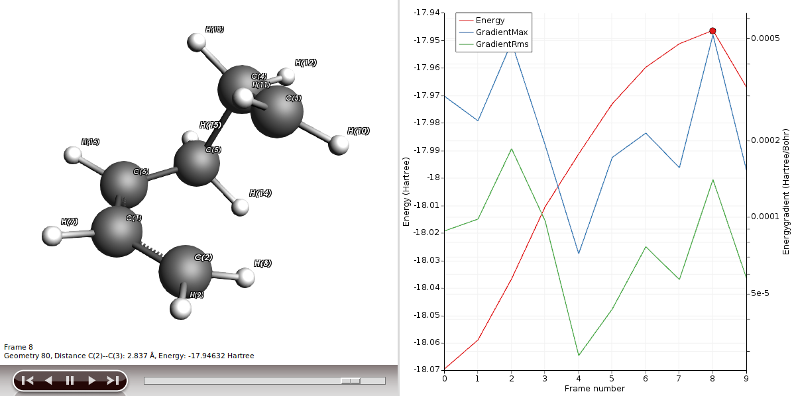

You will be presented with the corresponding structure and you can recognize already the diene in one plane and the dienophile approaching from above, as described in a textbook for this type of reaction. We will use this structure to perform a frequency calculation to see where on the PES we actually are and to check if this structure is suitable for a transition state (TS) calculation.

.. rst-class:: steps

  \
    | In **AMSmovie**, using either arrow keys or the slider, select Frame number 8 (or the frame where the maximum is)
    | Click on **File → Update Geometry in Input**
    | This will bring AMSinput to the front updated with the geometry of Frame 8
    | In **AMSinput** use the **Bonds → Guess Bonds** as the user-drawn bonds do no longer match the geometry

Performing a TS calculation is not simple; we are looking for a special point of the PES, a saddle point of the first order. This is where the curvature of the PES area is positive in all directions but one. In other words, we are looking for one negative frequency that corresponds to the move along our reaction coordinates, i.e. C2-C3 and C5-C6.

Thus, we will have to do a frequency calculation.

.. rst-class:: steps

  \
    | In **AMSinput**, go to the **Main** panel
    | Select **Task → Single Point**
    | Select **Frequencies**

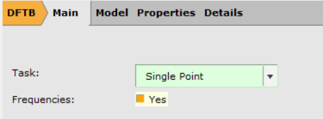

We can now run the Frequency calculation, which will compute the Hessian and the normal modes:

.. rst-class:: steps

  \
    | Click on **File → Save As...** and name it ``DA_Freq_DFTB.ams``.
    | Submit the calculation and wait for it to finish.
    | Then click on **SCM** **→ Spectra**

The first mode should have an imaginary frequency (which in the table is shown as a negative frequency). Click on the line in the table corresponding to the imaginary frequency to visualize the mode. You will see C2 and C3 moving towards and away from each other as you would expect them to do in the actual reaction.

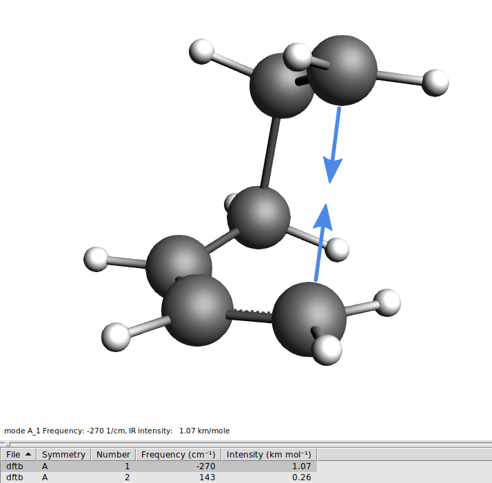

Now we are ready to let DFTB find the real TS.

.. rst-class:: steps

  \
    | Open the AMSinput window of the job “DA_Freq_DFTB”
    | Select **Task → Transition State**
    | Make sure that **Frequencies** is still checked

You will need the frequency file to assist the TS calculation. The algorithm needs the Hessian as input.

.. rst-class:: steps

  \
    | Go to the panel **Details → Geometry Optimization**
    | Select **Initial Hessian → From File**
    | Click on the folder icon next to **Initial Hessian From:**
    | Select the file **dftb.rkf** in the folder **DA_Freq_DFTB.results**

.. tip::

   Instead of loading the Hessian matrix from a previous job, you can also choose the **Initial Hessian → Calculate** option to have it (re)calculated at the beginning of your transition state search job.
   This is useful if you have no previous results around from which you could load the Hessian.

Check if your input still carries the geometry constraint from the previous PES scan calculation, which has to be removed before starting the new calculation:

.. rst-class:: steps

  \
    | Go to the panel **Model → Geometry Constraints and PES Scan**
    | Remove the **C(2) C(3)** constraint by clicking on **“-“** in front of it.

We can now run the TS search calculation:

.. rst-class:: steps

  \
    | Click on **File → Save As...** and give it the name **DA_TS_DFTB.ams**
    | Submit the calculation and wait for it to finish.
    | Then click on **SCM** **→ Spectra**

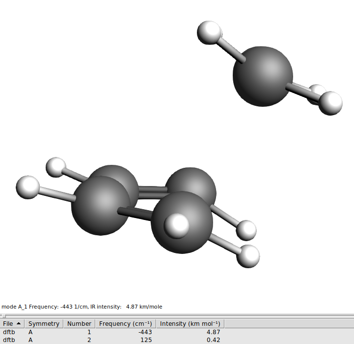

.. note::
   A transition state should have zero nuclear gradients and exactly **one** negative/imaginary frequency.

You will see to molecules, clearly identifiable as butadiene and ethene, only one negative frequency, and when you animate the vibration you see the molecules moving towards each other as if they would form the product and away from each other, as if they were splitting up again.

What can possibly go wrong?
---------------------------

You could find more than one negative frequency which means you are lost on the PES and have not found the TS. This can happen if the PES scan goes wrong because you did not have a good starting structure. In the case of click reactions, rearrange the two reactants in such a fashion that the resemble the suggested text book mechanism, i.e.

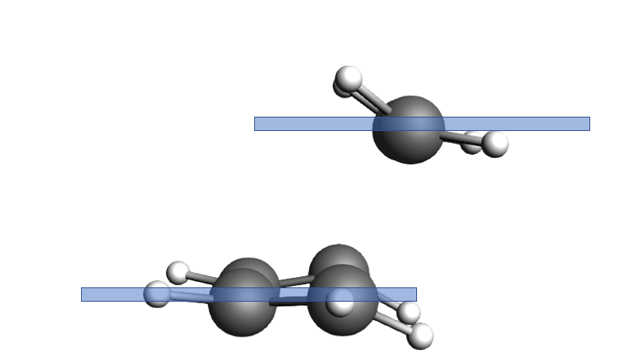

  The ethene molecule is in one plane and the butadiene in another one, very parallel to each other.

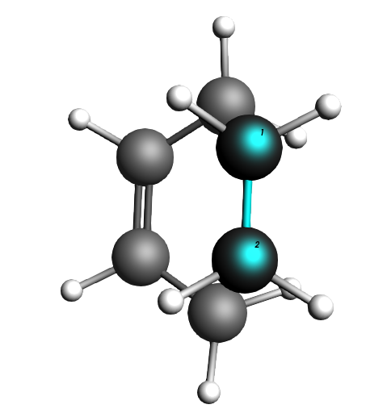

  The ethene molecule hovers “perfectly” above the butadiene C atoms it is supposed to click with.

… then repeat the transition state search.

Animate the negative frequencies and identify the one that represents the reaction coordinate, i.e. the one that looks like a movie of the reaction to happen. Then animate the other negative ones that have nothing to do with the reaction. Some common scenarios can be:

.. csv-table::
   :header: "Problem", "Solution"

   "geometries are forced to be planar, but should not", "force a slight aplanarity, repeat TS calculation"
   "local geometries are staggered, but should be eclipsed", "change the torsion angle, repeat TS calculation"

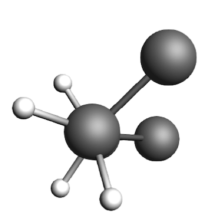

  Example of **staggered** local geometry

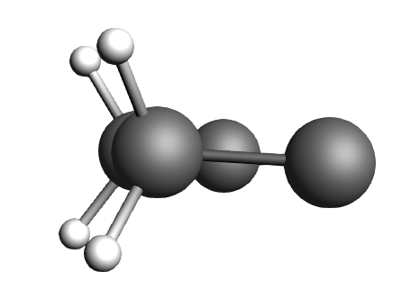

  Example of **eclipsed** local geometry

What are the next steps?
------------------------

* Reuse the DFTB geometry and Hessian to calculate the TS at the DFT level, e.g. PBE-D3(BJ)/TZP. This works well if the DFT and DFTB potential energy surfaces are reasonably similar. Switch to ADF with the updated geometry, select **Transition State** as Task. In the **Details → Geometry Convergence** panel click on the folder next to the **Initial Hessian** field and select the dftb.rkf from the DFTB TS calculation.
* If the TS does not converge, you could retry the above steps taken with DFTB, but now at the DFT level with ADF.
* After you've obtained a TS at the DFT level, perform a frequency calculation again to confirm that there is really only one negative frequency, and thus you are confident about your calculation.
* Perform an IRC search to find minima of reactants and products.

Starting from reactant and product – Nudged Elastic Band (NEB)
--------------------------------------------------------------

Another way to locate a TS would be using the NEB method. This requires you to provide the structure of your reactants and your products. These structures you provide have to have a realistic geometry but do not necessarily have to be minima on the PES. In case of our Diels-Alder reaction we do know about the product but we are uncertain how exactly the diene and dienophile look in their local minima before they “started to click”.

The NEB algorithm does not know about chemical reactions; it will interpolate between the geometries of your reactants and products. A preliminary path on the PES can be established which will then be discretized into a finite number of points. Each point corresponds to a geometry which the reactants are adopting on their way to reach the product. Imagine you would thread these images like pearls on a necklace, but using a rubber band. The NEB algorithm will check the slope of the PES and “nudges” the rubber band toward the minimum energy path (MEP). The MEP is defined as the path on the PES where every point is at an energy minimum in all directions perpendicular to the path. It also passes through at least one first-order saddle point which is the transition state we are looking for.

To help you select two suitable input structures, let’s revisit your file DA_PES_DFTB.ams.

.. rst-class:: steps

  \
    | **Open** the file as **DA_PES_DFTB.ams** and from the **SCM** Menu choose Movie.
    | **Click** on the **Frame 0** of the **red curve**

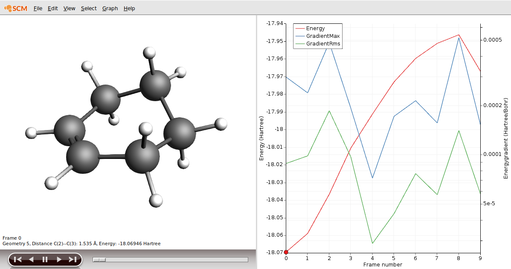

.. rst-class:: steps

  \
    | Choose **File → Save Geometry...** and save the file as ``product.xyz``

As our reactant, we could use frame 9 in our results.

.. rst-class:: steps

  \
    | **Click** on the **Frame 9** of the **red curve**
    | Choose **File → Save Geometry...** and save the file as **reactants.xyz**

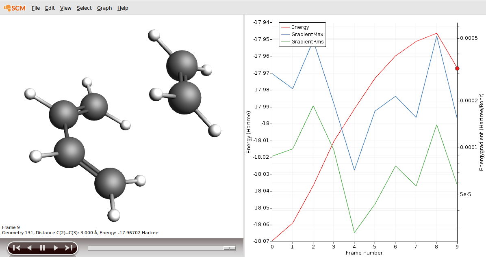

We now need to load both files into the ADF GUI.

.. rst-class:: steps

  \
    | Switch to AMSinput by loading the DA_PES_DFTB job to retrieve the right initial settings
    | Select the molecule and delete it
    | Click on **File → Import coordinates...** and select the file **reactants.xyz**
    | Add a new molecule: **Edit → New Molecule**
    | Click on **File → Import coordinates...** and select the file **product.xyz**
    | Rename the tabs at the bottom to "reactants" and "product"

You are now ready to setup your calculation. For speed we will use DFTB, but you could also use ADF if you wish:

.. rst-class:: steps

  \
    | Go to the Geometry Optimization panel in the Details section
    | In the **Main tab** choose
    | **Task → NEB**

Select the details for the NEB task:

.. rst-class:: steps

  \
    | In the same tab press the button labeled  |MoreBtn| next to NEB task
    | **Set** the number of images to 16.
    | **Set** initial system to **reactants** and final system to **product**
    | **Check** the Characterize PES point check button.

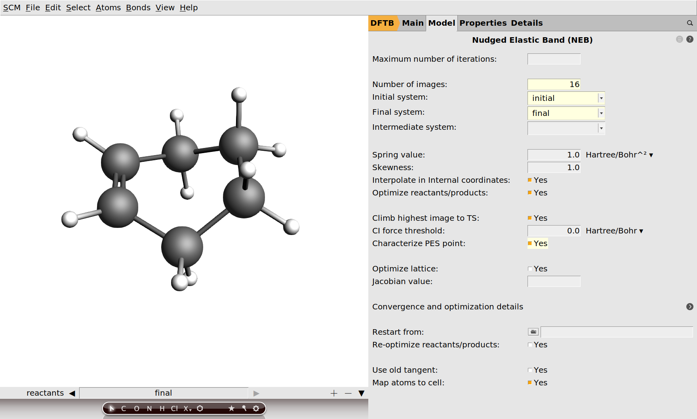

.. rst-class:: steps

  \
    | Click on **File → Save As...** and give it the name **DA_NEB.ams**.
    | Submit the calculation and wait for it to finish.
    | Then click on **SCM** **→ Output**

In the output file you can find details of the TS found by NEB (and that it is indeed a TS):

.. code::

   NEB found a transition state!

    ------------------------------------------------------------
    TS barrier height from the left           0.01348609 Hartree
                                              8.463 kcal/mol
                                             35.408 kJ/mol
    TS barrier height from the right          0.11051131 Hartree
                                             69.347 kcal/mol
                                            290.147 kJ/mol
    Reaction energy                          -0.09702522 Hartree
                                            -60.884 kcal/mol
                                           -254.740 kJ/mol
    ------------------------------------------------------------
              Transition state geometry

   --------
   Geometry
   --------
   Formula: C6H10
   Atoms
     Index Symbol   x (angstrom)   y (angstrom)   z (angstrom)
         1      C    -0.64861084    -0.29547413    -1.44354331
         2      C    -1.40179466     0.51347693    -0.64937591
         3      C    -0.74726237    -0.24013711     1.40309238
         4      C     0.60829014    -0.26170213     1.46539177
         5      C     1.47268993     0.46444397    -0.51896474
         6      C     0.76736509    -0.31976787    -1.37911408
         7      H    -1.13265537    -1.09784072    -1.99297252
         8      H    -2.47879889     0.40673925    -0.63474426
         9      H    -1.03159648     1.45681569    -0.27725129
        10      H    -1.30898740    -1.14291158     1.21063419
        11      H    -1.30516946     0.58472321     1.82415143
        12      H     1.15643344    -1.18208999     1.32417459
        13      H     1.15108981     0.54600685     1.93646925
        14      H     2.53961979     0.32082098    -0.40674592
        15      H     1.10283199     1.42058718    -0.18076315
        16      H     1.27147848    -1.13925102    -1.88340955

.. rst-class:: steps

  \
    | Next click on **SCM** **→ Movie**
    | Click on the highest point in the energy curve

This will show you the NEB path, the highest point is the calculated transition state.

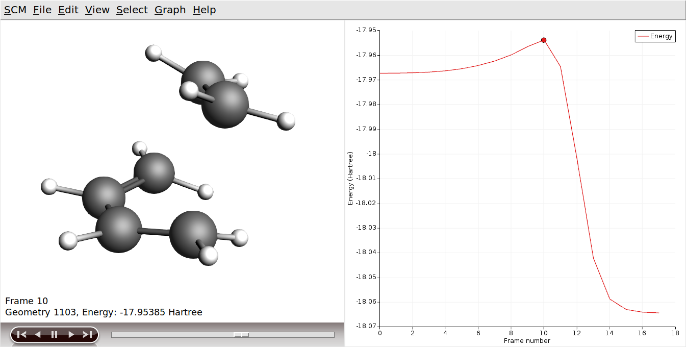

If you play the movie you should see the reaction happen.
You can also open the job in AMSspectra, to see the normal mode along the reaction coordinate.

What can possibly go wrong?
---------------------------

You could fail with the NEB and find no TS. In this case revisit the structure you are least sure about – which would be the reactants in our case. Imagine again each point on the NEB preliminary path corresponds to a geometry which the reactants are adopting on their way to reach the product. Make a movie out of it in your mind’s eye. Does the reaction look smooth? Are atoms forced to penetrate each other to change the geometry from reactant to product? If so, correct the geometries in such a way that this does not happen and start the NEB afresh.

What are the next steps?
------------------------
* Use the TS obtained with DFTB and perform a frequency calculation using ADF with the settings from before, i.e. PBE-D3(BJ) with a TZP basis set to get a guess for the Hessian. (**initial guess for TS calculation**)
* Use the Hessian to perform a TS calculation. (**actual TS calculation**)
* Do perform a frequency calculation again to confirm that there is really only one negative frequency, and thus you are confident about your calculation. (**confirmation of TS**)
* Report geometry and frequency values in your paper.
* Perform an IRC search to find minima of reactants and products.

