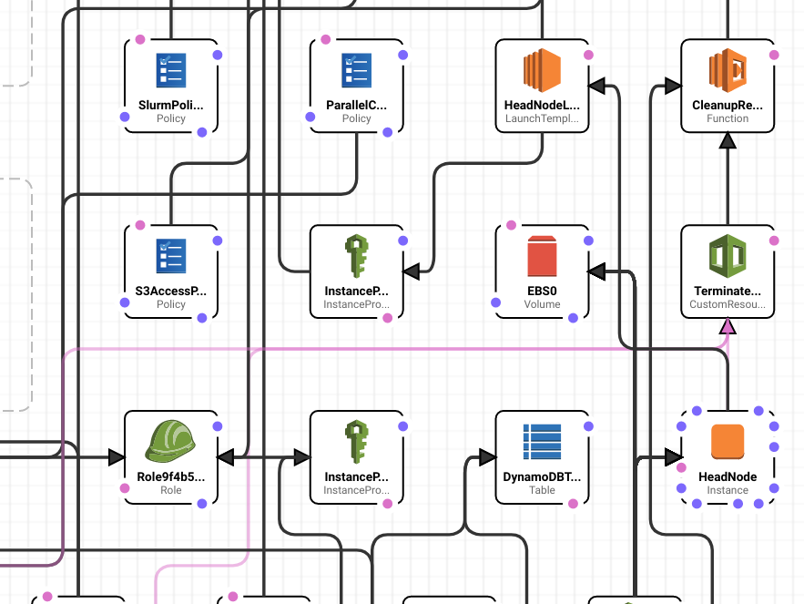

.. _aws_ParallelCluster_tutorial:

Using AMS with AWS ParallelCluster
##################################

 
Introduction
============

AMS can run on most modern linux platforms, which includes cloud servers.
In this tutorial we will demonstrate how to set up a basic SLURM cluster on AWS, install
AMS on it, and configure remote queues on your local machine.

Several cloud providers have supported tools for setting up a SLURM cluster in the cloud.
This provides a useful mechanism for running batch workloads in a cloud environment, without need for much additional setup.
It will allow you to use the powerful scheduling capabilities of SLURM in a setting where compute nodes are ephemeral and dynamically scaled up and down with demand to save on costs.
AMSJobs, and PLAMS have `integrated support <../../Installation/Installation.html#configure-amsjobs-queues-and-3rd-party-software-optional>`__ submitting jobs to a SLURM queue.

If you are interested in setting up an HPC cluster in the cloud, you could consider options from major cloud providers such as 

- `AWS ParallelCluster <https://aws.amazon.com/hpc/ParallelCluster/>`__
- `Azure CycleCloud <https://docs.microsoft.com/en-us/azure/cyclecloud/?view=cyclecloud-8/>`__
- `Using SLURM for Google Cloud <https://cloud.google.com/blog/products/gcp/easy-hpc-clusters-on-gcp-with-slurm/>`__

In this tutorial we demonstrate how to use AMS on a Centos cluster on Amazon EC2, configured using AWS ParallelCluster.
AWS ParallelCluster uses a relatively simple configuration file to set up a complicated `CloudFormation stack <https://aws.amazon.com/cloudformation/>`__ capable of providing an automatically scalling HPC cluster, fully hosted on AWS EC2.
The basic steps and some recommendations will be covered by this tutorial, but for advanced configurations we recommend checking the AWS documentation.

  AWS ParallelCluster sets up a complicated CloudFormation stack to automatically deploy all the resources you need to run your cluster on AWS.

Prerequisites
=============

During this tutorial we will use several AWS services. It is important that your account has permission to use these services.

The following tutorial presumes that you have:

- An AWS account, and the `AWS command line tools <https://docs.aws.amazon.com/cli/latest/userguide/install-cliv2.html>`__ installed
- Familiarity with command line use, python, shell scripting, and SLURM.
- Installed python 3.6 or greater, and a recent version of Node.js (no javascript knowledge required)
- Some basic experience with AWS services such as EC2, S3, and IAM, and knowledge about good security practices
- An `SSH key pair for EC2 <https://docs.aws.amazon.com/AWSEC2/latest/UserGuide/ec2-key-pairs.html>`__
- A cloud license for the version of AMS you wish to install. For questions regarding licenses, please email license@scm.com.

This tutorial is divided into the following steps.

#. Installing and configuring the cluster
  
   - We will cover some of the basic steps, and some configuration options that we recommend when running AMS.  

#. Installing and setting up AMS on the cluster
  
   - Where to install AMS, and how to set up the environment so that it runs correctly.

#. Configuring your local installation of AMS to connect to the cluster 
  
   - Setting up remote queues the correct way to use the SLURM cluster

The last part of the tutorial also will use an installation of AMS on your local machine, but it is not a prerequisite for using AMS on ParallelCluster.

Setting up your cluster with AWS ParallelCluster
================================================

.. note::

  For the latest instructions and options for ParallelCluster, always check the `AWS documentation <https://docs.aws.amazon.com/parallelcluster/latest/ug/what-is-aws-parallelcluster.html>`__

Installing ParallelCluster
--------------------------

AWS ParallelCluster is a command line tool that helps you deploy a dynamically scaling compute cluster on AWS. 
It provides a fairly simple way to run batch workloads in the cloud, also allowing software such as AMS to employ existing SLURM features.

.. rst-class:: steps

  \    
    | **1.** Install the command-line tool using the `instructions provided by AWS <https://docs.aws.amazon.com/parallelcluster/latest/ug/install-v3-parallelcluster.html>`__.
    
     
This tutorial is written for AWS ParallelCluster version 3.
Note that you will require a recent version of python 3 (3.6 or greater), and a recent version of Node JS.
These are dependencies of ParallelCluster. You will not need to write python or JS code as part of the setup.
We highly recommend that you install ParallelCluster using python's `virtualenv <https://docs.aws.amazon.com/parallelcluster/latest/ug/install-v3-virtual-environment.html>`__.
Keeping it inside a separate virtual environment will help keep the tool stable, and compatible with any clusters that you may have deployed.

.. rst-class:: steps
     
  \
    | **2.** Run After installing ParallelCluster, make sure you can run it successfully with the following command:

.. code-block:: shell

  (apc-ve) user@mymachine:~/tutorials/ams-parallelcluster$ pcluster version
  {
    "version": "3.0.0"
  }

After installing, we can configure a basic cluster.

Configuring ParallelCluster
---------------------------

Before you configure, make sure you already created an `EC2 SSH key pair <https://docs.aws.amazon.com/AWSEC2/latest/UserGuide/ec2-key-pairs.html>`__,
as you will be asked to provide it.
The configure command will run interactively, asking you to provide the basic information necessary to create your cluster.
For more information, see the `instructions provided by AWS <https://docs.aws.amazon.com/parallelcluster/latest/ug/install-v3-configuring.html>`__.
It is recommended to use this to create a template to work with, as it will automatically help you set up your cluster's network, and select some other basic options.
Here, we will tell you which recommended options to pick for the purpose of this tutorial.

.. rst-class:: steps

  \
    | **1.** Run the following configure command. 
    | using the ``--config`` flag, tou can select a different name for the configuration file if preferred. 

  .. code-block:: sh
  
    (apc-ve) user@mymachine:~/tutorials/ams-parallelcluster$pcluster configure --config cluster-config.yaml

    INFO: Configuration file cluster-config.yaml will be written.
    Press CTRL-C to interrupt the procedure.
  
  \
    | **2.** Select the region you want to host the cluster in. This may depend on your own location, or the location of resources you want to connect to the cluster.

  .. code-block:: shell

    Allowed values for AWS Region ID:
    1. ap-northeast-1
    2. ap-northeast-2
    3. ap-south-1
    4. ap-southeast-1
    5. ap-southeast-2
    6. ca-central-1
    7. eu-central-1
    8. eu-north-1
    9. eu-west-1
    10. eu-west-2
    11. eu-west-3
    12. sa-east-1
    13. us-east-1
    14. us-east-2
    15. us-west-1
    16. us-west-2
    AWS Region ID [eu-central-1]: 

  \
    | **3.** Select the keyname you want to use for connecting to the cluster. 

  .. code-block:: shell

    Allowed values for EC2 Key Pair Name:
    1. mykey
    2. otherkey  
    EC2 Key Pair Name [mykey]: 1

  Make sure you have this key available on the machine you will use to connect to the cluster.
  Next, you will need to select a scheduler.

  \
    | **4.** For the purpose of this tutorial please select **SLURM** as the scheduler

  .. code-block:: shell

    Allowed values for Scheduler:
    1. slurm
    2. awsbatch
    Scheduler [slurm]: 1
 
  
  \
    | **5.** Please select **Centos 7** as the operating system.

  .. code-block:: shell 

    Allowed values for Operating System:
    1. alinux2
    2. centos7
    3. ubuntu1804
    4. ubuntu2004
    Operating System [alinux2]: 2

  We highly recommend using Centos 7, which will provide advantages for running parallel jobs.
  Details about parallel jobs will be covered later in this tutorial.
  Now we need to define a compute queue, which will correspond to a 
 
  \
    | **6.** Set up 1 queue. Call it ``ondemand``
    | For this tutorial we will set up one queue at this step.
    
  .. code-block:: shell

    Head node instance type [t2.micro]: c5n.xlarge
    Number of queues [1]: 1
    Name of queue 1 [queue1]: ondemand

  \
    | **7.** For this queue, please choose **1 compute resource**, and use **c5n.xlarge** as instance type. Leave the maximum at 10.

  .. code-block:: shell

    Number of compute resources for ondemand [1]: 
    Compute instance type for compute resource 1 in ondemand [t2.micro]: c5n.xlarge
    Maximum instance count [10]:     

  The number of compute resources refers to the *number of different instance types*.
  As an example, we are using only ``c5n.xlarge`` instances, with a Maximum count of 10.
  These are intel based, and have 2 cores with 8 GB of memory. 
  When choosing instance types please note that the number of cores typically is only half the number of vCPUs.
  For optimal use of resources disabling simultaneous multithreading (known as hyper-threading on Intel platforms) is recommended, so that only one thread runs per core.
  
  Next up is the network configurations.

  \
    | **8.** Select a VPC, or automate creation of a new one.
    | If you already have a Virtual Private Cloud (VPC), you can use the one that already exists.
    | If you are unsure which to use or don't have a VPC, the configure tool can generate a VPC for you.

  .. code-block:: shell

    Automate VPC creation? (y/n) [n]: 
    Allowed values for VPC ID:
      #  id            name      number_of_subnets
    ---  ------------  ------  -------------------
      1  vpc-3213910c  vpc1                      5
    VPC ID [vpc-3213910c]: 1

  For more information about VPCs on AWS, please read `the AWS documentation <https://docs.aws.amazon.com/vpc/latest/userguide/what-is-amazon-vpc.html>`_ on the subject.
  Next up, you will need to define subnets both for the head node and the compute nodes.
  Automating this is easy, select an avalability zone and configuration.

  \
    | **9.** For this tutorial **Automate subnet creation**.
    | Select whichever you prefer and continue.
    | Note that using a private subnet will create a `NAT gateway <https://docs.aws.amazon.com/vpc/latest/userguide/vpc-nat-gateway.html>`_, which could incur some extra costs.

  .. code-block:: shell

    Automate Subnet creation? (y/n) [y]: 
    Allowed values for Availability Zone:
    1. eu-central-1a
    2. eu-central-1b
    3. eu-central-1c
    Availability Zone [eu-central-1a]: 1
    Allowed values for Network Configuration:
    1. Head node in a public subnet and compute fleet in a private subnet
    2. Head node and compute fleet in the same public subnet
    Network Configuration [Head node in a public subnet and compute fleet in a private subnet]: 2

  That should be the last step in the configuration. 
  Next, a CloudFormation stack will be created for your network configuration.

  \
    | **10.** Wait until the stack generation is finished.

  .. code-block:: shell
    
    Creating CloudFormation stack...
    Do not leave the terminal until the process has finished.
    Stack Name: parallelclusternetworking-pubpriv-20210923123456 (id: arn:aws:cloudformation:eu-central-1:112233445577:stack/parallelclusternetworking-pubpriv-20210923123456/21615d90-2059-11ec-b5c3-02cac9daa27a)
    Status: parallelclusternetworking-pubpriv-20210923123456 - CREATE_COMPLETE      
    The stack has been created.
    Configuration file written to cluster-config.yaml
    You can edit your configuration file or simply run 'pcluster create-cluster --cluster-configuration cluster-config.yaml --cluster-name cluster-name --region eu-central-1' to create your cluster.
    
  Note that this is different from the stack that will be used to deploy the cluster.
  That stack won't be created until later.
  At this point, you have a basic configuration file from which you could launch a cluster. 
  However, it may be useful to consider some options that will make it easier to use AMS effectively.
  

To continue configuring, **open the configuration file in a text editor**.
In this example we called the file ``cluster-config.yaml``.
Your basic cluster file will look something like this:

.. code-block:: yaml     
  
  Region: eu-central-1
  Image:
    Os: centos7
  HeadNode:
    InstanceType: c5n.xlarge
    Networking:
      SubnetId: subnet-0bd780a5354103
    Ssh:
      KeyName: mykey
  Scheduling:
    Scheduler: slurm
    SlurmQueues:
    - Name: ondemand
      ComputeResources:
      - Name: c5nxlarge
        InstanceType: c5n.xlarge
        MinCount: 0
        MaxCount: 10
      Networking:
        SubnetIds:
        - subnet-0bd780a5354103

In the next few subsections, we will provide recommendations for a lot of the individual options.
These will allow you to use AMS more effectively on your cluster.
If something is optional, it will be indicated as such.

Defining queues
---------------

The configuration tool will have guided you through the definition of at least one compute queue for use.
Inside the configuration file you will find the ``Scheduling`` section, and within the ``SlurmQueues`` section.

Under the ``ComputeResources`` section, you can define different types of compute nodes.
Each compute resource will require an instance type and a name. You can also setup
a minimal and maximal number of instances.

One setting you should add to your compute resource is the ``DisableSimultaneousMultithreading: true``, which will disable hyper-threading on your compute nodes.

.. rst-class:: steps

  \
    | Please Add **DisableSimultaneousMultithreading: true** key to your compute resource.

You might also be interested in using a Spot queue, as for short-running jobs they can be very cost efficient.
Spot instances can provide you with (much) cheaper instances, with the downside that sometimes nodes will be shut down, and a job will be resubmitted.
For a spot queue, add the ``CapacityType`` key to the queue, and set its value to ``SPOT``.
The default when unspecified is ``ONDEMAND``.
Your cluster will aqcuire spot instances at a variable price, which depends on the demand for instances by other users of AWS EC2.
By default, the max price per instance is set to the on-demand instance price, but it can be configured using the ``SpotPrice`` key.

Here is an example of a two queue setup with one on-demand queue and one spot queue.

.. code-block:: yaml

  SlurmQueues:
  - Name: ondemand
    CapacityType: ONDEMAND
    ComputeResources:
    - Name: c5nxlarge
      InstanceType: c5n.xlarge
      DisableSimultaneousMultithreading: true
    Networking:
      SubnetIds:
      - subnet-0bd780a5354103
  - Name: spot
    CapacityType: SPOT
    ComputeResources:
    - Name: c5nxlarge
      InstanceType: c5n.xlarge
      DisableSimultaneousMultithreading: true
    Networking:
      SubnetIds:
      - subnet-0bd780a5354103

Adding a shared directory for software installations and jobs
-------------------------------------------------------------

In order to provide AMS (and potentially other software) on your cluster, you need
to define a shared filesystem that will be present on both head and compute nodes.
For this you use the ``SharedStorage`` option, which is present on the top level of the configuration file.
ParallelCluster provides several options, such as `Elastic Block Store (EBS) <https://aws.amazon.com/ebs/>`__,
`Elastic File System (EFS) <https://aws.amazon.com/efs/>`__, and `FSx for Lustre <https://aws.amazon.com/fsx/lustre/>`__.

Here we define a single 64Gb shared EBS filesystem that uses gp2 SSD storage for installing software and storing job data.

.. rst-class:: steps

  \
    | Please add the following **SharedStorage** section to your configuration file.

  .. code-block:: yaml
    
    SharedStorage:
    - Name: ebs
      MountDir: /shared-ebs
      StorageType: Ebs
      EbsSettings:
        VolumeType: gp2      
        Size: 64
        Encrypted: false                  
        DeletionPolicy: Delete

In production you will probably have other needs, but for this tutorial this will suffice.
You may find that for your workflows it could be useful to have a high-performance EBS scratch directory, or a Lustre filesystem.
It may also be useful to store jobs on a separate filesystem, to make sure enough space is available.
Note that access to filesystems could be limited by the network performance, and that in a typical case this network access is routed through the head node.
Therefore if you experience IO slowdowns, it is also important to check the network load on the head node, and make sure you have selected an instance type that has high available bandwidth.

IntelMPI
--------

To ensure smooth operation of multicore jobs on SLURM, IntelMPI is required. 
AMS ships with a version of IntelMPI, but for best experience you can opt to `install Intel HPC software <https://docs.aws.amazon.com/parallelcluster/latest/ug/AdditionalPackages-v3.html>`__ with your cluster.
This is done using the ``AdditionalPackages`` section of the configuration file.

.. rst-class:: steps

  \
    | Add the following **AdditionalPackages** section to your configuration file.

.. code-block:: yaml
   
  AdditionalPackages:
    IntelSoftware:
      IntelHpcPlatform: true

At the time of writing this tutorial, ParallelCluster only supports installing Intel HPC software on Centos 7. 

Optional: Security groups
-------------------------

Your cluster should only be accessible by those that have the private key that you provided.
By default, ParallelCluster will configure a security group that allows access from all IPv4 addresses (0.0.0.0/0).
For increased security, you may also like to restrict access to known IP-addresses.
In the ``Ssh`` section, you will already find the ``KeyName`` that points to the ssh key you provided.
You can add the additional ``AllowedIps`` key to this section, and specify ip ranges using CIDR notation.

.. code-block:: yaml

  HeadNode:
    ....
    Ssh:
      KeyName: mykey
      AllowedIps: 
       - 12.34.123.0/24 # all office machine
       - 12.34.124.123/32 # specific machine

Optional: GUI access with NiceDCV
---------------------------------

AWS ParallelCluster can install a `NiceDCV server <https://www.nice-dcv.com/>`__ on your head node, in order to provide a graphical environment.
In the ``HeadNode`` section, add a ``Dcv`` block, and ``Enabled: True``.
You can also set the ``AllowedIps`` using CIDR notation to restrict access to specified IP ranges.

.. code-block:: yaml

  HeadNode:
    ....
    Dcv:
      Enabled: true
      AllowedIps: 12.34.123.234/32

Note that to use the GUI for AMS you will also need to install `GUI dependencies <../../Installation/Introduction.html#software-requirements>`__.
On a centos system, you can use yum to install these.
Of course, your cluster needs to be running to install this.
You can also put yum commands in a `bootstrap script <https://docs.aws.amazon.com/parallelcluster/latest/ug/custom-bootstrap-actions-v3.html>`__ to run on the headnode.

.. code-block:: sh

  sudo yum install -y \
    libXScrnSaver \
    libxkbcommon-x11 \
    fontconfig \
    freetype  \
    libdrm \
    libICE \
    libSM \
    libstdc++ \
    libX11 \
    libXau \
    libXdmcp \
    libXext \
    libXft\
    libXrender \
    libXt \
    libXxf86vm \
    mesa-libGL \
    mesa-libGLU

This concludes the basic configuration of the cluster.

Starting the cluster and installing AMS
=======================================

At this point you should have finished creating your cluster configuration as a yaml file.
Make sure you have taken a little time to read the `best practices <https://docs.aws.amazon.com/parallelcluster/latest/ug/best-practices-v3.html>`__ as well.

Creating the cluster
--------------------

In order to start the cluster, you need to use ``pcluster create-cluster``. 
This will deploy a CloudFormation stack that contains all your cluster components.
You need to provide a cluster name, and the path to your configuration file.
pcluster will validate your configuration file first, and if valid it will start your cluster.

.. rst-class:: steps

  \
    | Start the cluster using the **create-cluster** subcommand

  .. code-block:: shell
  
    pcluster create-cluster --cluster-name ams-cluster --cluster-configuration cluster-config.yaml

If you run into any errors with the configuration file, look if any manually added keys are in the right section of the file.
A full specification of the configuration format is `available online <https://docs.aws.amazon.com/parallelcluster/latest/ug/cluster-configuration-file-v3.html>`__.

The cluster will be created through a CloudFormation stack which has the same name as the cluster.
This will take a while. 
You can follow progress through the `CloudFormation console <https://docs.aws.amazon.com/AWSCloudFormation/latest/UserGuide/cfn-using-console.html>`__.
You can also follow progress on the command-line with the ``pcluster describe-cluster`` command.

.. rst-class:: steps
  
  \
    | Follow progress using the following command

  .. code-block:: shell

    pcluster describe-cluster --region eu-central-1 --cluster-name ams-cluster

After it is done, it will list ``"clusterStatus": "CREATE_COMPLETE"``. 

Connecting to the head node
---------------------------

If your cluster has reached "CREATE_COMPLETE" status, you should now be able to ssh to your cluster.
An easy way to do this is using 

.. code-block:: shell  

  pcluster ssh --region eu-central-1 --cluster-name ams-cluster -i ~/.ssh/mykey.pem

Alternatively, you can look up the head node in the `EC2 dashboard <https://console.aws.amazon.com/ec2/v2/home>`__.

If you opted to install a DCV server, you can also connect with NiceDCV.
An easy, one line way to connect is 

.. code-block:: shell
   
  pcluster dcv-connect --region eu-central-1 --cluster-name ams-cluster --key-path ~/.ssh/mykey.pem

Next you can install AMS on the cluster.

Installing and configuring AMS
------------------------------

You can follow the basic instructions in the `installation guide <../../Installation/Linux_Quickstart_Guide.html>`__, while taking a few caveats in mind.
We will summarize the main steps here for convenience.

Since you need access to AMS on the compute nodes, it is important to install it on a filesystem that is shared between the compute and head nodes.
In the cluster configuration we defined the ``shared-ebs`` EBS filesystem. 
Please go into that directory, and download and extract AMS there.

.. rst-class:: steps

  \
    | **1.** Download and extract the AMS tarball.

  .. code:: shell

    cd /shared-ebs
    URL=https://downloads.scm.com/Downloads/download2021/bin/ams2021.104.pc64_linux.intelmpi.bin.tgz
    CREDS=u12345:myscmpassword
    curl -u "$CREDS" -sL "$URL" | tar xz

  We download and extract the binaries in a single step by using curl and tar.
  You will have to provide your scm login details.
  Depending on which instance types you use, always use an appropriate set of binaries to match your CPU types.
  Here, we opted to use the AMS binaries that are optimized for Intel cpus.
  If you use `AMD-Zen based instances <https://aws.amazon.com/ec2/amd/>`_, you will want to download the version of AMS compiled with optimizations for AMD.
  If you have configured a shared EBS storage system under ``/shared-ebs``, extract the tarball in a folder there.

  You will also have to set up the environment, both on your head and compute node.
  Inside the AMS installation folder (typically named something like ``ams2021.104``) you will find the Utils folder.
  There, you can find a template ``amsrc.sh`` script, but it will require some editing.
  
  \
    | **2.** Make a copy of the ``amsrc.sh`` script to somewhere on your shared filesystem, for instance in the top directory of the installation.

  To distinguish it from other scripts such as ``$AMSHOME/amsbashrc.sh`` (which you should not use on AWS), you could call it something like ``cloudrc.sh``.

  .. code:: shell

    cd /shared-ebs-AMS2021.104
    cp Utils/amsrc.sh ./cloudrc.sh

  Edit the AMSHOME variable to point to the top folder containing your installation on the shared filesystem.
  
  \
    | **3.** AMSHOME=/shared-ebs/ams2021.104

  If in your configuration you have defined a high performance scratch filesystem,
  you can set the SCM_TMPDIR variable to point to it as well.
  You may wish to set the SCM_PYTHONDIR to somewhere in the shared filesystem.
  That way if you need to install any additional python packages, you only
  have to do it once.

  Remove the SCMLICENSE line, as it is not used in cloud environments.
  Instead, add a line with your SCM_CLOUD_CREDS which will allow the software to locate your license over the internet.
  Don't forget to export this additional variable. Save the file when you're done.

  \
    | **4.** Delete the SCMLICENSE line
    | **5.** Add a line ``export SCM_CLOUD_CREDS=u12345:myscmpassword``
    | **6.** Save the file.
    | **7.** Make sure you can source the file without error, using ``source cloudrc.sh``. 
  
  Remember that before running any jobs, you will need to source this file.
  You can add it to your ``prolog`` command in AMSJobs remote queue command, which will be covered later on
  Next, we need to check if your license works correctly. 
  
  \
    | **8.** run the ``dirac TARGET``, to check that the cloud license works for your target.

  For instance if you want to use ADF, call the ``dirac ADF`` command.
  If this returns an error check your credentials carefully.
  Also check the spelling of the target which is case sensitive. 
  If you don't have a valid license you will see a message such as "Your license does not include module ADF version 2021.104 on this machine".
  For information and support regarding licenses please contact license@scm.com

Configuring IntelMPI and SLURM
------------------------------

AMS is capable of running jobs in parallel, both across processor cores and several instances by using IntelMPI.
In order to use AMS with both IntelMPI with SLURM, some configuration is needed. 
Specifically, the I_MPI_PMI_LIBRARY needs to point to a valid path, containing the file `libpmi.so`.

On the AWS parallelcluster, you can find libpmi.so under ``/opt/slurm/lib/libpmi.so``. 

.. rst-class:: steps

  \
    | **1.** Open the start script with an editor, located at ``/shared-ebs/ams2021.104/bin/start``
    | **2.** Find the line that begins with ``export I_MPI_PMI_LIBRARY``
    | **3.** Edit it so it says ``export I_MPI_PMI_LIBRARY=/opt/slurm/lib/libpmi.so`` and save the file
    
  If you opted to install IntelMPI as part of your cluster, you will need to tell AMS to use it.

  First, to use the IntelMPI installation that comes installed on the AWS cluster you will have to load the intel mpi module.
  This needs to be done before every job.

  .. code-block:: shell

    module load intelmpi

  You will also need to `export SCM_USE_LOCAL_IMPI=1` inside your environment at run time.
  To make it simpler, you can put both the export, and module load commands inside the cloudrc.sh script.

  \
    | **4.** Open the ``cloudrc.sh`` script created earlier, and add a new line ``module load intelmpi``  
    | **5.** Add another line saying ``export SCM_USE_LOCAL_IMPI=1``, save and close the file.

  You should now be ready to run AMS jobs in parallel on your cluster.

In the next step, it will be explained how to use queues both through your local installation of AMS, and by running on the head node.

Using the queues on your local AMS installation
===============================================

To use your cluster from a local installation of AMS, in principle you just need to follow the `instructions for AMSJobs <../../GUI/AMSjobs.html#setting-up-your-own-queues>`__.

From AMSJobs select *Queue* >> *New* >> *SLURM*.

* ``Queue name``: Give the queue a descriptive name, for instance for the on-demand queue, AWS on Demand, and for the spot queue AWS Spot.

* ``Default options``: leave it at ``1``

* ``Remote host``: Fill in the public Ipv4 address of your cluster's Head Node. You can find this in the EC2 console.
  Alternatively, you can use the ``pcluster ssh`` command to connect, as it will also tell you the hostname when you log in.

* ``Remote user``: For centos 7 clusters the username should be ``centos``.

* ``Private key``: Leave this empty. 
  You should use an SSH agent to provide your SSH key.
  The "path to private key" field is not supported for SLURM configurations. 
  On Linux/MacOS you can use ssh-add, or create a configuration in your ``$HOME/.ssh/config`` file that uses your AWS key file. 
  On Windows you can use pageant.
  Please see the `detailed SSH instructions <../../Installation/Installation.html#managing-remote-jobs>`__ in the installation manual for more information.

* The ``Remote job directory`` should point to somewhere on a shared filesystem, such as a ``shared-ebs/jobs``. The GUI will copy jobs to the head node.

* ``Run command``: Jobs should be submitted using ``sbatch`` command. Next, some options are needed

  * ``-p queuename``, The name of your queue, such as ``ondemand``, or ``spot`` should be entered here.
  
  * the ``-N`` flag should be used for specifying how many nodes.
  
  * the ``--ntasks-per-node=X`` flag should be specified to match the number of cores (not vCPUs!) on the instance type.

  * If you want to mix different instance types in one queue, and request a specific instance type, use the ``-C flag.``
    for instance, ``-N 3 -C "[c5.xlarge*1&t2.micro*2]"`` will give you three instances, one ``c5.xlarge`` instance, and two ``t2.micro`` instances

* ``Use local batch`` no.  

* ``Kill command``: Use the default setting (``scancel $jid``)

* ``Job status command``: Use the default setting (``squeue -j $jid| grep -w $jid``)

* ``System status command``: Add the name of your queue. For example ``squeue -p ondemand``.

* ``Prolog command``: Source your cloudrc.sh script here:

  * ``source /shared-ebs/ams2021.104/amscloudrc.sh``

Other fields you can leave empty.

Using PLAMS on AWS ParallelCluster
==================================

You can also follow the `PLAMS instructions <../../plams/components/runners.html#remote-job-runner>`__ to set up a grid runner to run on the headnode of the cluster itself.

.. error::
   
  Test if Spot queues work well with PLAMS

A note on Spot queues
---------------------

If you use a SPOT queue, you may find that your compute instances occassionally get terminated.
In the event that this happens, the job will return to the pending state and keep its original job id. 
SLURM will try to find instances again to meet your jobs requirement, after which it should be able to restart.

.. error::

  It is not clear if AMS can restart all types of jobs automatically.
  

Monitoring the cluster
----------------------

AWS ParallelCluster will create a cloudwatch dashboard to monitor your cluster.
There you can see information such as CPU, disk, and network usage.
If you notice any issues with running jobs, it may be worth taking a look here.

.. error::
  
  Insert picture of a dashboard, some more descriptions of what it does

Debugging issues
----------------

ParallelCluster uses CloudFormation to deploy all the different AWS resources that are needed.
If something goes wrong during some stage of the deployment, it will automatically start rolling back changes.
This can make it difficult to debug sometimes.
To aid in debugging, provide the ``--rollback-on-failure`` to the ``pcluster create-cluster`` command.
This will prevent the rollback procedure. 
You can then use the `Cloudformation console <https://docs.aws.amazon.com/AWSCloudFormation/latest/UserGuide/cfn-using-console.html>`__ to inspect your stack, and see what went wrong.

Appendix
========

An example cluster
------------------

Here is an example of a fully configured cluster.
It defines both an on-demand, and a spot queue.
The headnode has DCV installed, and SSH and remote GUI access are restricted to preconfigured IP-addresses.
The headnode is configured with a custom bootstrap script present in an S3 bucket, and the cluster has read-only access to said bucket.
The bootstrap script installs AMS, and also installs GUI dependencies on the head node.

.. raw:: html

   

   
click to hide/show example

.. code-block:: yaml

  Region: eu-central-1
  Image:
  Os: centos7
  HeadNode:
    InstanceType: c5n.xlarge
    Networking:
      SubnetId: subnet-77daea63d414c9c4
    Ssh:
      KeyName: mykey
      AllowedIps: 12.34.123.234/32
    Dcv:
      Enabled: true
      AllowedIps: 12.34.123.234/32
    CustomActions:
      OnNodeConfigured:
        Script: s3://cluster-utils/post-install.sh
        Args:
          - INSTALL_AMS=YES
          - INSTALL_GUI_DEPS=YES
  Iam:
    S3Access:
      - BucketName: cluster-utils                
  Scheduling:
    Scheduler: slurm
    SlurmQueues:
    - Name: ondemand
      CapacityType: ONDEMAND
      ComputeResources:
      - Name: c5nxlarge
        InstanceType: c5n.xlarge
        DisableSimultaneousMultithreading: true
        MinCount: 0
        MaxCount: 10
      Networking:
        SubnetIds:
        - subnet-5208860694ca8109
    - Name: spot
      CapacityType: SPOT
      ComputeResources:
      - Name: c5nxlarge
        InstanceType: c5n.xlarge
        DisableSimultaneousMultithreading: true
        MinCount: 0
        MaxCount: 10
      Networking:
        SubnetIds:
        - subnet-5208860694ca8109
  SharedStorage:
  - Name: ebs
    MountDir: /shared-ebs
    StorageType: Ebs
    EbsSettings:
      VolumeType: gp2
      Size: 64
      Encrypted: false
      DeletionPolicy: Delete

.. raw:: html

   

    

Note that you should of course use your own, preconfigured subnets and information such as ip addresses and S3 buckets.

Automating the AMS install
--------------------------

It is possible to automate the setup and installation of software on your cluster using `custom bootstrap actions <https://docs.aws.amazon.com/parallelcluster/latest/ug/custom-bootstrap-actions-v3.html>`__.
These actions can be performed on your head, as well as compute nodes using a script.
If you have an S3 bucket containing a script, called post-install.sh. 
You can run this on your head-node using a configuration such as 

.. code-block:: yaml
   
  HeadNode:
    ...
    CustomActions:
      OnNodeConfigured:
        Script: s3://cluster-utils/post-install.sh
        Args:
          - INSTALL_AMS=YES
          - INSTALL_GUI_DEPS=YES

This uses ``OnNodeConfigured`` , which first waits till the regular setup of the cluster is complete.
If you need to perform actions before software such as SLURM is set up and configured,
use the ``OnNodeStart`` tag. 

.. error::

	Reminder , link to the remote queue setup section.

Recommended reading

- Installation guide
- AMSJobs guide
